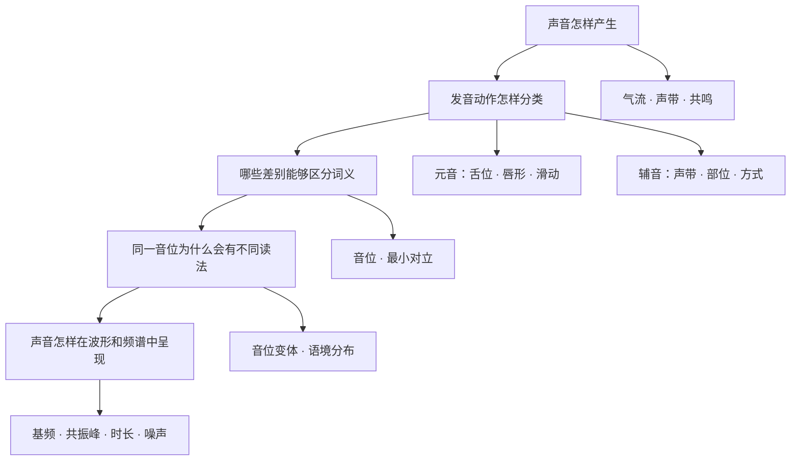
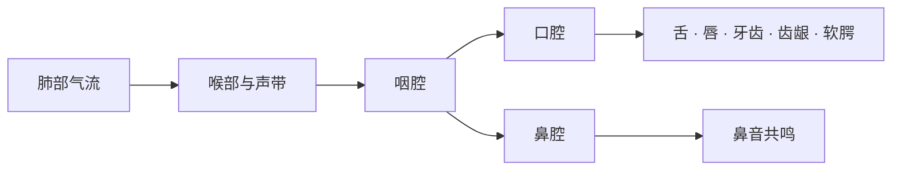

# 音素与发音动作

> **中心问题**：人怎样把气流变成可以区分意义的语言声音？ 
> **核心成果**：能够从声带振动、发音部位和发音方式描述常见美式音素，并使用词典音标校正单词读音。 
> **阅读建议**：第一至第五章属于核心路径；第六章处理真实语流中的音位变体；第七、八章进入声学和音系学分析。 
> **课程边界**：本课研究声音本身。拼写与读音、音节与重音、连读与语调由后续课程分别讲解。

英语口音不存在一张对所有说话者都完全相同的“固定音素表”。本课以 Lexi TTS 使用的通用美式发音为主要参照，同时说明常见口音差异。音标是描述工具，不是要求所有人模仿同一种口音的评分表。

---

## 一、知识地图

学习发音可以沿着四个问题逐层深入：

核心学习顺序：

1. 先感受气流和声带；
2. 再观察舌头、嘴唇、软腭等发音器官；
3. 用相同的维度比较声音；
4. 用最小对立判断声音差别是否影响词义；
5. 最后理解音位变体和声学指标。

> [!IMPORTANT]
> 字母是书写单位，音素是语言声音单位。字母 `c` 可以在 `cat` 和 `city` 中表示不同声音；同一个音素也可能由不同字母组合表示。拼写对应关系将在“拼写与读音规律”中系统讲解。

---

## 二、声音怎样产生

### 1. 从气流到语言声音

大多数英语声音使用肺部呼出的气流。气流经过喉部和声道时，依次受到控制：

1. **呼吸系统提供气流**：肺部和呼吸肌产生持续气流；
2. **喉部控制声带**：声带可以振动，也可以保持分开；
3. **声道改变共鸣**：咽腔、口腔和鼻腔选择性增强不同频率；
4. **发音器官形成动作**：舌、唇、牙齿、齿龈和软腭改变气流通道。

可以把这一过程理解为“声源 + 滤波器”：声带振动或湍流噪声提供声源，声道形状像可变化的滤波器，塑造最终听到的音色。

### 2. 清音与浊音的触觉检查

将两根手指轻放在喉结附近，交替发以下声音：

- <lexi-phoneme>`/s/`</lexi-phoneme> 与 <lexi-phoneme>`/z/`</lexi-phoneme>；
- <lexi-phoneme>`/f/`</lexi-phoneme> 与 <lexi-phoneme>`/v/`</lexi-phoneme>；
- <lexi-phoneme>`/θ/`</lexi-phoneme> 与 <lexi-phoneme>`/ð/`</lexi-phoneme>。

前一个声音主要依靠气流摩擦，喉部振动较弱；后一个声音伴随明显声带振动。这就是辅音分类中的**清浊对立**。

> [!NOTE]
> 清音不等于“小声”，浊音也不等于“大声”。清浊描述声带是否参与周期性振动，响度描述声音强弱，两者不是同一维度。

### 3. 口腔与鼻腔的通道切换

软腭抬起时，鼻腔通道大体关闭，多数英语元音和口腔辅音由口腔辐射。软腭下降时，气流进入鼻腔，可以产生 <lexi-phoneme>`/m/`</lexi-phoneme>、<lexi-phoneme>`/n/`</lexi-phoneme> 和 <lexi-phoneme>`/ŋ/`</lexi-phoneme>。

捏住鼻子持续发 <lexi-phoneme>`/m/`</lexi-phoneme>，声音会很快受到阻碍；发 <lexi-phoneme>`/s/`</lexi-phoneme> 时影响较小。这个对比可以帮助确认气流通道。

### 4. 发音器官速查

- **双唇**负责闭合、摩擦或圆唇。对比 `pie`、`five`、`we` 的起始动作。
- **上齿**可以与下唇或舌尖形成狭窄通道。对比 `fan` 与 `thin`。
- **齿龈**是舌尖或舌端经常接触的位置。对比 `tea`、`see`、`no`、`low`。
- **硬腭**位于舌前部抬高时接近的区域。观察 `yes` 的起始滑音。
- **软腭**既能与舌后部形成接触，也控制鼻腔通道。对比 `key`、`go`、`sing`。
- **声门**是两侧声带之间的开口。感受 `he` 起始位置的气流。

---

## 三、音标、语音和音位

### 1. 三个容易混淆的概念

| 概念 | 记号 | 关注点 | 示例 |
| :--- | :--- | :--- | :--- |
| 语音 `phone` | 方括号 `[ ]` | 实际发出的具体声音 | 美式 `water` 中常见的 `[ɾ]` |
| 音位 `phoneme` | 斜线 `/ /` | 能在某个语言系统中区别意义的抽象单位 | <lexi-phoneme>`/t/`</lexi-phoneme> 与 <lexi-phoneme>`/d/`</lexi-phoneme> |
| 音位变体 `allophone` | 常用方括号 `[ ]` | 同一音位在不同环境中的具体实现 | `[tʰ]`、`[t]`、`[ɾ]` 可以与音位 <lexi-phoneme>`/t/`</lexi-phoneme> 相关 |

斜线转写通常忽略可预测的细节，称为**宽式转写**；方括号转写可以记录送气、鼻化、舌位变化等细节，称为**窄式转写**。

### 2. 最小对立

如果两个词只在同一位置相差一个声音，而且词义不同，这一对词可以帮助确认音位对立。

分别点击每个单词，先听差别，再读出这一对词：

- <lexi-phoneme>`/p/`</lexi-phoneme> ～ <lexi-phoneme>`/b/`</lexi-phoneme>：`pat` ～ `bat`。双唇动作相近，声带状态不同。
- <lexi-phoneme>`/t/`</lexi-phoneme> ～ <lexi-phoneme>`/d/`</lexi-phoneme>：`ten` ～ `den`。发音部位相近，声带状态不同。
- <lexi-phoneme>`/i/`</lexi-phoneme> ～ <lexi-phoneme>`/ɪ/`</lexi-phoneme>：`sheep` ～ `ship`。舌位、时长和音质共同变化。
- <lexi-phoneme>`/ɛ/`</lexi-phoneme> ～ <lexi-phoneme>`/æ/`</lexi-phoneme>：`bed` ～ `bad`。开口度和舌位不同。

`Pat bought a blue coat.`

点击上面的句子只会朗读。依次点击 `Pat`、`blue`、`coat` 等单词，则会朗读并打开词典 Card。

### 3. IPA 不是“英语专用音标表”

国际音标是一套描述人类语言声音的系统。英语只使用其中一部分符号；不同英语口音也不必具有完全相同的音位集合。

因此，本课不采用“英语固定有 48 个音标”的表述。传统教学表仍可作为记忆入口，但必须知道：

- 有些表以英式发音为基础，有些以美式发音为基础；
- 有些表把辅音序列当作独立项目；
- 有些表按词典转写习惯区分长短音，有些更强调音质；
- 音位数量会随口音、合并现象和分析方式变化。

---

## 四、元音：改变声道形状

### 1. 描述元音的四个维度

发元音时，气流通常没有形成足以产生明显摩擦的狭窄通道。元音的主要差别来自：

1. **舌位高低**：舌面接近上腭还是远离上腭；
2. **舌位前后**：舌面最高点偏前、居中还是偏后；
3. **唇形**：圆唇还是非圆唇；
4. **动态变化**：舌位和唇形保持相对稳定，还是从一个目标滑向另一个目标。

“高元音”和“低元音”描述舌位，不描述音高。<lexi-phoneme>`/i/`</lexi-phoneme> 的舌位较高，<lexi-phoneme>`/æ/`</lexi-phoneme> 的舌位较低；这与说话人的声调高低不是一回事。

### 2. 通用美式元音对比集合

下面按照舌位区域建立对比，不宣称覆盖所有北美口音。符号选择也可能与不同词典略有差异。

**前元音**

- <lexi-phoneme>`/i/`</lexi-phoneme>：高、前、非圆唇，通常较紧；例词 `see`、`fleece`、`team`。
- <lexi-phoneme>`/ɪ/`</lexi-phoneme>：近高、前、较放松；例词 `sit`、`kit`、`milk`。
- <lexi-phoneme>`/ɛ/`</lexi-phoneme>：中低、前、非圆唇；例词 `bed`、`dress`、`head`。
- <lexi-phoneme>`/æ/`</lexi-phoneme>：低、前、开口较大；例词 `cat`、`trap`、`hand`。

**中央与卷舌元音**

- <lexi-phoneme>`/ə/`</lexi-phoneme>：中央、放松，常见于非重读音节；例词 `about`、`sofa`、`support`。
- <lexi-phoneme>`/ʌ/`</lexi-phoneme>：中央或偏后，常见于重读音节；例词 `cup`、`strut`、`luck`。
- <lexi-phoneme>`/ɝ/`</lexi-phoneme>：重读卷舌中央元音；例词 `bird`、`nurse`、`word`。
- <lexi-phoneme>`/ɚ/`</lexi-phoneme>：非重读卷舌中央元音；例词 `teacher`、`letter`、`color`。

**后元音**

- <lexi-phoneme>`/u/`</lexi-phoneme>：高、后、圆唇，通常较紧；例词 `food`、`goose`、`blue`。
- <lexi-phoneme>`/ʊ/`</lexi-phoneme>：近高、后、圆唇，较放松；例词 `book`、`foot`、`good`。
- <lexi-phoneme>`/ɑ/`</lexi-phoneme>：低、后、非圆唇或弱圆唇；例词 `father`、`lot`、`hot`。
- <lexi-phoneme>`/ɔ/`</lexi-phoneme>：中低、后、圆唇，部分口音与 <lexi-phoneme>`/ɑ/`</lexi-phoneme> 合并；例词 `thought`、`law`、`caught`。

### 3. 常见滑动元音

- <lexi-phoneme>`/eɪ/`</lexi-phoneme>：从中前位置向高前位置移动；例词 `day`、`face`、`rain`。
- <lexi-phoneme>`/oʊ/`</lexi-phoneme>：从中后位置向高后圆唇移动；例词 `go`、`goat`、`home`。
- <lexi-phoneme>`/aɪ/`</lexi-phoneme>：从低位向高前位置移动；例词 `time`、`price`、`bike`。
- <lexi-phoneme>`/aʊ/`</lexi-phoneme>：从低位向高后圆唇位置移动；例词 `now`、`mouth`、`house`。
- <lexi-phoneme>`/ɔɪ/`</lexi-phoneme>：从后圆唇位置向高前位置移动；例词 `boy`、`choice`、`voice`。

在卷舌口音中，`near`、`square`、`tour` 等词通常可以分析为元音后接 <lexi-phoneme>`/ɹ/`</lexi-phoneme>，不必照搬非卷舌口音中的“集中双元音”分类。

### 4. 元音观察：不要只看口型

元音没有一个适用于所有人的固定“几指宽”口型。口腔大小和面部结构存在差异，更可靠的方法是同时观察：

- 舌位变化；
- 唇形变化；
- 与邻近元音的听觉对比；
- 单词中的实际效果。

依次慢读以下序列，感受舌位由高到低移动：

`see, sit, set, sat`

再对比后部元音：

`food, good, thought, hot`

如果自己的口音合并了 `cot` 与 `caught`，最后两个词可能非常接近或相同。这是口音系统差异，不是单个词读错。

---

## 五、辅音：控制气流通道

### 1. 三维描述法

一个辅音通常可以从三个维度描述：

1. **声带状态**：清音还是浊音；
2. **发音部位**：气流在哪里受到控制；
3. **发音方式**：气流被完全阻断、形成摩擦、经鼻腔释放，还是从较宽通道通过。

例如，<lexi-phoneme>`/p/`</lexi-phoneme> 是清双唇塞音：声带不持续振动，双唇形成闭塞，气流积累后释放。<lexi-phoneme>`/b/`</lexi-phoneme> 与它共享部位和方式，主要差别是声带状态。

### 2. 清浊成对的塞音、破擦音与摩擦音

| 类型 | 清音 | 浊音 | 代表词 |
| :--- | :--- | :--- | :--- |
| 双唇塞音 | <lexi-phoneme>`/p/`</lexi-phoneme> | <lexi-phoneme>`/b/`</lexi-phoneme> | `pat` ～ `bat` |
| 齿龈塞音 | <lexi-phoneme>`/t/`</lexi-phoneme> | <lexi-phoneme>`/d/`</lexi-phoneme> | `ten` ～ `den` |
| 软腭塞音 | <lexi-phoneme>`/k/`</lexi-phoneme> | <lexi-phoneme>`/ɡ/`</lexi-phoneme> | `coat` ～ `goat` |
| 齿龈后破擦音 | <lexi-phoneme>`/tʃ/`</lexi-phoneme> | <lexi-phoneme>`/dʒ/`</lexi-phoneme> | `cheap` ～ `jeep` |
| 唇齿摩擦音 | <lexi-phoneme>`/f/`</lexi-phoneme> | <lexi-phoneme>`/v/`</lexi-phoneme> | `fan` ～ `van` |
| 齿摩擦音 | <lexi-phoneme>`/θ/`</lexi-phoneme> | <lexi-phoneme>`/ð/`</lexi-phoneme> | `thin` ～ `then` |
| 齿龈摩擦音 | <lexi-phoneme>`/s/`</lexi-phoneme> | <lexi-phoneme>`/z/`</lexi-phoneme> | `sip` ～ `zip` |
| 齿龈后摩擦音 | <lexi-phoneme>`/ʃ/`</lexi-phoneme> | <lexi-phoneme>`/ʒ/`</lexi-phoneme> | `ship`、`measure` |
| 声门摩擦音 | <lexi-phoneme>`/h/`</lexi-phoneme> | — | `hat`、`home` |

<lexi-phoneme>`/tʃ/`</lexi-phoneme> 和 <lexi-phoneme>`/dʒ/`</lexi-phoneme> 先形成闭塞，再通过狭窄通道释放为摩擦。`tree` 中的辅音通常包含 <lexi-phoneme>`/t/`</lexi-phoneme> 与 <lexi-phoneme>`/ɹ/`</lexi-phoneme> 的共同发音影响，但不需要把 `tr` 另列为一个基本英语音位。

### 3. 摩擦音动作重点

发 <lexi-phoneme>`/θ/`</lexi-phoneme> 和 <lexi-phoneme>`/ð/`</lexi-phoneme> 时，舌尖接近或轻触上下齿之间，保持足以产生摩擦的狭窄通道。不需要用力咬住舌尖。

### 4. 鼻音、近音与边音

**鼻音：软腭下降，气流进入鼻腔**

- <lexi-phoneme>`/m/`</lexi-phoneme>：双唇闭合；例词 `map`、`room`。
- <lexi-phoneme>`/n/`</lexi-phoneme>：舌尖接近齿龈；例词 `no`、`ten`。
- <lexi-phoneme>`/ŋ/`</lexi-phoneme>：舌后接近软腭；例词 `sing`、`long`。

**近音与边音：通道较宽，不产生持续摩擦**

- <lexi-phoneme>`/ɹ/`</lexi-phoneme>：舌尖或舌端接近齿龈后部；例词 `red`、`around`。
- <lexi-phoneme>`/j/`</lexi-phoneme>：舌前部接近硬腭；例词 `yes`、`use`。
- <lexi-phoneme>`/w/`</lexi-phoneme>：圆唇并抬高舌后部；例词 `we`、`away`。
- <lexi-phoneme>`/l/`</lexi-phoneme>：舌中部受阻，气流从舌侧通过；例词 `light`、`feel`。

美式 <lexi-phoneme>`/ɹ/`</lexi-phoneme> 可以采用不同舌形。重点不是强行“卷舌”，而是保持中央通道、避免舌尖直接碰到上腭，并形成稳定的卷舌共鸣。

### 5. 辅音观察：用感官理解动作

- **纸片测试**：将薄纸放在嘴前，对比 `pie` 与 `spy` 的起始气流；
- **喉部测试**：对比 `fan` 与 `van` 的声带振动；
- **鼻腔测试**：捏鼻对比 `map` 与 `back`；
- **持续测试**：<lexi-phoneme>`/s/`</lexi-phoneme> 可以持续，<lexi-phoneme>`/t/`</lexi-phoneme> 的闭塞不能持续发出相同声音。

观察重点是理解稳定、可重复的动作，不是让面部动作越夸张越好。

---

## 六、同一音位为什么会有不同读法

音位是抽象类别，真实声音会受到位置、重音、相邻声音和说话速度影响。以下现象常见于通用美式语流。

### 1. 塞音送气

词首重读音节中的 <lexi-phoneme>`/p t k/`</lexi-phoneme> 常带明显送气，例如 `pie`、`tie`、`key`。在 <lexi-phoneme>`/s/`</lexi-phoneme> 后，送气通常明显减弱，例如 `spy`、`sty`、`ski`。

这两种读法通常不会让英语使用者把它们听成不同单词，因此可视为相同音位在不同环境中的变体。

### 2. 齿龈闪音

在美式语流中，<lexi-phoneme>`/t/`</lexi-phoneme> 或 <lexi-phoneme>`/d/`</lexi-phoneme> 位于重读元音之后、非重读元音之前时，常实现为快速的齿龈闪音 `[ɾ]`。

- `water` 常接近 `[ˈwɔɾɚ]`；
- `city` 常接近 `[ˈsɪɾi]`；
- `ladder` 与 `latter` 在一些口音中可能非常接近。

闪音不是“把 `t` 故意读成字母 `d`”，而是一个独立的具体发音动作。

### 3. 不完全释放与声门化

词尾塞音可能没有明显爆破，例如 `cat`、`stop`、`back`。在某些环境中，<lexi-phoneme>`/t/`</lexi-phoneme> 还可能伴随或改用声门闭塞 `[ʔ]`，例如部分说话者的 `button`。

“没有听到强烈爆破”不等于辅音消失。前面元音的长度、声门动作和闭塞时长仍能提供线索。

### 4. 明亮与暗化的 `l`

<lexi-phoneme>`/l/`</lexi-phoneme> 在元音前和音节末可以有不同舌身位置。音节末的 `[ɫ]` 常伴随舌后部抬高，听感更暗，例如 `feel`、`milk`。不同美式口音的暗化范围并不完全相同。

### 5. 鼻化与同化

元音位于鼻音之前时常出现可预测的鼻化，例如 `man`、`sing`。鼻音自身也可能向后一个辅音的发音部位靠拢。这些细节有助于理解自然语流，但通常不需要在宽式词典音标中全部标出。

### 6. 口音差异不是错误清单

常见差异包括：

- `cot` 与 `caught` 是否合并；
- `Mary`、`marry`、`merry` 是否完全合并；
- 元音后的 <lexi-phoneme>`/ɹ/`</lexi-phoneme> 是否发出；
- `bag`、`bank` 等词中的 <lexi-phoneme>`/æ/`</lexi-phoneme> 是否明显抬高；
- 闪音、声门化和元音长度的具体分布。

本课以可理解性和稳定对比为目标。学习者应能识别主要变体，不必消除自己的全部口音特征。

---

## 七、声音怎样进入波形和频谱

这一章进入专业层面。它不要求学习者立即使用声学软件，但可以解释为什么“听起来不同”的声音能够被测量。

### 1. 波形、频谱与频谱图

- **波形**（`waveform`）以时间为横轴，显示气压振幅随时间的变化，适合观察周期和静音区。
- **频谱**（`spectrum`）以频率为横轴，显示某一时刻或时间窗内各频率成分的能量。
- **频谱图**（`spectrogram`）以时间为横轴，同时呈现频率和能量的变化，适合观察完整语音过程。

三种表示方式不是三份彼此独立的数据：它们从不同角度观察同一段声音。波形强调时间变化，频谱强调频率组成，频谱图把两者联系起来。

### 2. 基频与共振峰

声带周期性振动产生基频 <lexi-notation>`F0`</lexi-notation>，它与听觉上的音高密切相关。若一个周期持续时间为 <lexi-notation>`T`</lexi-notation> 秒，则基频可以写为：

<lexi-notation>`F0 = 1 / T`</lexi-notation>

声道共鸣产生一系列共振峰。元音分析最常关注第一、第二共振峰：

- <lexi-notation>`F1`</lexi-notation> 通常与舌位高低、口腔开合相关；
- <lexi-notation>`F2`</lexi-notation> 通常与舌位前后相关；
- 圆唇和声道长度会共同影响多个共振峰；
- 共振峰的绝对数值受说话者声道长度影响，不能脱离说话者和语境机械比较。

### 3. 辅音的声学线索

| 现象 | 常用线索 | 可以帮助观察什么 |
| :--- | :--- | :--- |
| 清浊对立 | 周期振动、闭塞时长、前后元音时长 | <lexi-phoneme>`/p/`</lexi-phoneme> 与 <lexi-phoneme>`/b/`</lexi-phoneme> 等对比 |
| 塞音 | 闭塞、爆破瞬间、送气 | 发音部位和喉部时序 |
| 摩擦音 | 高频或分布不同的非周期噪声 | <lexi-phoneme>`/s/`</lexi-phoneme>、<lexi-phoneme>`/ʃ/`</lexi-phoneme> 等差别 |
| 鼻音 | 低频鼻音共振及反共振 | 鼻腔参与和发音部位 |
| 近音 | 共振峰连续过渡 | <lexi-phoneme>`/ɹ/`</lexi-phoneme>、<lexi-phoneme>`/j/`</lexi-phoneme>、<lexi-phoneme>`/w/`</lexi-phoneme> 的滑动 |

### 4. 发音起始时间

`voice onset time`（VOT，发声起始时间）描述塞音释放与声带周期振动开始之间的时间关系。它是研究塞音清浊和送气的重要指标。

VOT 不是唯一线索。听者通常综合利用送气、闭塞时长、元音时长、基频变化等信息识别声音类别。

---

## 八、从语音学进入音系学

### 1. 语音学与音系学

- **语音学**研究声音怎样产生、传播和被感知；
- **音系学**研究一种语言怎样组织声音类别、对立和组合限制。

同一个具体声音在不同语言中可能承担不同功能。英语使用者把某些差异听作同一类别的变化，另一种语言的使用者可能用同样差异区分词义。

### 2. 互补分布与自由变体

如果两个具体声音稳定出现在不同环境，而且不会造成词义对立，它们可能处于互补分布。词首重读位置的送气 `[pʰ]` 与 <lexi-phoneme>`/s/`</lexi-phoneme> 后不送气的 `[p]` 是常见教学例子。

如果不同读法可以在相近环境中出现而不改变词义，则可能涉及自由变体、口音差异或说话风格差异。实际分析需要语料，不能只凭一个单词下结论。

### 3. 区别特征与自然类

音位可以进一步表示为一组区别特征，例如：

- <lexi-notation>`[±voice]`</lexi-notation>：是否具有声带振动特征；
- <lexi-notation>`[±nasal]`</lexi-notation>：是否具有鼻腔通道特征；
- <lexi-notation>`[±continuant]`</lexi-notation>：气流能否持续通过中央通道；
- `labial`、`coronal`、`dorsal`：主要发音器官类别。

共享特征的一组声音构成自然类。规则常常作用于自然类，而不是一串毫无关系的音标。例如英语复数词尾的读法受前一个声音的清浊和咝音特征影响。

### 4. 音系规则不是发音命令

形式化规则用于概括稳定模式。例如“鼻音在某些环境中向后续辅音的发音部位靠拢”描述一类同化现象。规则表达的是分析概括，不意味着说话者在开口前有意识地执行符号计算。

### 5. 音系配列限制

语言不仅选择声音类别，还限制它们如何组合。`spring` 的词首辅音组合在英语中可以出现，而某些语言不允许相同组合。学习者在陌生组合中插入额外元音，往往与母语的音系配列限制有关。

音节结构、重音和连续语流会继续改变这些组合的实际读法，它们分别属于后续课程。

---

## 九、本课回顾

1. 语音由气流、声带、声道共鸣和发音器官共同产生；
2. 元音主要通过舌位、唇形和动态变化描述；
3. 辅音主要通过声带状态、发音部位和发音方式描述；
4. 音位负责区别意义，音位变体描述语境中的具体实现；
5. 音素数量随口音和分析方式变化，不存在适用于所有英语口音的唯一固定表；
6. 声学分析使用基频、共振峰、时长和噪声等线索观察发音；
7. 音系学进一步研究声音类别、自然类、规则和组合限制。

### 核心术语与示例词

- `pat` · `bat` · `pie` · `spy` · `ten` · `den`
- `sheep` · `ship` · `bed` · `bad` · `food` · `good`
- `thin` · `then` · `fan` · `van` · `cheap` · `jeep`
- `water` · `city` · `button` · `feel` · `milk` · `sing`
- `cot` · `caught` · `bird` · `teacher` · `voice` · `measure`

### 继续学习

- 下一主题“拼写与读音规律”研究字母和声音的对应；
- “音节、重音与节奏”研究声音如何组成更大的节奏单位；
- “连读、弱读与语调”研究句子进入连续语流后的变化。

---

## 十、参考资料

- [International Phonetic Association：交互式 IPA 图表](https://www.internationalphoneticassociation.org/IPAcharts/IPA_charts_TI/IPA_charts_TI.html)
- [International Phonetic Association：IPA 图表与修订说明](https://www.internationalphoneticassociation.org/node/16/spanish)
- [UCLA Phonetics Lab：语音学教学与声音资料](https://www.phonetics.ucla.edu/)
- [MIT OpenCourseWare：Phonetics, Shading into Phonology](https://live.ocw.mit.edu/courses/24-900-introduction-to-linguistics-spring-2022/mit24_900s22_lec7.pdf)
- [MIT OpenCourseWare：Phonology Summary](https://ocw.mit.edu/courses/24-900-introduction-to-linguistics-fall-2012/f305bb4cff88d8643ef77a3c2ab6b92a_MIT24_900F12_Phonologysum.pdf)
- [Iowa State University：Segmentals and General American allophones](https://iastate.pressbooks.pub/oralcommunication2e/open/download?type=print_pdf)
- [ASHA：Speech resonance and the source-filter relationship](https://www.asha.org/Practice-Portal/Clinical-Topics/Resonance-Disorders/)
