# 国际音标与自然拼读

> **导读**：
> - **国际音标（IPA）**：共 48 个音标，用于精确标注每一个音素的口型与发音部位；
> - **自然拼读（Phonics）**：总结字母与声音的对应规律，辅助日常阅读与拼写；
> - **音标拼读与音节划分（Blending）**：介绍音标如何拼合为单词以及音节划分的基本规律。
> 
> 学习发音应“先见森林，后见树木”：先掌握 48 个音标的全景架构与分类，再逐步深入发音动作与拼读规律。

---

## 一、 48 个国际音标全景总览与分类

英语国际音标（IPA）共有 **48 个**，分为 **20 个元音** 和 **28 个辅音**：

```mermaid
graph LR
    A["48个国际音标 (IPA)"] --> B["元音 (20个)"]
    A --> C["辅音 (28个)"]

    B --> B1["单元音 (12个)"]
    B --> B2["双元音 (8个)"]
    B1 --> B11["长元音 (5个)"]
    B1 --> B12["短元音 (7个)"]
    B2 --> B21["开尾双元音 (5个)"]
    B2 --> B22["集中双元音 (3个)"]

    C --> C1["清辅音 (11个)"]
    C --> C2["浊辅音 (17个)"]
    C1 --> C11["10对成对清辅音"]
    C1 --> C12["独立清辅音 /h/"]
    C2 --> C21["10对成对浊辅音"]
    C2 --> C22["7个独立浊辅音"]
```

---

### 1. 元音全景分类表（20 个）

元音发音时声带振动，气流在口腔中不受明显阻碍：

| 元音大类 | 子分类 | 音标列表 | 典型单词示例 |
| :--- | :--- | :--- | :--- |
| **单元音 (12个)** | **长元音 (5个)** | `/iː/`, `/ɜː/`, `/ɑː/`, `/ɔː/`, `/uː/` | `see`, `bird`, `car`, `door`, `food` |
| **单元音 (12个)** | **短元音 (7个)** | `/ɪ/`, `/e/`, `/æ/`, `/ə/`, `/ʌ/`, `/ɒ/`, `/ʊ/` | `sit`, `bed`, `cat`, `about`, `cup`, `hot`, `book` |
| **双元音 (8个)** | **开尾双元音 (5个)** | `/eɪ/`, `/aɪ/`, `/ɔɪ/`, `/əʊ/`, `/aʊ/` | `day`, `sky`, `boy`, `go`, `now` |
| **双元音 (8个)** | **集中双元音 (3个)** | `/ɪə/`, `/eə/`, `/ʊə/` | `ear`, `air`, `tour` |

---

### 2. 辅音全景分类表（28 个）

辅音发音时气流在口腔中受到牙齿、嘴唇或舌头的阻碍，分为**清辅音**（声带不振动）和**浊辅音**（声带振动）：

#### ① 10 对成对清浊辅音（共 20 个）

| 发音方式 | 清辅音（声带不振动） | 浊辅音（声带振动） | 对比单词示例 |
| :--- | :--- | :--- | :--- |
| **双唇爆破音** | `/p/` | `/b/` | `pig` vs `big` |
| **舌尖齿龈爆破音** | `/t/` | `/d/` | `ten` vs `den` |
| **舌后软腭爆破音** | `/k/` | `/g/` | `coat` vs `goat` |
| **唇齿摩擦音** | `/f/` | `/v/` | `fan` vs `van` |
| **齿间咬舌音** | `/θ/` | `/ð/` | `think` vs `this` |
| **齿龈摩擦音** | `/s/` | `/z/` | `bus` vs `buzz` |
| **腭龈摩擦音** | `/ʃ/` | `/ʒ/` | `ship` vs `measure` |
| **破擦音 (清/浊)** | `/tʃ/` | `/dʒ/` | `cheap` vs `jeep` |
| **卷舌破擦音** | `/tr/` | `/dr/` | `tree` vs `dream` |
| **舌尖齿龈破擦音** | `/ts/` | `/dz/` | `cats` vs `beds` |

#### ② 8 个独立辅音

| 辅音类别 | 音标 | 典型单词示例 | 发音特点 |
| :--- | :--- | :--- | :--- |
| **声门摩擦音 (清)** | `/h/` | `hat`, `home`, `head` | 仅呼出气流，声带不振动 |
| **鼻辅音 (浊)** | `/m/` | `milk`, `mum`, `moon` | 双唇闭合，气流从鼻腔出 |
| **鼻辅音 (浊)** | `/n/` | `no`, `ten`, `name` | 舌尖抵上齿龈，气流走鼻腔 |
| **鼻辅音 (浊)** | `/ŋ/` | `sing`, `king`, `long` | 舌后部贴软腭，鼻音共鸣 |
| **舌侧音 (浊)** | `/l/` | `light`, `love`, `apple` | 舌尖抵上齿龈（分明/暗两种） |
| **齿龈后部摩擦音 (浊)** | `/r/` | `red`, `run`, `rose` | 舌尖卷起向上齿龈后部 |
| **半元音 (浊)** | `/w/` | `water`, `wait`, `we` | 唇形收圆，类似元音 `/uː/` 滑动 |
| **半元音 (浊)** | `/j/` | `yes`, `year`, `you` | 舌前部抬高，类似元音 `/iː/` 滑动 |

---

## 二、 音标如何拼读组合成单词（音素拼读与音节划分）

掌握 48 个音标后，下一步是将离散的音标组合为完整的单词发音：

### 1. 音素滑拼原理：辅音（声）+ 元音（韵）

拼读的本质是**气流从前一个发音部位平滑滑向下一个发音部位**：

> **拼读组合方式**：  
> **`/b/` (前辅音) + `/æ/` (核心元音) → `/bæ/` (前音滑拼) + `/t/` (收尾辅音) → `/bæt/` (`bat`)**

- **第一步：确定核心元音**（元音是音节的响亮度核心）；
- **第二步：辅元结合（声韵拼合）**：辅音与紧跟其后的元音快速拼合（如 `/k/` + `/eɪ/` → `/keɪ/`）；
- **第三步：平稳收尾**：尾辅音迅速收住口型（如 `/keɪ/` + `/k/` → `/keɪk/` `cake`）。

---

### 2. 音节核心法则：一个元音发音 = 一个音节

> **基本规律**：单词的音节数量**不取决于字母个数，而取决于听到的元音发音个数**。

| 音节类别 | 元音发音数 | 音标拆解 | 拼读实例 |
| :--- | :--- | :--- | :--- |
| **单音节词** | 1 个元音 | `/bæt/` (1个 `/æ/`) | `bat`, `desk`, `bread` (虽然有两个元音字母ea，但只发一个音 `/e/`) |
| **双音节词** | 2 个元音 | `/ˈdɒk.tə/` (2个: `/ɒ/` + `/ə/`) | `doc-tor`, `pen-cil` (`/ˈpen.səl/`), `wa-ter` (`/ˈwɔː.tə/`) |
| **多音节词** | 3 个及以上 | `/bəˈnɑː.nə/` (3个: `/ə/` + `/ɑː/` + `/ə/`) | `ba-na-na`, `com-pu-ter` (`/kəmˈpjuː.tə/`), `fa-mi-ly` |

---

### 3. 音节切分参考规则

遇到较长单词时，可依据以下规则进行切分与拼读：

| 切分规则 | 规律要领 | 拆解例词 |
| :--- | :--- | :--- |
| **一靠后 (V-CV)** | 两元音间有一个辅音时，辅音通常归后（前音节多为开音节，发长元音） | `ba-by` (`/ˈbeɪ.bi/`), `mu-sic` (`/ˈmjuː.zɪk/`) |
| **二分手 (VC-CV)** | 两元音间有两个辅音时，中间各分一个（前音节多为闭音节，发短元音） | `doc-tor` (`/ˈdɒk.tə/`), `rab-bit` (`/ˈræb.ɪt/`) |
| **词缀独立划分** | 常见前缀、后缀通常独立切分 | `un-hap-py`, `help-ful`, `play-ing` |

---

### 4. 重音符号 `ˈ` 与节奏强弱规律

音标中的重音标注决定了单词的抑扬顿挫：

- **主重音符号 `ˈ`（高位单引号）**：
  - 紧跟在 `ˈ` 后面的音节为**核心重读音节**；
  - **发音要领**：声音更响、音调略高、持续时间略长（如 `/ˈæp.əl/` `apple` 中 `ap` 强读，`ple` 弱读）。
- **次重音符号 `ˌ`（低位单引号）**：
  - 紧跟在 `ˌ` 后面的音节力度居中（如 `/ˌjuː.nɪˈvɜː.sə.ti/` `university`）。
- **非重读音节的弱化现象（Schwa 弱读）**：
  - 在非重读音节中，元音常常弱化为自然的中央元音 `/ə/`；
  - 例如 `banana` `/bəˈnɑː.nə/`：只有重读音节发清晰饱满的 `/nɑː/`，前后的 a 均弱读为轻微的 `/ə/`。

---

## 三、 自然拼读与国际音标的分工与配合

| 比较维度 | 自然拼读 (Phonics) | 国际音标 (IPA) |
| :--- | :--- | :--- |
| **教学定位** | 字母与发音的映射规律（看字读音） | 标注精准发音与舌位口型的标尺（查字典生词） |
| **核心作用** | 帮助建立见字读音、听音写词的直觉 | 帮助纠正口型动作、确定不规则词的标准读音 |
| **适用范围** | 涵盖英语中约 85% 规律词汇 | 涵盖 100% 英语词汇（含所有不规则词） |
| **典型实例** | 看到 `cake`, `rain`, `stop` 可直接顺畅读出 | 明确 `/θ/` (`think`) 的咬舌动作；确认不规则词 `knight` (`/naɪt/`) 的读音 |

---

## 四、 自然拼读核心发音规则

### 1. 规则一：短元音与闭音节（CVC 结构）

当元音字母处于辅音字母之间（辅音-元音-辅音 结构）时，通常发**短元音**：

| 元音字母 | 短元音音标 | 经典例词 | 发音提示 |
| :--- | :--- | :--- | :--- |
| **`a`** | `/æ/` | `cat`, `bad`, `map`, `bag` | 开口度约两指宽，短促有力 |
| **`e`** | `/e/` | `bed`, `pen`, `red`, `leg` | 开口度约一指半，舌前部稍抬 |
| **`i`** | `/ɪ/` | `pig`, `sit`, `big`, `milk` | 嘴角放松，口型微开 |
| **`o`** | `/ɒ/` | `dog`, `box`, `hot`, `clock` | 嘴微圆，开口适中 |
| **`u`** | `/ʌ/` | `cup`, `bus`, `sun`, `luck` | 嘴半开，由喉部短促发出 |

---

### 2. 规则二：相对开音节与 Magic E（长元音）

当单词结构为 `元音 + 辅音 + e` 时，词尾的 `e` 通常不发音，前方的元音字母发本身的**字母音（长元音/双元音）**：

| 结构模式 | 字母本身音 | 短元音对比词 | Magic E 对应词 | 发音变化 |
| :--- | :--- | :--- | :--- | :--- |
| **`a_e`** | `/eɪ/` | `hat` | `hate` | `/hæt/` → `/heɪt/` |
| **`a_e`** | `/eɪ/` | `cap` | `cape` | `/kæp/` → `/keɪp/` |
| **`i_e`** | `/aɪ/` | `bit` | `bite` | `/bɪt/` → `/baɪt/` |
| **`i_e`** | `/aɪ/` | `kit` | `kite` | `/kɪt/` → `/kaɪt/` |
| **`o_e`** | `/əʊ/` | `hop` | `hope` | `/hɒp/` → `/həʊp/` |
| **`o_e`** | `/əʊ/` | `not` | `note` | `/nɒt/` → `/nəʊt/` |
| **`u_e`** | `/juː/` 或 `/uː/` | `tub` | `tube` | `/tʌb/` → `/tjuːb/` |
| **`u_e`** | `/juː/` 或 `/uː/` | `cut` | `cute` | `/kʌt/` → `/kjuːt/` |

---

### 3. 规则三：常见元音组合（Vowel Teams）

元音字母组合通常有固定的发音对应：

| 字母组合 | 对应国际音标 | 典型单词 | 记忆参考 |
| :--- | :--- | :--- | :--- |
| **`ee`, `ea`** | `/iː/` | `see`, `meet`, `eat`, `tea`, `meat` | 嘴角向两侧平拉，发长音 |
| **`ai`, `ay`** | `/eɪ/` | `rain`, `wait`, `day`, `play`, `say` | 词中多用 `ai`，词尾多用 `ay` |
| **`oa`, `ow`** | `/əʊ/` | `boat`, `coat`, `snow`, `slow`, `grow` | 由放松音滑向小圆唇 |
| **`ou`, `ow`** | `/aʊ/` | `house`, `mouse`, `out`, `cow`, `town` | 由大口型滑向小圆唇 |
| **`oo` (长)** | `/uː/` | `food`, `moon`, `room`, `cool`, `tooth` | 唇部收圆向前突出 |
| **`oo` (短)** | `/ʊ/` | `book`, `look`, `good`, `foot`, `cook` | 唇部微圆，短促发音 |

---

### 4. 规则四：R 控元音（Bossy R）

元音字母后紧跟字母 `r` 时，元音发音受 `r` 影响产生卷舌色彩：

| 字母组合 | 国际音标 | 经典例词 | 发音说明 |
| :--- | :--- | :--- | :--- |
| **`ar`** | `/ɑː/` (美音 `/ɑːr/`) | `car`, `star`, `park`, `arm`, `farm` | 口腔充分打开后卷舌 |
| **`er`, `ir`, `ur`** | `/ɜː/` (美音 `/ɜːr/`) | `her`, `teacher`, `bird`, `girl`, `nurse`, `hurt` | 舌身平放居中卷舌 |
| **`or`** | `/ɔː/` (美音 `/ɔːr/`) | `fork`, `horse`, `door`, `sport`, `corn` | 唇部收圆后卷舌 |

---

### 5. 规则五：常见辅音组合（Digraphs & Blends）

| 组合类别 | 字母组合 | 对应发音 | 典型例词 | 发音说明 |
| :--- | :--- | :--- | :--- | :--- |
| **二合清辅音** | **`ch`** | `/tʃ/` | `chair`, `lunch`, `teach` | 破擦音，清脆发声 |
| **二合清辅音** | **`sh`** | `/ʃ/` | `ship`, `fish`, `shoe` | 唇前突出，摩擦出气 |
| **二合咬舌音** | **`th` (清)** | `/θ/` | `think`, `thank`, `three` | 舌尖轻搭齿间，仅吹气 |
| **二合咬舌音** | **`th` (浊)** | `/ð/` | `this`, `that`, `father` | 舌尖轻搭齿间，声带振动 |
| **二合辅音** | **`ph`** | `/f/` | `phone`, `photo`, `elephant` | 上齿轻搭下唇发音 |
| **二合辅音** | **`wh`** | `/w/` | `what`, `where`, `white` | 唇部收圆向前发音 |
| **辅音连缀** | **`bl, cl, fl`** | `/bl/`, `/kl/`, `/fl/` | `black`, `clean`, `fly` | 两辅音紧凑连读 |
| **辅音连缀** | **`gr, tr, dr`** | `/gr/`, `/tr/`, `/dr/` | `green`, `tree`, `dream` | 舌尖顺畅过渡至 r |
| **辅音连缀** | **`sp, st, sk`** | `/sp/`, `/st/`, `/sk/` | `sport`, `stop`, `sky` | 气流紧凑清脆 |

---

## 五、 重点发音部位与唇齿动作拆解

### 1. 单元音口型开合度对比

| 音标 | 类别 | 典型例词 | 唇齿动作要领 | 辅助发音技巧 |
| :--- | :--- | :--- | :--- | :--- |
| `/iː/` | 长元音 | `see`, `eat`, `meet`, `cheese` | 嘴角向两侧拉开如微笑，舌尖抵下齿，发音清晰拉长。 | 类似中文拉长发“衣”。 |
| `/ɪ/` | 短元音 | `sit`, `big`, `hit`, `milk` | 嘴角放松，口型微开（约一指宽），发音短促。 | 介于中文“衣”与“噎”之间。 |
| `/e/` | 短元音 | `bed`, `head`, `pen`, `desk` | 上下齿微开约一指半，舌前部稍抬，自然短促。 | 类似短促有力的“哎”。 |
| `/æ/` | 短元音 | `cat`, `bad`, `apple`, `hand` | 口腔大开（约两指宽），嘴角向两侧拉开，压低舌前部。 | 口型需充分张大。 |
| `/ɜː/` | 长元音 | `bird`, `nurse`, `girl`, `word` | 嘴微张，舌身平放居中，舌中部稍隆起，振动声带。 | 类似拉长平稳发“呃”。 |
| `/ə/` | 短元音 | `about`, `teacher`, `banana`, `ago` | 中央放松元音，面部肌肉完全放松，自然呼气发声。 | 弱读音，似有若无。 |
| `/ʌ/` | 短元音 | `cup`, `bus`, `sun`, `luck` | 嘴半开，舌后部微抬，由喉部短促发出。 | 短促有力的“啊”。 |
| `/uː/` | 长元音 | `food`, `blue`, `moon`, `shoe` | 双唇收圆成小孔并向前突出，舌后部抬高。 | 类似吹哨口型拉长发“呜”。 |
| `/ʊ/` | 短元音 | `book`, `good`, `look`, `foot` | 双唇略圆但相对放松，短促发声。 | 短促轻快的“屋”。 |
| `/ɔː/` | 长元音 | `door`, `fork`, `horse`, `water` | 双唇收圆向前突出，舌后部大幅抬高，声音深沉。 | 深沉拉长的“嗷”。 |
| `/ɒ/` | 短元音 | `hot`, `box`, `dog`, `clock` | 口型大开微圆，舌身压低后缩，短促发出。 | 短促开阔的“奥”。 |
| `/ɑː/` | 长元音 | `car`, `father`, `star`, `park` | 嘴充分张大，舌身平放后缩，声带振动拉长。 | 饱满开阔的“啊”。 |

---

### 2. 双元音滑动路线

| 音标 | 典型例词 | 滑动口型路线 | 辅助记忆参考 |
| :--- | :--- | :--- | :--- |
| `/eɪ/` | `name`, `day`, `cake`, `rain` | 从 `/e/` 迅速滑向 `/ɪ/`，嘴角拉开 | 对应字母 A 的发音。 |
| `/aɪ/` | `sky`, `bike`, `time`, `eye` | 从开口音 `/a/` 迅速滑向扁唇 `/ɪ/` | 对应字母 I 的发音，类似中文“爱”。 |
| `/ɔɪ/` | `boy`, `toy`, `voice`, `coin` | 从圆唇 `/ɔ/` 滑向扁唇 `/ɪ/` | 类似“欧-一”快速连读。 |
| `/əʊ/` | `go`, `home`, `no`, `boat` | 从放松音 `/ə/` 滑向小圆唇 `/ʊ/` | 对应字母 O 的发音，类似“欧”。 |
| `/aʊ/` | `now`, `cow`, `house`, `mouth` | 从大开口 `/a/` 迅速收拢为圆唇 `/ʊ/` | 类似“嗷”的滑动。 |
| `/ɪə/` | `ear`, `near`, `beer`, `here` | 从 `/ɪ/` 滑向中央放松音 `/ə/` | 类似“一-呃”平缓过渡。 |
| `/eə/` | `air`, `chair`, `bear`, `care` | 从 `/e/` 滑向中央放松音 `/ə/` | 类似“哎-呃”平缓过渡。 |
| `/ʊə/` | `tour`, `poor`, `sure` | 从 `/ʊ/` 滑向中央放松音 `/ə/` | 类似“屋-呃”平缓过渡。 |

---

### 3. 辅音难点发音要领

#### ① 咬舌音（`/θ/` 与 `/ð/`）
- **发音要领**：上下门牙轻轻搭住舌尖（舌尖伸出约 1~2 毫米）；
- `/θ/`（清音）：仅向外吹气，声带不振动（例词：`think`, `thank`, `three`, `mouth`）；
- `/ð/`（浊音）：向外吹气同时振动声带，舌尖有震颤感（例词：`this`, `that`, `they`, `brother`）。

#### ② 唇齿音（`/f/` 与 `/v/`）
- `/f/`（清音）：上门牙轻搭下唇内侧吹气，声带不振动（例词：`fish`, `face`, `coffee`）；
- `/v/`（浊音）：保持上牙搭下唇姿势并振动声带（例词：`very`, `love`, `seven`）。

#### ③ 明 /l/ 与 暗 /l/
- **明 /l/**（词首如 `light`, `love`）：舌尖抵上齿龈后弹开发音。
- **暗 /l/**（词尾如 `milk`, `table`, `apple`）：舌尖抵上齿龈**不弹开**，喉部发出微弱的共鸣音（如 `milk` 读音过渡为 `密-欧-k`）。

---

## 六、 本课核心练习词汇

点击下列词汇，可在 Lexi 中查看释义并听标准读音：

- `cake` · `bike` · `rose` · `cute` · `rain`
- `boat` · `house` · `cheese` · `milk` · `apple`
- `doctor` · `pencil` · `banana` · `nurse` · `moon`
- `water` · `clock` · `father` · `voice` · `think`
- `thank` · `three` · `this` · `brother` · `very`
