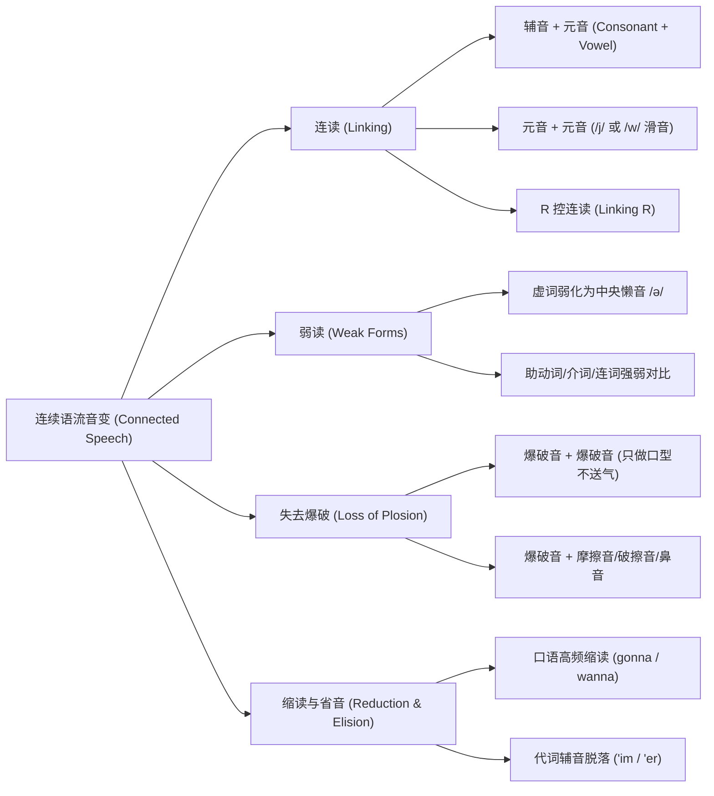

# 连读、弱读与语流节奏

> **导读**：
> - 许多英语学习者常常困惑：“为什么单个单词我都能听懂，但在影视、播客或日常交流中连起来就完全听不清？”
> - 英语是一种**以重音为节奏核心（Stress-timed）**的语言。在真实的连续语流中，发音器官为了兼顾流畅度与省力原则，会自然产生**连读**、**弱读**、**失去爆破**与**缩读**等音变现象。
> 
> 掌握这些规律不仅能提升口语自然度，更能从根本上解决英文听力中的“吞音”与“粘连”听辨障碍。

---

## 一、 连续语流音变现象全景架构

在连续语流（Connected Speech）中，单词之间的边界并不是机械割裂的，而是存在系统的物理衔接规律：

---

## 二、 连读（Linking）：声音的无缝平滑过渡

连读指的是在前一个词的尾音与后一个词的首音之间建立平滑的声学桥梁：

### 1. 辅音 + 元音连读（最基础、最高频）

前一个词以**辅音**结尾，后一个词以**元音**开头，前辅音直接与后元音拼合成一个新的音节：

| 文本表达 | 离散发音拆解 | 实际语流连读 | 音标连读标注 | 中文听感参考 |
| :--- | :--- | :--- | :--- | :--- |
| `check it out` | `check` + `it` + `out` | `che-cki-tout` | `/tʃek.ɪ.taʊt/` → `/tʃe.kɪ.taʊt/` | 彻-克-特-奥特 |
| `pick it up` | `pick` + `it` + `up` | `pi-cki-tup` | `/pɪk.ɪt.ʌp/` → `/pɪ.kɪ.tʌp/` | 匹-克-特-阿普 |
| `not at all` | `not` + `at` + `all` | `no-ta-tall` | `/nɒt.æt.ɔːl/` → `/nɒ.tæ.tɔːl/` | 诺-泰-滔 |
| `hold on` | `hold` + `on` | `hol-don` | `/həʊld.ɒn/` → `/həʊl.dɒn/` | 喉-东 |
| `an apple` | `an` + `apple` | `a-napple` | `/æn.æp.əl/` → `/æ.næp.əl/` | 安-耐剖 |

---

### 2. 元音 + 元音连读（增加平滑滑音 `/j/` 或 `/w/`）

当两个元音直接相遇时，为了避免声带产生突兀的中断（声门塞音），口型会自然过渡并带出微弱的半元音：

| 类别 | 衔接机制 | 示例短语 | 实际发音连读 | 发音说明 |
| :--- | :--- | :--- | :--- | :--- |
| **加 `/j/` 滑音** | 前词以扁唇元音 `/iː/`, `/ɪ/`, `/eɪ/`, `/aɪ/`, `/ɔɪ/` 结尾 | `see it` | `see-(j)-it` (`/siː.jɪt/`) | 嘴角平拉过渡至后元音 |
| **加 `/j/` 滑音** | 前词以 `/iː/` 等结尾 | `I am` | `I-(j)-am` (`/aɪ.jæm/`) | 自然带出极轻的 `y` 音 |
| **加 `/j/` 滑音** | 前词以 `/eɪ/` 结尾 | `say it` | `say-(j)-it` (`/seɪ.jɪt/`) | 平滑连贯不中断 |
| **加 `/w/` 滑音** | 前词以圆唇元音 `/uː/`, `/ʊ/`, `/əʊ/`, `/aʊ/` 结尾 | `go on` | `go-(w)-on` (`/ɡəʊ.wɒn/`) | 嘴唇收圆过渡至后元音 |
| **加 `/w/` 滑音** | 前词以 `/uː/` 结尾 | `do it` | `do-(w)-it` (`/duː.wɪt/`) | 自然带出极轻的 `w` 音 |
| **加 `/w/` 滑音** | 前词以 `/aʊ/` 结尾 | `now and then` | `now-(w)-and then` | 嘴型由大圆收至小圆 |

---

### 3. R 控连读（Linking R）

英音中单词末尾的 `r` 单独出现通常不发卷舌音，但当后面紧跟元音开头的词时，末尾的 `r` 必须恢复发音并与后词连读：

| 示例短语 | 离散发音 | 实际连读语流 | 说明 |
| :--- | :--- | :--- | :--- |
| `for example` | `/fɔː/` + `/ɪɡˈzɑːm.pəl/` | `for-rexample` (`/fɔː.rɪɡˈzɑːm.pəl/`) | `r` 与 `e` 连读为 `/rɪ/` |
| `far away` | `/fɑː/` + `/əˈweɪ/` | `far-ra-way` (`/fɑː.rəˈweɪ/`) | `r` 与 `a` 连读为 `/rə/` |
| `here and there` | `/hɪə/` + `/ænd/` | `here-rand there` (`/hɪə.rənd.../`) | `r` 恢复发音连读 |

---

## 三、 失去爆破与不完全爆破（Incomplete Plosion）

爆破音共有 6 个：`/p/`, `/b/`, `/t/`, `/d/`, `/k/`, `/ɡ/`。  
**核心要领**：**只做发音口型、短暂停顿闭气，但不向外猛烈喷发气流**，直接迅速滑向下一个音。

| 组合情况 | 典型短语 | 失去爆破发音要领 | 听感特点 |
| :--- | :--- | :--- | :--- |
| **爆破音 + 爆破音** | `bad boy` (`/d/` + `/b/`) | 舌尖抵上齿龈做 `/d/` 准备，但不喷气，直接发 `/b/` | 感觉 `/d/` 有个极短的停顿 |
| **爆破音 + 爆破音** | `stop talking` (`/p/` + `/t/`) | 双唇闭合做 `/p/` 口型不爆破，直接发 `/t/` | 听不到 `p` 的爆破气流 |
| **爆破音 + 爆破音** | `black board` (`/k/` + `/b/`) | 舌后抵软腭做 `/k/` 口型不爆破，直接发 `/b/` | `black` 尾音收住即转 `board` |
| **爆破音 + 摩擦音** | `good friend` (`/d/` + `/f/`) | `/d/` 仅做口型不送气，瞬间切换上牙咬下唇发 `/f/` | 极其流畅，无顿挫感 |
| **爆破音 + 鼻音** | `good morning` (`/d/` + `/m/`) | `/d/` 不向外爆破，气流直接走鼻腔转入 `/m/` | 听起来像 `goo-morning` |

---

## 四、 弱读与中央懒音 Schwa `/ə/`（Weak Forms）

英语句子中，**实词（名词、动词、形容词、副词）重读**，传达核心信息；**虚词（介词、代词、助动词、连词、冠词）通常弱读**。

> **中央懒音 Schwa `/ə/` 的本质**：  
> 口腔各肌肉完全放松，声带发出极轻、极短、似有若无的声音。

| 词汇 | 词性类别 | 强读音标（独立查词） | 语流弱读音标 | 真实句子语流示例 |
| :--- | :--- | :--- | :--- | :--- |
| `to` | 介词 | `/tuː/` | `/tə/` | `I want to go` (`/aɪ wɒnt tə ɡəʊ/`) |
| `for` | 介词 | `/fɔː/` | `/fə/` | `This is for you` (`/ðɪs ɪz fə juː/`) |
| `at` | 介词 | `/æt/` | `/ət/` | `Look at him` (`/lʊk ət ɪm/`) |
| `of` | 介词 | `/ɒv/` | `/əv/` | `a cup of tea` (`/ə kʌp əv tiː/`) |
| `and` | 连词 | `/ænd/` | `/ənd/` 或 `/ən/` | `rock and roll` (`/rɒk ən rəʊl/`) |
| `can` | 助动词 | `/kæn/` | `/kən/` | `I can do it` (`/aɪ kən duː ɪt/`) |
| `was` | 助动词 | `/wɒz/` | `/wəz/` | `He was happy` (`/hiː wəz ˈhæp.i/`) |
| `you` | 代词 | `/juː/` | `/jə/` | `See you later` (`/siː jə ˈleɪ.tə/`) |

---

## 五、 口语高频缩读与省音（Reductions & Elision）

日常地道口语交流中，由于语速与省力习惯，高频词组会固化为缩读表达：

| 缩读形式 | 完整原型表达 | 音标与发音提示 | 常见例句 |
| :--- | :--- | :--- | :--- |
| `gonna` | `going to` | `/ˈɡɒn.ə/` | `I'm gonna tell you.`（我打算告诉你。） |
| `wanna` | `want to` | `/ˈwɒn.ə/` | `I wanna know.`（我想知道。） |
| `gotta` | `got to` (have got to) | `/ˈɡɒt.ə/` | `I gotta go now.`（我得走了。） |
| `lemme` | `let me` | `/ˈlem.i/` | `Lemme see.`（让我看看。） |
| `gimme` | `give me` | `/ˈɡɪm.i/` | `Gimme a break.`（饶了我吧 / 让我歇会儿。） |
| `kinda` | `kind of` | `/ˈkaɪn.də/` | `It's kinda cool.`（这挺酷的。） |
| `should've` | `should have` | `/ˈʃʊd.əv/` | `You should've told me.`（你本该告诉我的。） |

---

## 六、 本课核心练习词汇与短语

点击下列词汇与短语，在 Lexi 中查看释义并跟读标准语流：

- `check it out` · `pick it up` · `not at all` · `hold on` · `an apple`
- `see it` · `do it` · `for example` · `far away` · `bad boy`
- `stop talking` · `good morning` · `a cup of tea` · `gonna` · `wanna`
- `gotta` · `lemme` · `gimme` · `kinda` · `should've`
