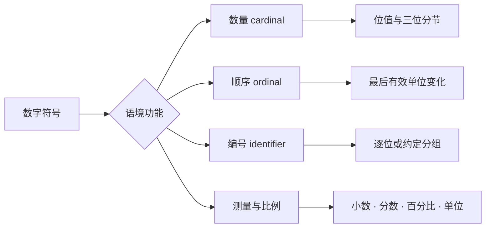

# 数字、单位与数据表达

> **中心问题**：怎样把数字的位值结构准确转换成英语，并在数量、顺序、比例和公式中选择合适读法？
> **核心成果**：能够读写整数、序数、分数、小数、百分比、比率和常见数学表达，并区分数量、编号、单位与近似值。
> **阅读建议**：第二至第四章是日常核心路径；第五章进入数学关系；第六章处理数据、单位和科学语境。
> **课程边界**：本课讲数字、单位与数据如何表达；日期、历法和日程由《时间、历法与日程》负责。

英语数字不是逐位翻译。整数依赖三位分节，序数词改变最后一个有效单位，分数把分子和分母分开处理，而电话号码、编号和年份又常采用逐位或分组读法。先识别数字在当前语境中的功能，才能决定读法。

---

## 一、知识地图

遇到数字时依次判断：

1. 它表示数量、顺序、标签，还是测量值？
2. 是否包含小数点、分数线、百分号或单位？
3. 整数部分应该按位值读，还是按编号逐位读？
4. 当前场景要求精确值、近似值，还是有效数字？
5. 听者使用的地区规范是否影响分隔符、单位或大数名称？

---

## 二、从 0 到 99：词形、重音与组合

### 1. 先掌握不能推导的核心形式

`zero` 到 `twelve` 多数不能仅靠规则生成，需要作为完整词学习：

`zero` · `one` · `two` · `three` · `four` · `five` · `six` · `seven` · `eight` · `nine` · `ten` · `eleven` · `twelve`

其中 `zero` 还会随语境出现其他读法：

- 小数中的 `0` 通常读 `zero`；
- 电话号码和比赛比分中可能听到 `oh`；
- 网球中的零分使用 `love`；
- 摄氏温度的零度读作 `zero degrees Celsius`。

### 2. 十几与几十共享词根，但不是同一种节奏

从 `thirteen` 到 `nineteen` 通常带 `-teen`；整十从 `twenty` 到 `ninety` 使用 `-ty`。需要特别注意词根变化：

- `three` → <lexi-word form="changed">`thirteen`</lexi-word>、<lexi-word form="changed">`thirty`</lexi-word>
- `four` → `fourteen`、<lexi-word form="irregular">`forty`</lexi-word>
- `five` → <lexi-word form="changed">`fifteen`</lexi-word>、<lexi-word form="changed">`fifty`</lexi-word>
- `eight` → <lexi-word form="changed">`eighteen`</lexi-word>、<lexi-word form="changed">`eighty`</lexi-word>
- `nine` → `nineteen`、`ninety`

`-teen` 与 `-ty` 的对比不能只靠尾音：

- `thirTEEN` 通常突出后部；
- `THIRty` 通常突出前部；
- 句子焦点可能改变重音，因此仍需结合上下文和数值逻辑。

`The ticket costs thirteen dollars, not thirty.`

### 3. 21—99 使用十位加个位

非整十数字通常由“整十 + 个位”组成，正式书写中常用连字符：

- `21` → `twenty-one`
- `38` → `thirty-eight`
- `54` → `fifty-four`
- `99` → `ninety-nine`

连字符表示这是一个复合数词，不改变朗读停顿。不要在十位和个位之间加入 `and`。

### 4. 数量词与名词一致

精确数量之后，名词通常根据数值决定单复数：

- `one meter`
- `zero meters` 或测量标签中的 `0 meter`，取决于结构；
- `1.0 meters` 在科学读数中通常按复数处理；
- `one and a half hours`，而不是 `one and a half hour`。

数字只是限定成分，不能代替名词自身的可数性判断。`two pieces of equipment` 仍然不能写成 `two equipments`。

---

## 三、大整数：三位分节与数量级

### 1. 为什么英语按三位分节

英语大数通常从右向左每三位形成一个数量级：

<lexi-notation>`1`</lexi-notation> | <lexi-notation>`234`</lexi-notation> | <lexi-notation>`567`</lexi-notation> | <lexi-notation>`890`</lexi-notation>

对应：

`billion` | `million` | `thousand` | `units`

每一节先按 0—999 读取，再附加节名。值为零的整节跳过。

| 数位与数值 | 英文表达 | 示例读法 |
| :--- | :--- | :--- |
| 百 100 | `hundred` | `three hundred`（300） |
| 千 1,000 | `thousand` | `five thousand`（5,000） |
| 百万 1,000,000 | `million` | `twelve million`（12,000,000） |
| 十亿 1,000,000,000 | `billion` | `two billion`（2,000,000,000） |
| 万亿 1,000,000,000,000 | `trillion` | `one trillion`（1,000,000,000,000） |

### 2. 大数读取算法

以 `1,234,567` 为例：

1. 分成 `1 | 234 | 567`；
2. 第一节读 `one million`；
3. 第二节读 `two hundred thirty-four thousand`；
4. 最后一节读 `five hundred sixty-seven`；
5. 合并为一个连续表达。

`One million two hundred thirty-four thousand five hundred sixty-seven.`

美式英语常省略百位后的 `and`；英式英语中 `three hundred and eighty-five` 很常见。两者都应保持同一份材料内部一致。

### 3. 精确数量不使用复数 -s

有具体数字时，`hundred`、`thousand`、`million` 等通常保持单数形式：

- `five thousand people`
- `two hundred pages`
- `3.6 million users`

表示不确定的大量时，才使用复数和 `of`：

- `hundreds of pages`
- `thousands of samples`
- `millions of stars`

### 4. 近似值与大数简写

- `about 2,000` → `about two thousand`
- `nearly 5 million` → `nearly five million`
- `2.4 billion` → `two point four billion`
- `between 10 and 12 million`

`2.4 billion` 表示 <lexi-notation>`2.4 × 10^9`</lexi-notation>，不能理解为 `2 billion 4 million`。

### 5. 年份、门牌号和编号不是普通大数

同一串数字可以因用途不同而改变分组：

- 年份 `1998` 常读 `nineteen ninety-eight`；
- 年份 `2005` 常读 `two thousand five` 或 `two thousand and five`；
- 房间 `204` 常读 `two oh four`；
- 公交线路 `105` 可能读 `one oh five`；
- 统计数量 `105` 通常读 `one hundred five`。

编号的目标是识别标签，不是表达位值总量，因此经常逐位读取。

---

## 四、序数、编号与位置

### 1. 序数词改变“最后一个有效单位”

序数词表示顺序或位置。多数形式以 `-th` 结尾，但高频词存在不规则变化：

- `one` → <lexi-word form="irregular">`first`</lexi-word>
- `two` → <lexi-word form="irregular">`second`</lexi-word>
- `three` → <lexi-word form="irregular">`third`</lexi-word>
- `five` → <lexi-word form="changed">`fifth`</lexi-word>
- `eight` → <lexi-word form="changed">`eighth`</lexi-word>
- `nine` → <lexi-word form="changed">`ninth`</lexi-word>
- `twelve` → <lexi-word form="changed">`twelfth`</lexi-word>

复合序数只改变最后一部分：`twenty-one` → <lexi-word form="irregular">`twenty-first`</lexi-word>。

| 基数词 序数词 · 缩写 | 变化说明 |
| :--- | :--- |
| `1` `one` <lexi-word form="irregular">`first`</lexi-word> `1st` | 独立词形；缩写取 `st` |
| `2` `two` <lexi-word form="irregular">`second`</lexi-word> `2nd` | 独立词形；缩写取 `nd` |
| `3` `three` <lexi-word form="irregular">`third`</lexi-word> `3rd` | 独立词形；缩写取 `rd` |
| `4` `four` `fourth` `4th` | 直接加 `-th` |
| `5` `five` <lexi-word form="changed">`fifth`</lexi-word> `5th` | `ve` 变为 `f` 后加 `-th` |
| `8` `eight` <lexi-word form="changed">`eighth`</lexi-word> `8th` | 保留词根中的 `t`，再加 `h` |
| `9` `nine` <lexi-word form="changed">`ninth`</lexi-word> `9th` | 去掉词尾 `e` 后加 `-th` |
| `12` `twelve` <lexi-word form="changed">`twelfth`</lexi-word> `12th` | `ve` 变为 `f` 后加 `-th` |
| `20` `twenty` <lexi-word form="changed">`twentieth`</lexi-word> `20th` | `y` 变为 `ie` 后加 `-th` |
| `21` `twenty-one` <lexi-word form="irregular">`twenty-first`</lexi-word> `21st` | 只改变个位 |
| `100` `hundred` `hundredth` `100th` | 直接加 `-th` |

表中展示的是构词关系，不代表缩写后缀只由最后一位决定。`11th`、`12th`、`13th` 是例外；应先检查最后两位是否为 11—13。

### 2. 楼层、名次和章节

- `the first floor` 的实际楼层含义可能随地区变化；
- `Chapter 3` 常读 `Chapter three`，不一定使用序数词；
- `the third chapter` 强调顺序位置；
- `World War II` 通常读 `World War Two`；君主名号 `Elizabeth II` 使用序数读法 `Elizabeth the Second`。

---

## 五、分数、小数、百分比与比率

### 1. 普通分数

普通分数通常把分子读作基数词、分母读作序数词。分子大于 1 时，分母一般使用复数：

- <lexi-notation>`1/3`</lexi-notation> → `one third` 或 `a third`
- <lexi-notation>`2/3`</lexi-notation> → `two thirds`
- <lexi-notation>`1/4`</lexi-notation> → `one quarter` 或 `a quarter`
- <lexi-notation>`3/4`</lexi-notation> → `three quarters`
- <lexi-notation>`7/10`</lexi-notation> → `seven tenths`

`half` 和 `quarter` 是高频特殊形式。复杂数学分式则更常用 `over`：

<lexi-notation>`(x + 1) / (x - 1)`</lexi-notation> → `x plus one over x minus one`

### 2. 小数

小数点读 `point`，点后通常逐位读取：

- `0.5` → `zero point five`
- `3.1415` → `three point one four one five`
- `0.008` → `zero point zero zero eight`
- `12.04` → `twelve point zero four`

保留末尾零可能表达测量精度：`2.0` 和 `2.00` 在科学记录中不一定等价，因此不能随意省略朗读或书写中的有效零。

### 3. 百分比、百分点和变化率

- `25%` → `twenty-five percent`
- `0.08%` → `zero point zero eight percent`
- 从 `20%` 增加到 `25%` 是增加 `5 percentage points`；
- 相对增幅为 <lexi-notation>`(25 - 20) / 20 = 25%`</lexi-notation>。

“增加 5%”与“增加 5 个百分点”不是同一概念。专业写作应明确基准。

### 4. 比率、比例和赔率

- `3:2` → `three to two`
- `a ratio of three to two`
- `three parts water to one part concentrate`
- 地图比例 `1:50,000` → `one to fifty thousand`

比例中的两个数不是普通大整数句子的一部分，要保留它们之间的关系词 `to`。

---

## 六、运算、公式与科学读法

### 1. 四则运算

- <lexi-notation>`2 + 3 = 5`</lexi-notation> → `two plus three equals five`
- <lexi-notation>`10 - 4 = 6`</lexi-notation> → `ten minus four equals six`
- <lexi-notation>`3 × 4 = 12`</lexi-notation> → `three times four equals twelve`
- <lexi-notation>`20 ÷ 5 = 4`</lexi-notation> → `twenty divided by five equals four`

操作指令与等式读法不同：

- `Add ten to twenty.`
- `Subtract five from fifteen.`
- `Multiply six by seven.`
- `Divide one hundred by ten.`

注意 `subtract A from B` 表示 <lexi-notation>`B - A`</lexi-notation>。

### 2. 比较关系

- <lexi-notation>`x = y`</lexi-notation> → `x equals y` 或 `x is equal to y`
- <lexi-notation>`x ≠ y`</lexi-notation> → `x is not equal to y`
- <lexi-notation>`x > y`</lexi-notation> → `x is greater than y`
- <lexi-notation>`x < y`</lexi-notation> → `x is less than y`
- <lexi-notation>`x ≥ y`</lexi-notation> → `x is greater than or equal to y`
- <lexi-notation>`x ≈ y`</lexi-notation> → `x is approximately equal to y`

### 3. 幂、根和科学记数法

- <lexi-notation>`x²`</lexi-notation> → `x squared`
- <lexi-notation>`x³`</lexi-notation> → `x cubed`
- <lexi-notation>`xⁿ`</lexi-notation> → `x to the power of n`
- <lexi-notation>`√x`</lexi-notation> → `the square root of x`
- <lexi-notation>`3.2 × 10⁸`</lexi-notation> → `three point two times ten to the eighth`

科学记数法把数量级和有效数字分离。`3.2 × 10⁸` 中 `3.2` 是系数，`8` 是指数。

### 4. 单位与复合单位

- `5 m` → `five meters`
- `1 kg` → `one kilogram`
- `20 °C` → `twenty degrees Celsius`
- `60 km/h` → `sixty kilometers per hour`
- `9.8 m/s²` → `nine point eight meters per second squared`

单位符号在科学写作中通常不加复数标记，但朗读时按数量选择单复数。

### 5. 统计和数据表达

- `mean`：均值；
- `median`：中位数；
- `range`：极差或取值范围；
- `variance`：方差；
- `standard deviation`：标准差；
- `95% confidence interval`：`ninety-five percent confidence interval`。

读图表时应同时说明数值、单位、比较基准和不确定性，而不是只朗读坐标轴上的数字。

---

## 七、复习与核心词汇

完成本课后，应能：

- 根据数量、顺序和编号选择读法；
- 使用三位分节读取大整数；
- 正确构成复合序数词；
- 区分小数、普通分数、百分比和百分点；
- 朗读常见运算、比较、幂、根和单位；
- 在数据摘要中说明基准和变化。

核心词汇：

`cardinal` · `ordinal` · `digit` · `place value` · `hundred` · `thousand` · `million` · `billion` · `fraction` · `decimal` · `percent` · `percentage point` · `ratio` · `approximately` · `multiply` · `divide` · `exponent` · `unit`
