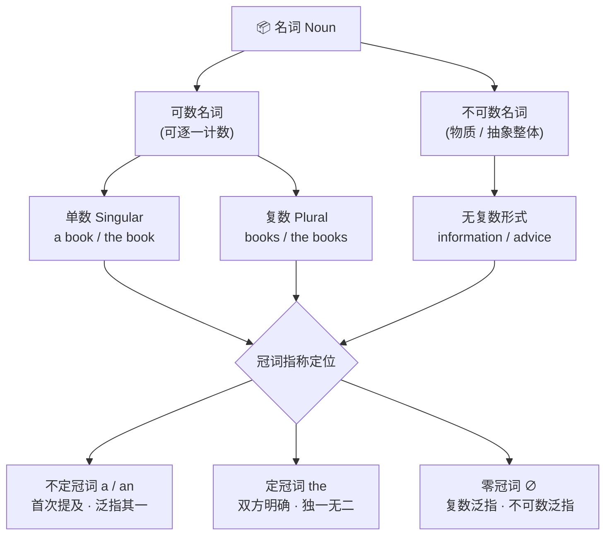

# 名词与冠词

> **导读**：
> - 名词是英语句子的实体基石，冠词则是附着在名词上的“指称标记”。两者必须合在一起理解：**冠词的选用本质上由名词的可数性与指称状态决定**。
> - 本课从可数性判断出发，依次解决复数构成、所有格与句法功能，最终落到 `a/an`、`the`、零冠词的三分判断体系。

---

## 一、 名词与冠词体系全景图

名词先按可数性分流，再由冠词系统完成指称定位：

---

## 二、 可数与不可数名词

可数性判断的核心标准是：**该事物能否被自然切成一个个独立个体**。

| 类别 | 判断标准 | 典型成员 | 搭配限定词 |
| :--- | :--- | :--- | :--- |
| **可数名词** | 有独立个体边界，可以逐一计数 | `book`, `idea`, `apple`, `problem` | `a / an`, `many`, `few`, `several`, `a number of` |
| **物质不可数** | 呈连续整体，切开仍是同类物质 | `water`, `rice`, `furniture`, `equipment` | `much`, `little`, `some`, `an amount of` |
| **抽象不可数** | 概念性整体，无个体边界 | `information`, `advice`, `progress`, `knowledge` | `much`, `little`, `a piece of` |

> [!IMPORTANT]
> 中英文可数性并不一一对应：中文可说“一条消息、两件家具”，但英语中 `information`、`furniture`、`advice`、`news`、`homework` 均为不可数，**不能加 `a`，也没有复数形式**。

### 量词化表达：`a + 单位词 + of + 不可数名词`

不可数名词要“数”，需要借用量词单位：

| 量词单位 | 适用场景 | 示例 |
| :--- | :--- | :--- |
| `a piece of` | 消息、建议、纸张等抽象/片状物 | `a piece of advice`, `two pieces of news` |
| `an item of` | 条目化的信息或物品 | `an item of information`, `an item of furniture` |
| `a glass / cup / bottle of` | 液体按容器计量 | `a glass of water`, `a bottle of milk` |
| `a loaf / slice of` | 面包整体与切片 | `a loaf of bread`, `a slice of bread` |

---

## 三、 复数构成与不规则变化

### 1. 规则变化速查表

| 词尾条件 | 变化方式 | 示例 |
| :--- | :--- | :--- |
| 一般情况 | 直接加 `-s` | `book` → `books`, `cat` → `cats` |
| 以 `s / x / ch / sh` 结尾 | 加 `-es` | `bus` → `buses`, `box` → `boxes`, `watch` → `watches` |
| 辅音字母 + `y` 结尾 | 改 `y` 为 `i` 加 `-es` | `city` → `cities`, `story` → `stories` |
| `o` 结尾（有生命常用词） | 加 `-es` | `potato` → `potatoes`, `hero` → `heroes` |
| `o` 结尾（多数其余词） | 加 `-s` | `photo` → `photos`, `piano` → `pianos` |
| `f / fe` 结尾 | 改 `f/fe` 为 `v` 加 `-es` | <code class="ord-variant">leaf → leaves</code>, <code class="ord-variant">wife → wives</code> |

### 2. 不规则复数：内部元音变化与特殊形式

| 单数 | 复数 | 变化类型 |
| :--- | :--- | :--- |
| `man` | <code class="ord-special">men</code> | 内部元音变化 |
| `woman` | <code class="ord-special">women</code> | 内部元音变化 |
| `child` | <code class="ord-special">children</code> | 古英语后缀 |
| `foot` | <code class="ord-special">feet</code> | 内部元音变化 |
| `tooth` | <code class="ord-special">teeth</code> | 内部元音变化 |
| `mouse` | <code class="ord-special">mice</code> | 内部元音变化 |
| `ox` | <code class="ord-special">oxen</code> | 古英语后缀 |
| `sheep` | <code class="ord-special">sheep</code> | 单复数同形 |
| `fish` | <code class="ord-special">fish</code> | 单复数同形 |

### 3. 外来词复数（学术与技术文献常见）

| 单数 | 复数 | 来源规律 |
| :--- | :--- | :--- |
| `criterion` | <code class="ord-variant">criteria</code> | 希腊语 `-on → -a` |
| `datum` | <code class="ord-variant">data</code> | 拉丁语 `-um → -a` |
| `analysis` | <code class="ord-variant">analyses</code> | 希腊语 `-is → -es` |
| `phenomenon` | <code class="ord-variant">phenomena</code> | 希腊语 `-on → -a` |

---

## 四、 名词所有格与句法功能

### 1. `'s` 属格与 `of` 属格的分工

| 属格形式 | 适用对象 | 示例 |
| :--- | :--- | :--- |
| `'s` 属格 | 人、动物、时间、国家等 | `Tom's book`, `today's news`, `China's economy` |
| `of` 属格 | 无生命事物的从属关系 | `the door of the room`, `the title of the report` |
| 双重属格 | `of + 's/名词性物主`，表示“其中之一” | `a friend of my father's` |

> [!NOTE]
> 以 `s` 结尾的复数名词只加 `'`：`the students' homework`；不以 `s` 结尾的复数仍加 `'s`：`the children's toys`。

### 2. 名词的句法功能

名词（短语）可以充当句子的多种成分：

| 句法功能 | 示例 | 说明 |
| :--- | :--- | :--- |
| 主语 | `Water is essential to life.` | 不可数名词作主语，谓语用单数 |
| 宾语 | `She needs some advice.` | 抽象不可数名词直接作宾语 |
| 表语 | `His job is teaching.` | 说明主语身份或内容 |
| 名词作定语 | `a coffee cup`, `a train station` | 修饰名词时通常用单数形式 |

---

## 五、 冠词三分：`a / an`、`the` 与零冠词

冠词选择的判断链条：**可数吗？→ 单数还是复数？→ 听说双方能定位吗？**

| 冠词 | 核心功能 | 典型场景 | 示例 |
| :--- | :--- | :--- | :--- |
| `a / an` | 泛指其一，首次提及 | 可数名词单数、表示“一个/某一类中任一” | `I saw a dog in the park.`（首次提及，哪只狗不明确） |
| `the` | 特指定位，双方明确 | 再次提及、唯一事物、最高级、序数词、乐器 | `The dog was black.`（上文那只）；`the sun`, `the first day`, `play the piano` |
| `∅` 零冠词 | 泛指整体概念 | 复数名词泛指、不可数名词泛指、三餐球类学科 | `Dogs are loyal.`；`Knowledge is power.`；`have breakfast`, `play basketball` |

> [!IMPORTANT]
> `a / an` 的选择取决于**发音**而非拼写：元音音素前用 `an`（`an hour`, `an MBA`），辅音音素前用 `a`（`a university`, `a one-way street`）。

### 零冠词与 `the` 的易混对照

| 场景 | 零冠词（抽象/泛指） | `the`（具体/特指） |
| :--- | :--- | :--- |
| 去某机构的目的 vs 建筑本身 | `go to school`（上学）/ `go to hospital`（看病） | `go to the school`（去那所学校办事）/ `go to the hospital`（去医院探视） |
| 季节、餐饭 | `in spring`, `after dinner` | 被限定语特指时：`the spring of 2020` |
| 学科、球类 | `study physics`, `play football` | 乐器加 `the`：`play the violin` |

---

## 六、 本课核心练习词汇

点击下列词汇，在 Lexi 中查看释义并听标准发音：

- `noun` · `article` · `countable` · `uncountable` · `plural`
- `singular` · `definite` · `indefinite` · `furniture` · `information`
- `advice` · `criteria` · `children` · `phenomena` · `equipment`
