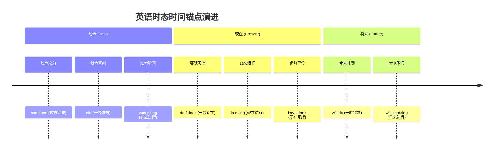

# 动词时态体系

> **导读**：
> - 英语中的“时态”在英文中其实由两个独立概念组成：**时（Tense，时间点）** 与 **态（Aspect，动作状态）**。
> - 传统死记硬背 16 种句型公式极其容易混淆。只要建立 **$4 \times 4$ 的二维坐标系心智模型**，就能从根本上透彻理解英语中所有时态的生成规律与语境意图。

---

## 一、 16 种时态二维坐标系全景图

时态的本质是 **4 个时间点（Time）** 与 **4 种动作状态（Aspect）** 的交叉乘积：

---

### 16 种时态完整矩阵对照表（以动词 `do` 为例）

| 时间维 \ 状态维 | 一般态 (Simple) | 进行态 (Continuous) | 完成态 (Perfect) | 完成进行态 (Perfect Continuous) |
| :--- | :--- | :--- | :--- | :--- |
| **现在 (Present)** | `do / does` | `am / is / are doing` | `have / has done` | `have / has been doing` |
| **过去 (Past)** | `did` | `was / were doing` | `had done` | `had been doing` |
| **将来 (Future)** | `will do` | `will be doing` | `will have done` | `will have been doing` |
| **过去将来 (Past Future)**| `would do` | `would be doing` | `would have done`| `would have been doing` |

---

## 二、 四大动作状态（Aspect）的心智本质

理解状态的本质，是摆脱死记硬背的关键：

| 动作状态 | 核心心智模型 | 动词构成公式 | 核心表达含义 | 典型例句 |
| :--- | :--- | :--- | :--- | :--- |
| **一般态 (Simple)** | **客观平面事实** | 原形 / 过去式 | 描述客观真理、恒定事实或长期规律习惯（不强调过程或完成） | `The earth moves around the sun.` |
| **进行态 (Continuous)**| **摄像机动态镜头** | `be + doing` | 画面切入某瞬间，动作正在发生、处于未完成的过程动态中 | `He is writing a letter.` |
| **完成态 (Perfect)** | **回望视线连接线** | `have + done` | 站在某一时间点**往回看**，过去的动作对当前立足点产生了**影响或结果** | `I have lost my key.`（钥匙丢了，现在还没找到） |
| **完成进行态 (P.C.)** | **持续贯通且仍在发生**| `have been + doing`| 动作不仅在立足点之前已持续了一段时间，且**此刻仍在继续进行** | `It has been raining for three hours.` |

---

## 三、 高频核心时态辨析与实战场景

日常阅读与交流中，以下 8 大时态占据了 95% 以上的应用场景：

### 1. 一般过去时 vs 现在完成时（最经典混淆点）

> **辨析核心**：**看动作是否与“现在”发生关联，以及是否有明确的“过去时间锚点”**。

| 比较维度 | 一般过去时 (Simple Past) | 现在完成时 (Present Perfect) |
| :--- | :--- | :--- |
| **时间立足点** | 完全立足于**过去**，动作已成为历史 | 立足于**现在**，强调过去对现在的影响 |
| **时间标志词** | 必须搭配**明确过去时间**（`yesterday`, `in 2020`, `ago`, `last week`） | 搭配**不确定时间或持续时间**（`already`, `yet`, `ever`, `since`, `for 5 years`） |
| **例句对照 A** | `I lived in Beijing for 3 years.`（过去住过3年，**现在已不在北京**） | `I have lived in Beijing for 3 years.`（住了3年，**现在依然住在北京**） |
| **例句对照 B** | `I bought a new car yesterday.`（陈述昨天买车的过去事实） | `I have bought a new car.`（买了新车，**强调我现在有新车开了**） |

---

### 2. 过去完成时（过去的过去）

> **心智模型**：过去的某一动作（Past A）发生在另一个过去动作（Past B）**之前**。

- **时间链条**：`过去之前 (Had Done)` → `过去动作 (Did)` → `现在 (Now)`
- **经典例句**：
  - `When I arrived at the station, the train had already left.`  
    （当我到达车站时（过去），火车**已经开走了（过去的过去）**。）

---

### 3. 过去将来时（站在过去看未来）

> **心智模型**：在过去叙事语境中，提及当时尚未发生的事情。

- **经典例句**：
  - `He said that he would help me.`  
    （他当时说（过去），他**会来帮我（站在过去看将来）**。）

---

## 四、 常见时间状语与时态匹配速查表

时间状语是判断时态的最佳航标：

| 目标时态 | 常见时间状语搭配 | 经典例句 |
| :--- | :--- | :--- |
| **一般现在时** | `always`, `usually`, `often`, `sometimes`, `every day`, `seldom` | `She always gets up early.` |
| **现在进行时** | `now`, `at the moment`, `right now`, `Look!`, `Listen!` | `Listen! The birds are singing.` |
| **一般过去时** | `yesterday`, `last night`, `two days ago`, `in 1999`, `just now` | `We visited the museum yesterday.` |
| **现在完成时** | `already`, `yet`, `just`, `ever`, `never`, `since then`, `so far` | `We have already finished our work.` |
| **过去进行时** | `at 8:00 last night`, `when he came in`, `while I was reading` | `I was reading a book when he called.` |
| **一般将来时** | `tomorrow`, `next week`, `in two days`, `soon`, `in the future` | `They will start the project next week.` |
| **过去完成时** | `by the time...`, `by the end of last year`, `before I arrived` | `By the end of last year, we had built 500 houses.` |

---

## 五、 本课核心练习词汇

点击下列词汇，在 Lexi 中查看释义并听标准发音：

- `present` · `past` · `future` · `aspect` · `continuous`
- `perfect` · `simple` · `yesterday` · `already` · `since`
- `moment` · `tomorrow` · `finished` · `arrived` · `occurred`
