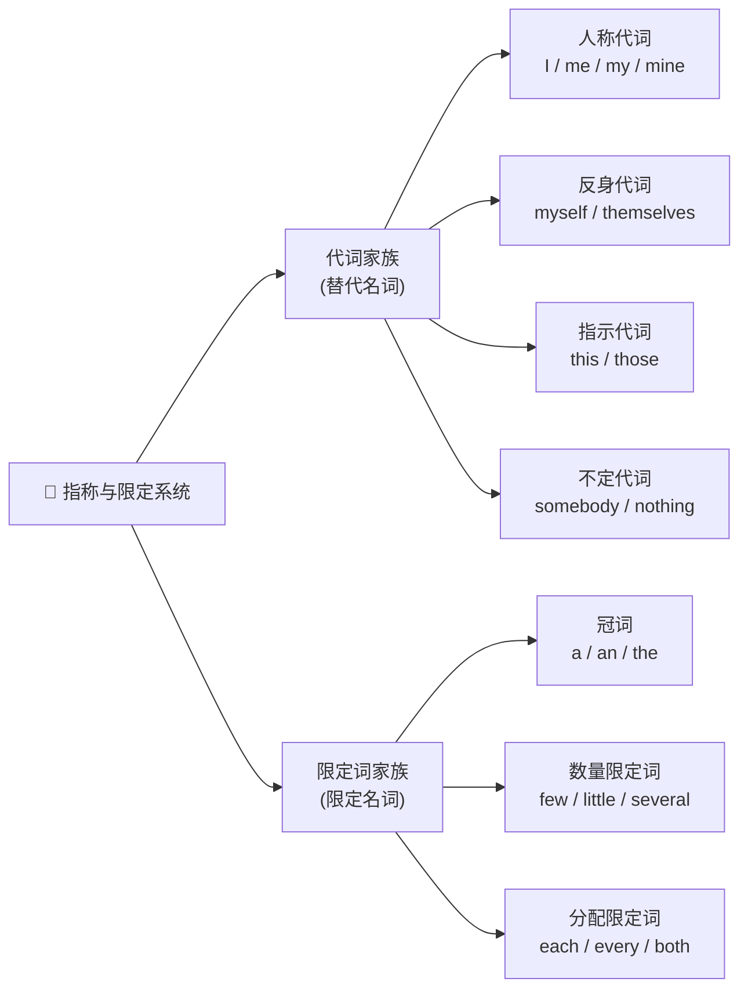

# 代词与限定词

> **导读**：
> - 代词与限定词都服务于同一个任务：**对名词进行指称与限定**。代词直接替代名词，限定词则出现在名词前确定其范围与数量。
> - 本课先建立两大词族的全景分类，再依次解决人称代词的格变化、指示与不定代词、数量限定词辨析，最后处理指代一致性这一高频错误来源。

---

## 一、 代词与限定词分类全景图

两大词族共同构成名词短语的“指称与限定层”：

---

## 二、 人称代词、物主代词与反身代词

### 1. 人称代词的格变化

人称代词按句法位置切换形态：主语用主格，动词或介词后用宾格。

| 人称 | 主格（作主语） | 宾格（作宾语） | 形容词性物主（+名词） | 名词性物主（独立使用） |
| :--- | :--- | :--- | :--- | :--- |
| 第一人称单数 | `I` | `me` | `my` | `mine` |
| 第二人称 | `you` | `you` | `your` | `yours` |
| 第三人称单数（男/女/物） | `he` / `she` / `it` | `him` / `her` / `it` | `his` / `her` / `its` | `his` / `hers` / — |
| 第一/三人称复数 | `we` / `they` | `us` / `them` | `our` / `their` | `ours` / `theirs` |

> [!TIP]
> `my` 与 `mine` 的分工：形容词性物主代词后必须接名词（`my book`）；名词性物主代词独立充当成分，相当于“物主代词 + 名词”（`This book is mine.` = `This is my book.`）。

### 2. 反身代词的构成与用法

反身代词由“物主/宾格 + `self`（单数）/ `selves`（复数）”构成：`myself`, `yourself`, `himself`, `herself`, `itself`, `ourselves`, `yourselves`, <code class="ord-special">themselves</code>。

| 用法 | 说明 | 示例 |
| :--- | :--- | :--- |
| 反身动作 | 动作返回施事者自身 | `He taught himself programming.` |
| 强调同位 | 加强语气，可省略 | `The manager himself replied.` |
| 固定搭配 | 与特定动词/介词绑定 | `enjoy oneself`, `by oneself`, `help yourself` |

> [!IMPORTANT]
> 反身代词不能作主语：不能说 `Myself will go.`，应为 `I will go.`；但可作宾语与同位语。

---

## 三、 指示代词与不定代词

### 1. 指示代词：距离 × 单复数二维定位

| | 近指 | 远指 |
| :--- | :--- | :--- |
| **单数** | `this` | `that` |
| **复数** | `these` | `those` |

指示代词既可作限定词（`this book`），也可独立作代词（`This is mine.`）。语篇中 `that / those` 常回指前文内容：`The cost of living here is higher than that in my hometown.`（`that` 替代 `the cost`）。

### 2. 不定代词：`some / any / no / every` 复合矩阵

四个前缀与三个后缀交叉构成复合不定代词，谓语一律按**单数**处理：

| 前缀 \ 后缀 | `-body / -one`（人） | `-thing`（物） | `-where`（地点） |
| :--- | :--- | :--- | :--- |
| `some-`（肯定句） | `somebody` / `someone` | `something` | `somewhere` |
| `any-`（疑问/否定/条件） | `anybody` / `anyone` | `anything` | `anywhere` |
| `no-`（否定含义） | `nobody` / `no one` | `nothing` | `nowhere` |
| `every-`（全体） | `everybody` / `everyone` | `everything` | `everywhere` |

> [!NOTE]
> `some-` 系也可用于表示请求或期待肯定答复的疑问句：`Would you like something to drink?`；`no-` 系本身含否定，句中不再加 `not`：`Nobody knows.`（而非 `Nobody doesn't know.`）。

---

## 四、 数量限定词辨析

### 1. `few / a few` 与 `little / a little`

| 限定词 | 搭配名词 | 含义倾向 | 示例 |
| :--- | :--- | :--- | :--- |
| `few` | 可数复数 | 否定：几乎没有 | `Few people came.`（几乎没人来） |
| `a few` | 可数复数 | 肯定：有一些 | `A few people came.`（来了几个） |
| `little` | 不可数 | 否定：几乎没有 | `There is little time left.`（几乎没时间了） |
| `a little` | 不可数 | 肯定：有一些 | `Add a little salt.`（加一点盐） |

### 2. 分配与范围限定词

| 限定词 | 范围 | 谓语一致 | 示例 |
| :--- | :--- | :--- | :--- |
| `each` | 逐个强调个体 | 单数 | `Each student has a laptop.` |
| `every` | 强调整体无一例外 | 单数 | `Every seat was taken.` |
| `both` | 两者都 | 复数 | `Both answers are correct.` |
| `either` | 两者之一 | 单数 | `Either option works.` |
| `neither` | 两者都不 | 单数 | `Neither answer is correct.` |
| `all` | 三者及以上全部 | 视名词而定 | `All the water is gone.` / `All the books are here.` |

### 3. 数量表达的“可数 / 不可数”搭配表

| 语义 | 搭配可数名词 | 搭配不可数名词 |
| :--- | :--- | :--- |
| 大量 | `many` / `a number of` | `much` / `an amount of` |
| 更多 / 最多 | `more` / `most`（可数） | `more` / `most`（不可数） |
| 足量 | `enough` | `enough` |
| 通用口语大量 | `a lot of` / `lots of` | `a lot of` / `lots of` |

---

## 五、 代词指代与一致性常见错误

| 错误类型 | 错误示例 | 正确形式 | 原因 |
| :--- | :--- | :--- | :--- |
| 指代不明 | `Tom told Jim that he won.` | 改写明确主语，如 `Tom told Jim, "You won."` | `he` 无法确定指向谁 |
| 单复数不一致 | `Everyone should bring their books.`（正式文体存疑） | `Everyone should bring his or her book.` 或复数化 `All students should bring their books.` | 正式写作中 `everyone` 按单数处理 |
| 不定代词谓语误用 | `Everything are ready.` | `Everything is ready.` | 复合不定代词谓语用单数 |
| `neither` 误接复数谓语 | `Neither of them are right.`（口语可接受） | `Neither of them is right.`（正式） | `neither of` 正式文体按单数 |

> [!TIP]
> 现代英语中 `they/their` 作单数泛指（`Someone left their umbrella.`）已在日常与多数书面语中广泛接受；考试与正式文体中仍建议按传统单数一致原则处理。

---

## 六、 本课核心练习词汇

点击下列词汇，在 Lexi 中查看释义并听标准发音：

- `pronoun` · `himself` · `herself` · `themselves` · `somebody`
- `anyone` · `nothing` · `everywhere` · `neither` · `either`
- `both` · `several` · `amount` · `myself` · `ourselves`
