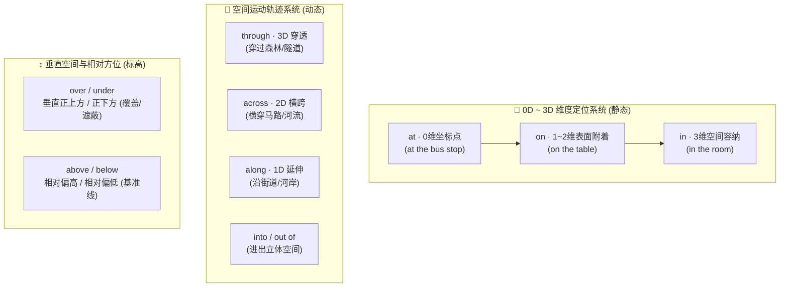

# 空间与介词

> **导读**：
> - 英语介词看似琐碎零散，但其底层都源自人类对**物理空间（点、线、面、体、相对方位与运动轨迹）**的直观认知。
> - 空间介词先确立物理几何模型，进而**隐喻投射**到“时间先后”以及“抽象状态（如情绪、组织、条件）”中。
> 
> 掌握介词的几何心智图谱，便无需死记成百上千条孤立词组，能自然形成地道的语感判断。

---

## 一、 空间介词几何体系全景图

英语空间介词根据几何维度与运动状态可分为三大核心系统：

---

## 二、 核心三剑客 `at` / `on` / `in`：点、面、体的降维与升维

`at`、`on`、`in` 构成了英语中最基础的几何维度定位基准：

| 介词 | 物理空间几何模型 | 空间典型场景 | 时间维度隐喻投射 | 抽象状态隐喻投射 |
| :--- | :--- | :--- | :--- | :--- |
| `at` | **0 维坐标点**（视作无体积的定位点） | `at the bus stop`, `at the corner`, `at home` | **精确时间点**：`at 5:00`, `at noon`, `at midnight` | **处于某目标状态**：`at work` (在工作), `at war` (在交战), `at peace` |
| `on` | **1~2 维表面接触**（有附着或支撑） | `on the table`, `on the wall`, `on the floor` | **具体某一天/某日**：`on Monday`, `on May 1st`, `on weekends` | **处于运行/依附状态**：`on fire` (着火), `on duty` (值班), `on vacation` |
| `in` | **3 维立体包围**（有边界与内部容积） | `in the room`, `in the box`, `in London` | **较长封闭时间段**：`in 2026`, `in May`, `in summer`, `in the morning` | **处于某种情绪/困境**：`in love` (恋爱), `in danger` (遇险), `in trouble` |

---

## 三、 动态轨迹与穿透介词深度辨析

表示“穿过 / 沿着 / 进出”的动态介词辨析：

| 介词 | 核心运动模型 | 几何物理特征 | 经典例词与搭配 |
| :--- | :--- | :--- | :--- |
| `through` | **3D 实体内部穿透** | 从一个**有体积/有阻碍的立体空间内部**这一端穿到另一端 | `walk through the forest` (穿过森林), `drive through the tunnel` (穿过隧道), `go through hardship` (经历磨难) |
| `across` | **2D 平面横跨** | 从一个**平面的这一边跨到另一边**（有交叉 cross 意象） | `walk across the street` (过马路), `swim across the river` (横渡河流), `bridge across the ocean` |
| `along` | **1D 沿线延伸** | 沿着线状物体的边缘**同向移动** | `walk along the river` (沿河边散步), `trees along the road` (路旁树木) |
| `into` | **由外向内穿入** | 运动轨迹从外界**跨越边界进入 3D 内部** | `jump into the pool` (跳入泳池), `translate A into B` (转化/翻译) |
| `onto` | **由低向上附着** | 运动轨迹落在一个**支撑表面的上方** | `step onto the stage` (登上舞台), `climb onto the roof` |

---

## 四、 垂直方位介词：垂直正对 vs 相对高低

| 相对位置 | 介词 | 空间相对特征 | 典型例句与语境 |
| :--- | :--- | :--- | :--- |
| **高位 (垂直正上方 / 覆盖)** | `over` | 垂直位于正上方，常伴有**跨越或覆盖**意象 | `The plane flew over the city.` (飞机飞越城市上空) `Put a blanket over the baby.` (盖毯子) |
| **高位 (相对偏高 / 不强调正对)**| `above` | 只要海拔、基准线或位置**高于参考点**即可 | `The birds are flying above the trees.` (在树林上方盘旋) `temperature above zero` (零度以上) |
| **低位 (垂直正下方 / 遮蔽)** | `under` | 垂直位于正下方，常被上方物体**完全遮蔽** | `The cat is sleeping under the table.` (猫在桌子下) `under control` (在控制之下) |
| **低位 (相对偏低 / 基准线下)** | `below` | 只要位置或水平线**低于某一基准点**即可 | `The valley is below sea level.` (低于海平面) `below average` (低于平均水平) |

---

## 五、 本课核心练习词汇

点击下列词汇与短语，在 Lexi 中查看释义并听标准发音：

- `spatial` · `dimension` · `surface` · `container` · `through`
- `across` · `along` · `into` · `onto` · `above`
- `below` · `under` · `over` · `tunnel` · `forest`
- `at work` · `on duty` · `in danger` · `walk across` · `go through`
