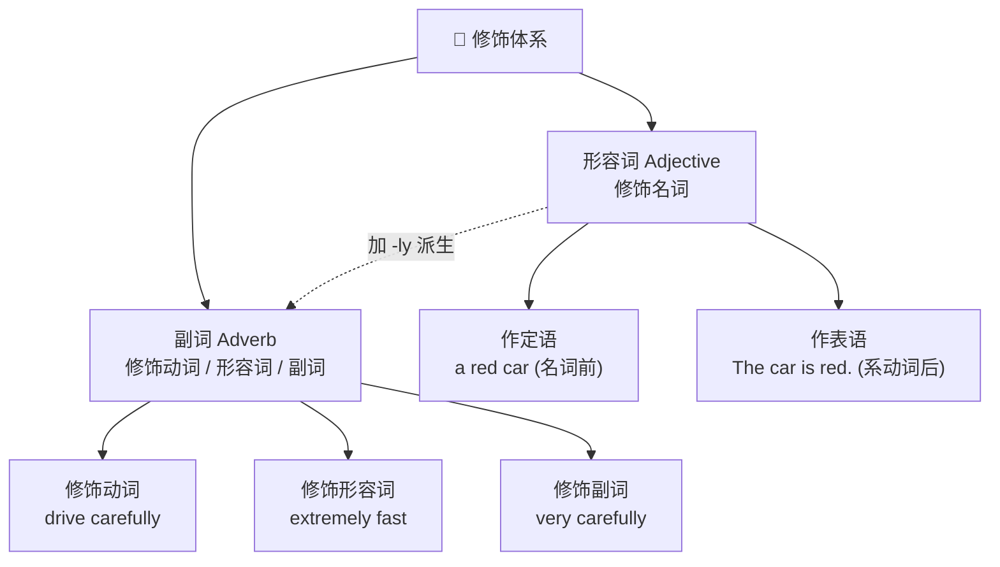

# 形容词、副词与比较

> **导读**：
> - 形容词修饰名词，副词修饰动词、形容词与其他副词——两者的**分工与位置**是英语修饰体系的根基。
> - 本课先建立修饰分工与位置规则，再处理副词构成中的同形异义陷阱，最后系统讲解比较级与最高级的构成和句型。

---

## 一、 形容词与副词的分工与位置全景图

---

## 二、 形容词作定语与表语、多形容词排序

### 1. 定语与表语的位置分工

| 句法功能 | 位置 | 示例 |
| :--- | :--- | :--- |
| 作定语 | 名词之前 | `a quiet village`, `an important decision` |
| 作表语 | 系动词（`be`, `seem`, `become`, `feel` 等）之后 | `The village seems quiet.` |
| 后置定语 | 修饰复合不定代词时后置 | `something important`, `anyone available` |

> [!NOTE]
> 少数形容词只能作表语（`afraid`, `asleep`, `alive`, `alone`）：说 `The baby is asleep.`，定语需换用 `a sleeping baby`。

### 2. 多形容词排序规则

多个形容词修饰同一名词时，按“主观评价 → 客观属性”的顺序排列：

| 顺序 | 类别 | 示例词 |
| :--- | :--- | :--- |
| 1 | 观点评价 | `beautiful`, `lovely`, `nice` |
| 2 | 大小长短 | `big`, `small`, `long` |
| 3 | 形状 | `round`, `flat` |
| 4 | 新旧年龄 | `old`, `new`, `young` |
| 5 | 颜色 | `red`, `black` |
| 6 | 来源产地 | `Chinese`, `Italian` |
| 7 | 材料用途 | `wooden`, `racing` |

> 综合示例：`a lovely small old red Italian wooden table`（日常以两三个形容词并用为常态）。

---

## 三、 副词构成与位置

### 1. `-ly` 派生规则

| 词尾 | 变化方式 | 示例 |
| :--- | :--- | :--- |
| 一般形容词 | 直接加 `-ly` | `quick` → `quickly`, `careful` → `carefully` |
| 辅音 + `y` | 改 `y` 为 `i` 加 `-ly` | `happy` → `happily`, `easy` → `easily` |
| `-le` 结尾 | 去 `e` 加 `y` | `simple` → `simply`, `possible` → `possibly` |
| `-ic` 结尾 | 加 `-ally` | `basic` → `basically` |

### 2. 同形异义陷阱：形容词与副词同形但含义分化

| 词形 | 作形容词含义 | 作副词含义 | 例句对照 |
| :--- | :--- | :--- | :--- |
| `hard` | 坚硬的；努力的 | 努力地、用力地 | `a hard stone` / `He works hard.` |
| `hardly` | — | **几乎不**（否定含义） | `I can hardly hear you.`（几乎听不见） |
| `late` | 迟的 | 迟地、晚 | `a late train` / `He arrived late.` |
| `lately` | — | **最近**（= `recently`） | `Have you seen him lately?` |
| `near` | 近的 | 在附近 | `the near future` / `Don't come near.` |
| `nearly` | — | 几乎、差不多 | `It's nearly done.` |

> [!WARNING]
> `hardly`、`lately` 与 `hard`、`late` 的含义完全不同，不可按字面类推。`hardly` 含否定意义，句中不再与 `not` 连用。

---

## 四、 比较级与最高级的构成

### 1. 规则变化速查表

| 词形条件 | 比较级 | 最高级 | 示例 |
| :--- | :--- | :--- | :--- |
| 单音节 / 部分双音节 | 加 `-er` | 加 `-est` | `tall → taller → tallest` |
| 辅音 + `y` | 改 `y` 为 `i` 加 `-er/-est` | 同左 | `easy → easier → easiest` |
| 重读闭音节 | 双写尾辅音 | 同左 | <code class="ord-variant">big → bigger → biggest</code> |
| 多音节词 | 前加 `more` | 前加 `most` | `careful → more careful → most careful` |

### 2. 不规则变化（必须整体记忆）

| 原级 | 比较级 | 最高级 | 备注 |
| :--- | :--- | :--- | :--- |
| `good` / `well` | <code class="ord-special">better</code> | <code class="ord-special">best</code> | 完全异根 |
| `bad` / `badly` | <code class="ord-special">worse</code> | <code class="ord-special">worst</code> | 完全异根 |
| `many` / `much` | <code class="ord-special">more</code> | <code class="ord-special">most</code> | 兼作比较标记词 |
| `little` | <code class="ord-special">less</code> | <code class="ord-special">least</code> | 表数量更少 |
| `far` | <code class="ord-variant">farther</code> / <code class="ord-variant">further</code> | <code class="ord-variant">farthest</code> / <code class="ord-variant">furthest</code> | `farther` 偏实际距离；`further` 兼表“进一步” |
| `old` | <code class="ord-variant">older</code> / <code class="ord-variant">elder</code> | <code class="ord-variant">oldest</code> / <code class="ord-variant">eldest</code> | `elder` 仅用于家庭成员长幼 |

---

## 五、 比较句型与用法

| 句型 | 结构公式 | 示例 |
| :--- | :--- | :--- |
| 同级比较 | `as + 原级 + as` | `She is as tall as her mother.` |
| 否定同级 | `not as / so + 原级 + as` | `It is not as cold as yesterday.` |
| 比较级 | `比较级 + than` | `This method is simpler than that one.` |
| 最高级 | `the + 最高级 + of / in 范围` | `He is the tallest of the three.` / `the best day in my life` |
| 越…越… | `the + 比较级, the + 比较级` | `The more you read, the more you learn.` |
| 越来越… | `比较级 + and + 比较级` / `more and more + 原级` | `It's getting colder and colder.` / `more and more difficult` |

> [!TIP]
> 最高级的范围介词：**同类个体集合用 `of`**（`the tallest of the three`），**场所或时间段用 `in`**（`the best student in our class`）。

---

## 六、 本课核心练习词汇

点击下列词汇，在 Lexi 中查看释义并听标准发音：

- `adjective` · `adverb` · `comparison` · `comparative` · `superlative`
- `better` · `best` · `worse` · `worst` · `farther`
- `furthest` · `carefully` · `hardly` · `lately` · `easiest`
