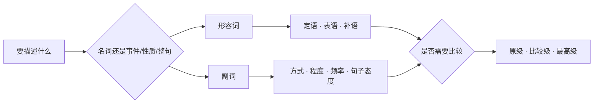

# 修饰、程度与比较

> **中心问题**：英语怎样描述性质、调整事件，并把两个对象放在同一尺度上比较？
> **核心成果**：能够确定形容词和副词的修饰范围，选择自然位置，构成比较形式，并解释比较句的尺度与省略。
> **阅读建议**：第二章掌握形容词位置，第三章处理副词范围，第四、五章进入比较；第六章讨论尺度、语用和歧义。
> **课程边界**：本课聚焦修饰与比较。分词形容词的来源见“非谓语动词”，从句级修饰见“句型结构与复合从句”。

形容词通常给人、事物或状态赋予性质；副词可以调整动作、程度、频率、说话人态度甚至整个命题。比较级不是简单给单词加 `-er`，而是选定一个尺度、比较基准和差值。

---

## 一、修饰关系的知识地图

```mermaid
flowchart LR
    A[要描述什么] --> B{名词还是事件/性质/整句}
    B --> C[形容词]
    B --> D[副词]
    C --> E[定语 · 表语 · 补语]
    D --> F[方式 · 程度 · 频率 · 句子态度]
    E --> G{是否需要比较}
    F --> G
    G --> H[原级 · 比较级 · 最高级]
```

判断步骤：

1. 修饰目标是名词、动词、形容词、副词还是整个句子？
2. 修饰语与目标之间是否隔着其他结构？
3. 词义是否可以自然分级？
4. 比较双方是否处于同一尺度和同一语法层级？
5. `than` 后省略的内容能否准确恢复？

---

## 二、形容词：名词内部与系词之后

### 1. 定语和表语

形容词常见两个位置：

- 名词前作定语：`a careful analysis`；
- 系词后作表语：`the analysis is careful`。

并非所有形容词都能自由进入两个位置：

- `the main reason` 很自然，但 `the reason is main` 通常不自然；
- `the child is asleep` 很自然，但 `an asleep child` 通常改为 `a sleeping child`；
- `an involved procedure` 可表示复杂的程序，`the people involved` 表示相关人员，位置会影响词义。

### 2. 系词不只包括 be

以下动词可以连接主语和性质：

- 感官：`look`、`sound`、`smell`、`taste`、`feel`；
- 变化：`become`、`get`、`grow`、`turn`；
- 保持：`remain`、`stay`、`keep`；
- 表象：`seem`、`appear`。

`The result looks promising but remains uncertain.`

系词后通常用形容词描述主语，而不是用方式副词：`The soup tastes good`，不是为了“修饰 taste”而写 `tastes well`。`well` 作形容词时可表示健康。

### 3. 多个形容词的顺序来自语义层次

常见倾向是：评价离说话人较近，材料和用途离名词较近：

`evaluation` → `size` → `age` → `shape` → `color` → `origin` → `material` → `purpose` → `noun`

例如 `a useful small digital sensor`。但这不是必须塞满的固定口诀：

- 分类性修饰通常靠近名词：`medical research center`；
- 并列、同等地位的形容词可用逗号或 `and`：`a clear, concise explanation`；
- 固定搭配和信息焦点可以改变一般顺序；
- 形容词过多时，应拆成后置短语或新句子。

### 4. 形容词可以带补语

- `afraid of failure`
- `ready to begin`
- `aware that the data are incomplete`
- `difficult for beginners to use`

补语完成形容词的意义。不能只背形容词本身，还要学习它允许的介词、不定式或从句结构。

### 5. -ed 和 -ing 形容词

粗略地说，`-ing` 形式描述引发感受的性质，`-ed` 形式描述体验者的状态：

- `a confusing instruction` / `a confused reader`
- `an interesting result` / `an interested reviewer`
- `a tiring task` / `a tired worker`

这不是“物用 -ing、人用 -ed”的规则。`a bored audience` 是人，`the damaged equipment` 是物；关键是事件中的语义角色。

---

## 三、副词：位置决定范围

### 1. 副词可以修饰不同层级

- 动词：`work carefully`；
- 形容词：`extremely useful`；
- 副词：`surprisingly quickly`；
- 数量或介词短语：`almost ten`、`right after lunch`；
- 整句：`Fortunately, no one was injured.`。

找副词时不要只找 `-ly`。`often`、`very`、`almost`、`here`、`fast` 都可以是副词，而 `friendly`、`likely` 可以是形容词。

### 2. 方式副词通常靠近动作或结果

- `She explained the method clearly.`
- `She carefully explained the method.`

句末位置常把方式作为新信息；动词前位置可能强调行动过程。长宾语后再放副词通常更清楚，避免把副词夹在动词和紧密宾语之间。

### 3. 频率副词有中位位置倾向

- 实义动词前：`They often revise the draft.`
- `be` 后：`The result is often unstable.`
- 第一个助动词后：`The result has often been misunderstood.`

句首或句末也可用于话题组织和强调：`Sometimes, the simplest model works best.`

### 4. 程度副词选择取决于尺度

- `very large`
- `slightly larger`
- `completely empty`
- `almost impossible`
- `highly effective`
- `deeply concerned`

搭配受词义和惯用法限制。`very impossible` 通常不自然，因为 `impossible` 表示尺度端点；在夸张语境中可能出现创造性用法，但不应作为中性规则。

### 5. 句子副词表达说话人立场

- `probably`：可能性判断；
- `fortunately`：评价；
- `frankly`：言说态度；
- `technically`：限定判断标准；
- `therefore`：逻辑连接。

`Technically, the request succeeded, but the returned data were unusable.`

句子副词修饰整个命题，不是描述某个动作“如何发生”。

### 6. only、even 和 almost 的位置会改变焦点

- `Only Maya reviewed the report.`：只有 Maya；
- `Maya only reviewed the report.`：她只是审阅，没有做更多；
- `Maya reviewed only the report.`：只审阅报告，没有审阅其他材料。

实际口语还依赖重音，但书面语应把焦点副词尽量放在目标附近。

---

## 四、比较形式怎样构成

### 1. 规则形式

短形容词通常使用 `-er/-est`：

- `small` → <lexi-word form="changed">`smaller`</lexi-word> → <lexi-word form="changed">`smallest`</lexi-word>
- `fast` → <lexi-word form="changed">`faster`</lexi-word> → <lexi-word form="changed">`fastest`</lexi-word>
- `large` → <lexi-word form="changed">`larger`</lexi-word> → <lexi-word form="changed">`largest`</lexi-word>

辅音—元音—辅音结尾的部分短词会双写末辅音：

- `big` → <lexi-word form="changed">`bigger`</lexi-word> → <lexi-word form="changed">`biggest`</lexi-word>
- `hot` → <lexi-word form="changed">`hotter`</lexi-word> → <lexi-word form="changed">`hottest`</lexi-word>

辅音加 `y` 通常变 `y` 为 `i`：

- `easy` → <lexi-word form="changed">`easier`</lexi-word> → <lexi-word form="changed">`easiest`</lexi-word>
- `happy` → <lexi-word form="changed">`happier`</lexi-word> → <lexi-word form="changed">`happiest`</lexi-word>

较长形容词通常使用 `more/most`：`more reliable`、`most significant`。

### 2. 不规则比较

- `good/well` → <lexi-word form="irregular">`better`</lexi-word> → <lexi-word form="irregular">`best`</lexi-word>
- `bad/badly` → <lexi-word form="irregular">`worse`</lexi-word> → <lexi-word form="irregular">`worst`</lexi-word>
- `many/much` → <lexi-word form="irregular">`more`</lexi-word> → <lexi-word form="irregular">`most`</lexi-word>
- `little` → <lexi-word form="irregular">`less`</lexi-word> → <lexi-word form="irregular">`least`</lexi-word>
- `far` → `farther/further` → `farthest/furthest`，选择受空间义、抽象义和地区习惯影响。

不要叠加两种形式：标准中性表达使用 `more useful`，不是 `more usefuller`。

### 3. 两音节词存在变体

`narrower`、`simpler`、`more common`、`more pleasant` 等选择受词尾、重音、语域和习惯影响。有些词允许两种形式但频率不同。遇到不确定形式时查词典或语料，而不是强套音节数规则。

---

## 五、比较结构与尺度

### 1. 比较级需要比较基准

`This model is faster than the previous version.`

句子建立“速度”尺度，并比较 `this model` 与 `the previous version`。比较双方应属于可比较类型：不要写成 `The speed of this model is faster than the previous version`，因为速度被拿来和版本比较。可以改为：

- `This model is faster than the previous version.`
- `The speed of this model is greater than that of the previous version.`

### 2. 原级表示同等或不足

- `as accurate as the reference method`
- `not as accurate as the reference method`
- `nearly as accurate as`
- `twice as large as`

`A is twice as large as B.` 通常表示 <lexi-notation>`A = 2 × B`</lexi-notation>。专业写作应避免含糊的 `two times larger than`。

### 3. 差值可以直接修饰比较级

- `three meters longer`
- `20 percent faster`
- `slightly more reliable`
- `far less expensive`
- `no better than the baseline`

差值说明两个对象在同一尺度上相距多少。

### 4. 最高级需要明确比较集合

`This was the fastest method in the benchmark.`

`the fastest` 需要一个可恢复集合。集合可以由 `in/of` 短语、上下文或类别提供：

- `the tallest of the three`
- `the most reliable method in the study`
- `one of the most common errors`

最高级不等于绝对事实，它只在给定集合和尺度内成立。

### 5. the + 比较级表示联动

`The more data we collect, the more stable the estimate becomes.`

这里两个 `the` 不是冠词，而是相关比较结构，表达两个变化共同推进。它不自动证明因果，只表达关联趋势。

### 6. 比较从句经常省略重复内容

`Maya reads more papers than Sam does.`

`does` 替代 `reads papers`。若写 `Maya likes Sam more than Lee`，可能表示 Maya 更喜欢 Sam 而不是 Lee，也可能表示 Maya 比 Lee 更喜欢 Sam。补出省略内容可以消除歧义：

- `Maya likes Sam more than she likes Lee.`
- `Maya likes Sam more than Lee does.`

---

## 六、尺度、绝对性质与语用

### 1. 可分级与不可分级不是绝对二分

典型可分级形容词允许程度和比较：`tall`、`expensive`、`likely`。端点或分类形容词通常不自然地接受 `very`：`dead`、`unique`、`chemical`。

但语言可以根据语境重新解释尺度：

- `more complete`：接近完成的程度；
- `very British`：典型特征程度；
- `the most unique feature` 在严格编辑中可能被修改，但实际语用中常表达“最与众不同”。

专业写作应区分逻辑定义和修辞分级。

### 2. 比较标准依赖语境

`The sensor is small.`

“小”需要隐含比较类：相对于手机元件、实验设备还是建筑传感器？在技术文本中，最好补充绝对尺寸或明确基准。

### 3. more than 和 less than 的范围

- `more than 100 samples`：数量超过 100；
- `more than useful`：不只是有用，程度更强；
- `no more than 100`：至多 100；
- `not more than 100`：不超过 100；
- `no less than 100`：至少 100，并带强调。

### 4. 否定比较需要检查推论

`A is not better than B` 只否认 A 更好，可能相同，也可能更差。它不等于 `A is worse than B`。科学论证中不要从“不显著更好”直接推导“等效”。

---

## 七、复习与核心词汇

完成本课后，应能：

- 判断修饰目标和修饰范围；
- 区分定语、表语和句子副词；
- 根据词义和惯用法选择副词位置；
- 构成规则与不规则比较形式；
- 保持比较对象平行；
- 解释比较句的尺度、集合、差值和省略。

核心词汇：

`adjective` · `adverb` · `modifier` · `attributive` · `predicative` · `degree` · `frequency` · `focus` · `scope` · `gradable` · `comparative` · `superlative` · `scale` · `standard` · `ellipsis`
