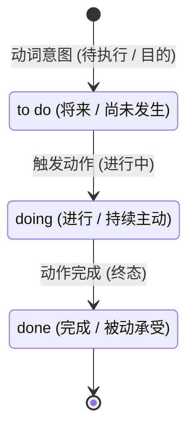

# 非谓语动词

> **导读**：
> - 英语语法中最严格的铁律之一是：**一个简单句在没有连词的情况下，有且仅能有一个谓语动词**。
> - 当句子中需要表达多个动作时，其余动作必须“退居二线”，转化为**非谓语动词（Non-finite Verbs）**。
> 
> 非谓语动词的三种形式 `doing`、`to do` 与 `done`，本质上是在表达**动作的主被动方向**与**相对于主句的“逻辑时间差”**。

---

## 一、 非谓语动词三大形态与时间逻辑全景图

---

## 二、 三大非谓语形态核心特性对照表

| 非谓语形态 | 语法名称 | 核心逻辑时间 | 主动 / 被动 | 核心语境与功能 | 经典例句 |
| :--- | :--- | :--- | :--- | :--- | :--- |
| **`to do`** | **动词不定式 (Infinitive)** | **将来 / 未发生** | 主动 (除非 to be done) | 表示**目的、计划、倾向、未来的动作** | `I decided to study abroad.` (决定去留学：尚未成行) `He went there to meet his friend.` (去那里的目的) |
| **`doing`** | **现在分词 / 动名词 (Participle / Gerund)** | **进行中 / 持续发生** | **主动发出** | 表示**正在进行的过程、长期的习惯、主动的伴随状态** | `I saw him walking on the street.` (看到他正在走) `Swimming is good exercise.` (游泳这项长期的运动) |
| **`done`** | **过去分词 (Past Participle)** | **已完成 / 状态** | **被动承受** | 表示**动作已经完成、或者主语被动承受该动作** | `The broken window was fixed.` (窗户被打破了) `Given more time, we can finish it.` (如果被给予更多时间) |

---

## 三、 接 `to do` 与接 `doing` 的语义反转精讲

许多动词后既可以接 `to do` 又可以接 `doing`，其含义差异严格遵循“**`to do` 代表未发生的未来目的，`doing` 代表已发生或正在进行的事情**”：

| 核心动词 | 接 `to do` (未发生 / 目的) | 接 `doing` (已发生 / 正在进行) | 语义对比解析 |
| :--- | :--- | :--- | :--- |
| `remember` | `remember to do sth.` → 记得**去做某事**（事情还没做，提醒去做） | `remember doing sth.` → 记得**曾经做过某事**（事情已完成，回忆过去） | `Remember to lock the door.` (记得去锁门) `I remember locking the door.` (我记得我锁过门了) |
| `forget` | `forget to do sth.` → 忘记**去执行某事**（未完成） | `forget doing sth.` → 忘记**曾经做过某事**（做过了但遗忘了） | `Don't forget to post the letter.` (别忘了去寄信) `I forgot meeting him before.` (我忘了他以前见过我) |
| `stop` | `stop to do sth.` → 停下手中的事，**转而去开启做另一件事** | `stop doing sth.` → **停止中断正在进行的某件事** | `He was tired, so he stopped to rest.` (停下来去休息) `Please stop talking.` (请停止讲话) |
| `regret` | `regret to do sth.` → **很遗憾地将要做某事**（如遗憾地宣布坏消息） | `regret doing sth.` → **后悔曾经做过某事**（为过去的行为后悔） | `We regret to inform you that...` (很遗憾地通知您) `I regret saying those words.` (我后悔说了那些话) |
| `try` | `try to do sth.` → **尽力、设法去达成某目标**（强调克服困难） | `try doing sth.` → **尝试体验一下某种方法**（强调尝试性探索） | `He tried to climb the wall.` (他设法翻墙) `Try adding some salt.` (试着加点盐看看味道) |

---

## 四、 分词作定语与状语的极简主被动判断

### 1. 分词作定语修饰名词（主动进行 vs 被动完成）

| 修饰对象 | 使用 `doing` (主动 / 进行) | 使用 `done` (被动 / 完成) | 差异对比 |
| :--- | :--- | :--- | :--- |
| **国家状态** | `developing country` (发展中国家：正在发展中) | `developed country` (发达国家：已经发展完成) | 进程 vs 终态 |
| **树叶状态** | `falling leaves` (飘落中的树叶：正在下落) | `fallen leaves` (落叶：已经落在地上的叶子) | 进行 vs 完成 |
| **开水状态** | `boiling water` (沸腾中的水：水正在翻滚) | `boiled water` (凉开水：曾经烧开过的水) | 进行 vs 结果 |
| **事件感受** | `interesting story` (令人感到有趣的故事：主动赋予特征) | `interested listener` (感兴趣的听众：被动感到兴趣) | 主动输出 vs 被动接收 |

---

### 2. 分词作状语的逻辑主语一致性原则

> **判断法则**：非谓语动词的逻辑主语，**必须是主句的主语**。  
> - 如果主句主语**主动发出**该动作，用 `doing`；  
> - 如果主句主语**被动承受**该动作，用 `done`。

- **主动例句（`doing`）**：  
  `Hearing the bad news, he couldn't help crying.`  
  （逻辑主语是 `he`，他主动听到消息，故使用 `Hearing`）
- **被动例句（`done`）**：  
  `Seen from the top of the hill, the city looks beautiful.`  
  （逻辑主语是 `the city`，城市是被人类俯瞰，故使用 `Seen`）

---

## 五、 本课核心练习词汇

点击下列词汇与短语，在 Lexi 中查看释义并听标准发音：

- `infinitive` · `participle` · `gerund` · `decide` · `remember`
- `forget` · `regret` · `inform` · `developing` · `developed`
- `boiling` · `boiled` · `interesting` · `interested` · `crying`
- `remember to do` · `remember doing` · `stop to do` · `stop doing`
