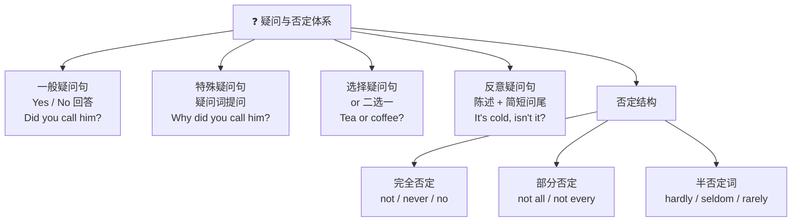

# 疑问句与否定

> **导读**：
> - 英语疑问句的核心机制是**操作词（助动词/系动词/情态动词）前移**；否定的核心机制是**在操作词后加 `not`**。两者共享同一套句法底座。
> - 本课从四类疑问句入手，理解 do-support 助动词原理，再系统梳理否定层级与反意疑问句的构成规则。

---

## 一、 疑问句与否定体系全景图

---

## 二、 一般疑问句与助动词

### 1. 操作词前移原理

句中若已有 `be` 动词、助动词或情态动词，直接将其前移至句首：

| 陈述句 | 一般疑问句 | 前移成分 |
| :--- | :--- | :--- |
| `She is a doctor.` | `Is she a doctor?` | `is` |
| `They have finished.` | `Have they finished?` | `have` |
| `He can swim.` | `Can he swim?` | `can` |

### 2. do-support：无操作词时引入 `do / does / did`

实义动词单独作谓语的陈述句没有可前移的操作词，需**引入助动词 `do`** 承担前移与否定功能：

| 陈述句 | 疑问句 | 否定句 |
| :--- | :--- | :--- |
| `You like coffee.` | `Do you like coffee?` | `You don't like coffee.` |
| `She works here.` | `Does she work here?` | `She doesn't work here.` |
| `He left early.` | `Did he leave early?` | `He didn't leave early.` |

> [!IMPORTANT]
> `do / does / did` 一旦引入，后面的实义动词**恢复原形**：`Did he leave...?`（不是 `Did he left...?`）。

### 3. 祈使句及其否定

祈使句以动词原形开头；否定直接在前面加 `Don't`（或更正式的 `Never`）：`Be quiet.` → `Don't be late.` / `Never give up.`

---

## 三、 特殊疑问句、选择疑问句与感叹句

### 1. 疑问词家族

| 疑问词 | 提问对象 | 示例 |
| :--- | :--- | :--- |
| `what` | 事物、职业 | `What do you do?` |
| `who` / `whom` / `whose` | 人 / 宾格 / 所属 | `Whose pen is this?` |
| `which` | 限定范围内选择 | `Which color do you prefer?` |
| `when / where / why / how` | 时间 / 地点 / 原因 / 方式 | `How did you fix it?` |
| `how + 形/副` | 程度 | `How long will it take?` |

### 2. 疑问词作主语与作宾语的语序差异

> [!NOTE]
> 疑问词**作宾语**时须倒装（引入助动词）；疑问词**作主语**时保持陈述语序，无需 `do`。

| 角色 | 语序 | 示例 |
| :--- | :--- | :--- |
| 疑问词作宾语 | 疑问词 + 助动词 + 主语 + 动词 | `Who did you meet?`（你遇见了谁？） |
| 疑问词作主语 | 疑问词 + 谓语（陈述语序） | `Who met you?`（谁遇见了你？） |

### 3. 选择疑问句与感叹句

- **选择疑问句**：用 `or` 连接选项，不能用 Yes/No 回答：`Would you like tea or coffee?`
- **感叹句**：
  - `What + (a/an) + 形容词 + 名词 (+ 主谓)`：`What a clever idea (it is)!`
  - `How + 形容词/副词 (+ 主谓)`：`How fast time flies!`

---

## 四、 否定结构

| 否定类型 | 构成方式 | 示例 | 说明 |
| :--- | :--- | :--- | :--- |
| **完全否定** | `not / no / never / nothing / nobody` | `I don't agree.` / `Nothing happened.` | 整体否定 |
| **部分否定** | `not + all / every / both / always` | `Not all birds can fly.`（并非所有鸟都会飞） | 只否定一部分 |
| **双重否定** | 两个否定成分叠加 | `I can't not go.`（我不能不去） | 表达强烈肯定含义 |
| **半否定** | `hardly / seldom / rarely / few / little` | `He seldom complains.` | 词本身含否定意义，**不再与 `not` 连用** |

> [!WARNING]
> 部分否定与完全否定差异巨大：`All that glitters is not gold.` 是“闪光的**未必**都是金子”（部分否定），而非“闪光的都不是金子”。

---

## 五、 反意疑问句构成与应答

### 1. 基本规则：前肯后否、前否后肯

| 陈述部分 | 疑问尾 | 示例 |
| :--- | :--- | :--- |
| 肯定陈述 | 否定尾 | `You are tired, aren't you?` |
| 否定陈述 | 肯定尾 | `She doesn't smoke, does she?` |

疑问尾的助动词与时态必须与陈述部分一致；陈述部分无操作词时，疑问尾用 `do / does / did`：`He lives nearby, doesn't he?`

### 2. 特殊情形速查

| 情形 | 疑问尾规则 | 示例 |
| :--- | :--- | :--- |
| `I am...` | 用 `aren't I` | `I'm late, aren't I?` |
| `Let's...` | 用 `shall we` | `Let's start, shall we?` |
| 祈使句 | 用 `will you` | `Open the door, will you?` |
| 含半否定词 | 视为否定陈述，用肯定尾 | `He never lies, does he?` |
| 不定代词主语（`everyone` 等） | 疑问尾常用 `they` | `Everyone is here, aren't they?` |

> [!TIP]
> 应答以**事实**为准，与问句的肯定/否定形式无关：`You don't like it, do you?` 若事实是喜欢，仍回答 `Yes, I do.`。

---

## 六、 本课核心练习词汇

点击下列词汇，在 Lexi 中查看释义并听标准发音：

- `question` · `negative` · `auxiliary` · `interrogative` · `whether`
- `whose` · `never` · `seldom` · `rarely` · `hardly`
- `deny` · `refuse` · `whisper` · `wonder` · `whichever`
