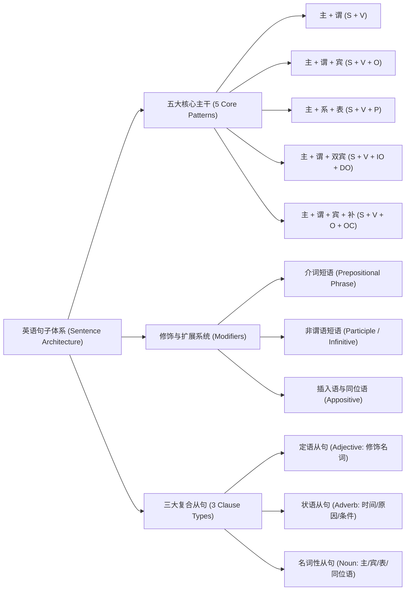
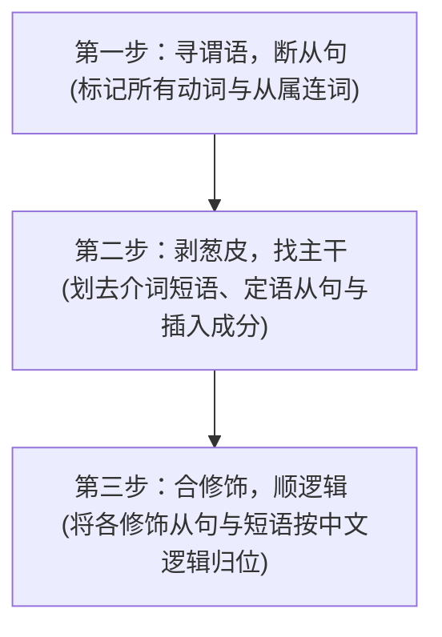

# 句型结构与复合从句

> **导读**：
> - 英语是一门**高度强调形式逻辑与主干骨架（Tree Structure）**的语言。
> - 无论长达数十甚至上百词的论文复杂句，其底层核心都绝脱离不了**五大基本句型骨架**。长句只是在主干上像“搭积木”一样挂载了从句、非谓语短语与介词修饰。
> 
> 掌握“主干抓取与修饰剥离”的心智模型，就能在阅读外刊、学术文献和技术规范时做到一眼看穿句式结构。

---

## 一、 英语句子生成与扩展全景架构

---

## 二、 英语五大核心基本句型公式表

任何简单句的主干均属于以下五种之一：

| 句型类别 | 句型结构公式 | 谓语动词特征 | 结构说明 | 典型例句拆解 |
| :--- | :--- | :--- | :--- | :--- |
| **句型 1** | **主语 + 不及物谓语 (S + V)** | 不及物动词（无需宾语即可表达完整含义） | 动作由主语发出，不涉及承受者 | `The sun rises.` (太阳升起) `Birds fly.` (鸟儿飞翔) |
| **句型 2** | **主语 + 及物谓语 + 宾语 (S + V + O)** | 及物动词（必须跟动作承受对象） | 动作直接作用于宾语 | `I wrote a letter.` (我写了一封信) `He bought a computer.` |
| **句型 3** | **主语 + 连系动词 + 表语 (S + V + P)** | 系动词 (`be`, `seem`, `feel`, `become`, `look`) | 谓语无实际动作，表语说明主语的性质、特征或身份 | `The apple tastes sweet.` (苹果尝起来很甜) `She is a doctor.` |
| **句型 4** | **主语 + 谓语 + 间宾 + 直宾 (S + V + IO + DO)** | 双宾动词 (`give`, `send`, `show`, `buy`, `pass`) | `间接宾语(人) + 直接宾语(物)`，可转换为 `to/for` 结构 | `He gave me a book.` → `He gave a book to me.` |
| **句型 5** | **主语 + 谓语 + 宾语 + 宾补 (S + V + O + OC)** | 复合及物动词 (`make`, `find`, `keep`, `call`) | 宾语后必须加补语，否则句意不完整（宾语与补语有逻辑主谓关系） | `We made him our captain.` (我们选他当队长) `I find English interesting.` |

---

## 三、 三大复合从句体系功能速查

从句本质上是“一个具有完整主谓结构的小句子充当主句中的某一语法成分”：

| 从句类别 | 充当的功能角色 | 引导词 (Connectives) | 作用与定位 | 经典例句 |
| :--- | :--- | :--- | :--- | :--- |
| **定语从句 (Adjective Clause)** | 相当于一个**形容词**，后置修饰先行词名词 | 关系代词：`that`, `which`, `who`, `whom`, `whose` 关系副词：`where`, `when`, `why` | 描述、限定或补充说明前方的名词 | `The man who called you yesterday is my teacher.` (昨天给你打电话的那个人) |
| **状语从句 (Adverbial Clause)** | 相当于一个**副词**，修饰动词、形容词或整句 | 时间：`when`, `while`, `after` 原因：`because`, `as` 条件：`if`, `unless` 让步：`although`, `even if` | 交代动作发生的背景、时间、原因、前提条件或逻辑让步 | `Although it was raining hard, we continued our journey.` (尽管雨下得很大) |
| **名词性从句 (Noun Clause)** | 相当于一个**名词**，可充当主语、宾语、表语或同位语 | 连词：`that`, `whether`, `if` 连接代词：`what`, `who`, `which` 连接副词：`how`, `when`, `where`, `why` | 充当句子的核心构件（如宾语从句、主语从句） | `What he said at the meeting surprised everyone.` (他在会上说的话让所有人吃惊) |

---

## 四、 长难句拆解 3 步法实战

面对结构复杂的长句，严格执行以下标准拆解流程：

### 经典长难句实战拆解演示

> **原长难句**：  
> `The scientists [who are working in the national laboratory] have discovered [that the newly developed material (which was tested last week) can significantly reduce energy loss in high-temperature environments].`

- **第 1 步：寻谓语与从属连词**：
  - 关系词与连词：`who`, `that`, `which`
  - 动词群：`are working`, `have discovered` (核心主动词), `was tested`, `can reduce`
- **第 2 步：剥离修饰，提取主干**：
  - 去除 `who...` 定语从句（修饰 scientists）
  - 去除 `which...` 定语从句（修饰 material）
  - 提取最核心主干：**`The scientists have discovered that ...`（科学家们已经发现了……）**
- **第 3 步：理顺宾语从句内部逻辑**：
  - 宾语从句核心主干：`The newly developed material can significantly reduce energy loss.`（新开发的材料能显著降低能量损耗）。
  - 合并修饰得到通顺译文：*“国家实验室的科学家们发现，上周测试的新型材料能够在高温环境下显著降低能量损耗。”*

---

## 五、 本课核心练习词汇

点击下列词汇与短语，在 Lexi 中查看释义并听标准发音：

- `sentence` · `subject` · `predicate` · `object` · `complement`
- `adjective` · `adverbial` · `clause` · `connective` · `laboratory`
- `discovered` · `significantly` · `reduce` · `environment` · `appositive`
