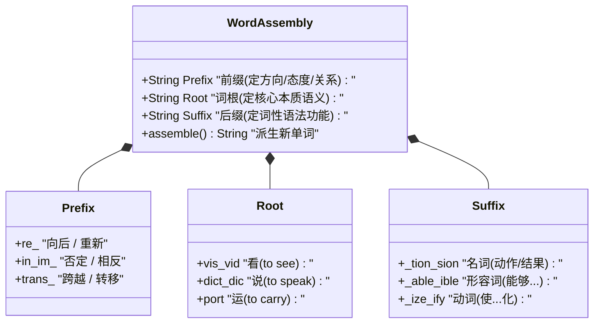

# 核心词根与词缀

> **导读**：
> - 英语词汇量虽然庞大，但超过 70% 的学术词汇、科技词汇与书面语均由**“前缀（Prefix） + 词根（Root） + 后缀（Suffix）”**像积木一样装配而成。
> - **词根**决定单词的核心本质含义（如同汉字的偏旁部首）；**前缀**改变语义方向或态度（如反向、提前、共同）；**后缀**决定词性（名词、动词、形容词、副词）。
> 
> 掌握 20 个超级核心词根与高频词缀，便能建立“见词拆词、触类旁通”的词汇生长网络。

---

## 一、 构词体系全景逻辑图

---

## 二、 高频核心前缀与后缀分类速查表

### 1. 核心前缀分类表

| 前缀类别 | 常见前缀 | 核心语义意图 | 典型构词例词 |
| :--- | :--- | :--- | :--- |
| **否定 / 相反** | `un-`, `non-` | 不、非、未 | `unhappy`, `unusual`, `non-stop` |
| **否定 / 逆转** | `in-`, `im-`, `il-`, `ir-` | 不、非（随辅音同化变音） | `invisible`, `impossible`, `illegal`, `irregular` |
| **分离 / 否定** | `dis-` | 离开、相反、不 | `disagree`, `discover`, `disappear` |
| **错误 / 不当** | `mis-` | 错误的、不良的 | `misunderstand`, `mislead`, `mistake` |
| **再次 / 向后** | `re-` | 重新、再、向后 | `rebuild`, `review`, `return`, `recall` |
| **预先 / 提前** | `pre-` | 在……之前、预先 | `predict`, `pre-training`, `prevent` |
| **向前 / 支持** | `pro-` | 向前、推动、赞同 | `progress`, `promote`, `prospect` |
| **下方 / 次级** | `sub-` | 在……下方、次于 | `subway`, `submarine`, `subdivide` |
| **跨越 / 转换** | `trans-` | 横跨、转移、转变 | `transport`, `transform`, `translate` |
| **共同 / 汇聚** | `con-`, `com-`, `col-` | 一起、共同、完全 | `connect`, `combine`, `collect`, `construct` |

---

### 2. 核心后缀与词性转换表

| 后缀类别 | 常见后缀 | 赋予的词性与功能 | 典型构词例词 |
| :--- | :--- | :--- | :--- |
| **名词后缀** | `-tion`, `-sion` | 表示动作的过程、状态或结果 | `action`, `decision`, `attention`, `education` |
| **名词后缀** | `-ment`, `-ness` | 表示性质、状态或具体事物 | `development`, `movement`, `happiness`, `darkness` |
| **名词后缀 (人/物)** | `-er`, `-or`, `-ist` | 执行某动作的人、专家或仪器 | `teacher`, `actor`, `scientist`, `artist`, `printer` |
| **形容词后缀** | `-able`, `-ible` | 能够……的、具备……能力的 | `portable` (便携的), `visible` (可见的), `readable` |
| **形容词后缀** | `-ive`, `-ous` | 具备……特性的、充满……的 | `creative`, `attractive`, `famous`, `dangerous` |
| **形容词后缀** | `-ful`, `-less` | 充满……的 vs 毫无……的 | `helpful` (有帮助的) vs `helpless` (无助的) |
| **动词后缀** | `-ize`, `-ify`, `-ate` | 使……化、使成为…… | `realize`, `modernize`, `simplify`, `generate` |

---

## 三、 20 大超级黄金词根全景精讲与单词裂变表

掌握以下 20 个高产词根，可快速辐射出数千个中高阶英语词汇：

| 序号 | 词根 | 词根核心原义 | 派生核心词汇谱系 | 构词分解与词义解析 |
| :--- | :--- | :--- | :--- | :--- |
| 1 | `vis / vid` | **看 (to see)** | `vision`, `visible`, `visit`, `provide`, `evidence` | `pro-` (向前) + `vide` (看) → 为将来提前看好准备 → **`provide` (提供)** `e-` (出) + `vid` (看) + `-ence` → 看得见摆在眼前的证据 → **`evidence` (证据)** |
| 2 | `dict / dic` | **说 / 命令 (to speak)** | `dictate`, `predict`, `verdict`, `contradict`, `dictionary` | `pre-` (提前) + `dict` (说) → 提前说出未来 → **`predict` (预测)** `contra-` (反对) + `dict` (说) → 反着说 → **`contradict` (反驳/矛盾)** |
| 3 | `port` | **携带 / 运送 (to carry)** | `import`, `export`, `transport`, `portable`, `report` | `im-` (向内) + `port` (运) → 运进国内 → **`import` (进口)** `ex-` (向外) + `port` (运) → 运出国外 → **`export` (出口)** |
| 4 | `spect / spic` | **看 / 审视 (to look)** | `inspect`, `respect`, `prospect`, `suspect`, `spectator` | `in-` (向内) + `spect` (看) → 往里面仔细看 → **`inspect` (检查/视察)** `re-` (再/反复) + `spect` (看) → 令人刮目相看 → **`respect` (尊敬)** |
| 5 | `tract` | **拉 / 抽取 (to drag/pull)** | `attract`, `extract`, `contract`, `distract`, `abstract` | `at-` (向) + `tract` (拉) → 把人拉过来 → **`attract` (吸引)** `ex-` (出) + `tract` (拉) → 抽拉出来 → **`extract` (提取/拔出)** |
| 6 | `struct` | **建造 / 构筑 (to build)** | `structure`, `construct`, `destruct`, `instruct`, `obstruct` | `con-` (共同) + `struct` (建) → 一起建起来 → **`construct` (建设/建造)** `de-` (向下破坏) + `struct` (建) → 拆毁推倒 → **`destruct` (破坏/毁灭)** |
| 7 | `form` | **形状 / 形式 (shape/form)**| `transform`, `reform`, `conform`, `inform`, `uniform` | `trans-` (转换) + `form` (形) → 改变外形与结构 → **`transform` (转变/变形)** `re-` (重新) + `form` (形) → 重新塑造形式 → **`reform` (改革/改良)** |
| 8 | `press` | **压 / 挤 (to press)** | `express`, `impress`, `compress`, `depress`, `suppress` | `ex-` (向外) + `press` (挤压) → 把内心情感挤出来表达 → **`express` (表达)** `im-` (向内) + `press` (压) → 在心里留下深深烙印 → **`impress` (留下深刻印象)** |
| 9 | `scrib / script`| **写 (to write)** | `describe`, `prescribe`, `manuscript`, `transcript`, `inscribe` | `de-` (向下) + `scribe` (写) → 逐条记录写下来 → **`describe` (描述/描写)** `pre-` (提前) + `scribe` (写) → 医生在用药前提前写下处方 → **`prescribe` (开药方/规定)** |
| 10 | `duc / duct` | **引导 / 带领 (to lead)** | `introduce`, `produce`, `conduct`, `reduce`, `deduct` | `intro-` (向内) + `duce` (引) → 引领进门相互认识 → **`introduce` (介绍/引入)** `pro-` (向前) + `duce` (引) → 引导推向前方产出 → **`produce` (生产/制造)** |
| 11 | `aud / audit` | **听 (to hear)** | `audio`, `audience`, `audible`, `auditorium`, `audit` | `audi-` (听) + `-ence` (人群) → 来听音乐/演讲的人群 → **`audience` (观众/听众)** `aud` (听) + `-ible` (能) → 听得见的 → **`audible` (听得清的)** |
| 12 | `mit / miss` | **发送 / 派遣 (to send)** | `admit`, `commit`, `transmit`, `mission`, `dismiss` | `trans-` (跨越) + `mit` (送) → 跨越空间发送信号 → **`transmit` (传输/发射)** `dis-` (分开) + `miss` (送) → 打发分散送走 → **`dismiss` (解散/开除)** |
| 13 | `fact / fect` | **做 / 制作 (to make/do)** | `factory`, `manufacture`, `affect`, `effect`, `perfect` | `manu-` (手) + `facture` (制作) → 原指手工制作，现指工业制造 → **`manufacture` (制造/加工)** `per-` (完全) + `fect` (做) → 全部做完毫无瑕疵 → **`perfect` (完美的)** |
| 14 | `cept / capt` | **抓 / 接收 (to take/seize)**| `accept`, `concept`, `capture`, `capable`, `intercept` | `ac-` (去) + `cept` (接) → 迎上去接过来 → **`accept` (接受)** `con-` (共同) + `cept` (抓取) → 在脑海中综合抓取形成的想法 → **`concept` (概念/观念)** |
| 15 | `gen` | **产生 / 种类 (to birth/kind)**| `generate`, `generator`, `genius`, `gender`, `generic` | `gen` (产生) + `-er-` + `-ate` (动词) → 产生能量/内容 → **`generate` (生成/产生)** `gen` (产生) + `-ius` → 与生俱来的天赋 → **`genius` (天才)** |
| 16 | `sens / sent` | **感觉 / 意识 (to feel)** | `sense`, `sensitive`, `consent`, `resent`, `sensor` | `sens` (感觉) + `-or` (器) → 能感知物理信号的器件 → **`sensor` (传感器)** `con-` (共同) + `sent` (感觉) → 感觉一致 → **`consent` (同意/赞同)** |
| 17 | `ped / pod` | **脚 (foot)** | `pedal`, `pedestrian`, `tripod`, `expedition` | `ped` (脚) + `-al` (名词) → 用脚踩的踏板 → **`pedal` (踏板/踩踏板)** `ped` (脚) + `-estrian` → 用双脚走路的人 → **`pedestrian` (行人)** |
| 18 | `ject` | **投掷 / 扔 (to throw)** | `project`, `reject`, `inject`, `eject`, `subject` | `pro-` (向前) + `ject` (扔) → 把光影/计划投向前方 → **`project` (项目/投影)** `re-` (向后回退) + `ject` (扔) → 扔回去不收 → **`reject` (拒绝/驳回)** |
| 19 | `chron` | **时间 (time)** | `synchronize`, `chronological`, `chronic` | `syn-` (同时) + `chron` (时间) + `-ize` → 时间完全保持一致 → **`synchronize` (同步)** `chron` (时间) + `-ic` → 持续时间很长的病症 → **`chronic` (慢性的/长期的)** |
| 20 | `bio / logy` | **生命 / 学科 (life/study)** | `biology`, `biography`, `technology`, `geology` | `bio` (生命) + `-logy` (学科) → 研究生命的科学 → **`biology` (生物学)** `bio` (生命) + `graph` (写) + `-y` → 记录某人一生的书 → **`biography` (传记)** |

---

## 四、 见词拆词实战演示

面对陌生中长单词，按“**剥离前缀 → 寻找词根 → 分析后缀**”的顺序拆解：

- **例 1：`unprecedented`**  
  - 拆解：`un-` (无/未) + `pre-` (先/前) + `cede` (走) + `-ent` + `-ed`  
  - 逻辑：没有任何走在前面先例的 → **史无前例的 / 空前的**
- **例 2：`indispensable`**  
  - 拆解：`in-` (不) + `dis-` (分发散开) + `pens` (花费/称量) + `-able` (可……的)  
  - 逻辑：不能被分走或省去的 → **必不可少的 / 不可或缺的**
- **例 3：`transportation`**  
  - 拆解：`trans-` (横跨) + `port` (运输) + `-ation` (名词后缀)  
  - 逻辑：跨越空间的搬运活动 → **交通运输 / 交通工具**

---

## 五、 本课核心练习词汇

点击下列词汇与短语，在 Lexi 中查看释义并听标准发音：

- `prefix` · `suffix` · `root` · `provide` · `evidence`
- `predict` · `import` · `export` · `inspect` · `respect`
- `attract` · `extract` · `construct` · `transform` · `express`
- `describe` · `introduce` · `audience` · `accept` · `generate`
