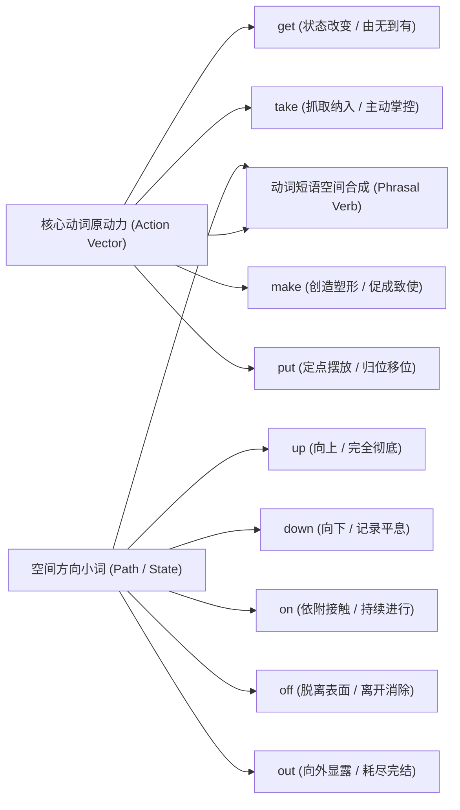

# 核心动词与短语动词

> **导读**：
> - 许多学习者在写作与口语中习惯堆砌生僻大词，然而母语者的地道表达中，高频出现的反而是最基础的小动词。
> - 英语动词短语（Phrasal Verbs）的本质是：**动词提供“基础动作原动力（Action Vector）”，小副词/介词提供“空间方向与状态终点（Path Vector）”**。
> 
> 掌握四大核心动词（`get`, `take`, `make`, `put`）与空间小词的碰撞组合网络，就能自如运用数百个高频地道表达。

---

## 一、 动词短语空间心智合成模型全景图

---

## 二、 四大核心动词的“原动力心智模型”

| 核心动词 | 核心心智模型 | 底层力学机制 | 经典场景引申 |
| :--- | :--- | :--- | :--- |
| `get` | **状态改变 (State Transition)** | 描述从“状态 A”转变为“状态 B”，或物理位置上的“到达与获得” | `get rich` (变富), `get angry` (变生气), `get there` (到达那里) |
| `take` | **主动抓取 (Take & Grasp)** | 主动伸出手将某物“抓进自己的控制范围”内，或占用时间与资源 | `take a photo` (抓取画面), `take time` (耗费时间), `take care` |
| `make` | **从无到有 (Create & Shape)**| 经过加工制造创造出新事物，或通过外力促成某种结果（使役动词） | `make a plan` (制订计划), `make money` (赚钱), `make him laugh` |
| `put` | **定位摆放 (Place & Shift)** | 将某物移动并安置在特定的物理空间或抽象位置上 | `put it here` (放这里), `put into words` (付诸言语) |

---

## 三、 空间小词（Particles）的方向与抽象含义速查

| 空间小词 | 物理基础空间方向 | 抽象核心引申义 | 典型短语示例 |
| :--- | :--- | :--- | :--- |
| `up` | 向上升起（由低至高） | **完全、彻底、结束**（把事情做满做完） | `eat up` (吃光), `clean up` (打扫干净), `use up` (耗尽) |
| `down` | 向下降落（由高至低） | **平息、记录在纸上、停止运转** | `calm down` (冷静下来), `write down` (记下来), `break down` (故障) |
| `on` | 接触表面、附着其上 | **持续不断进行、处于开启运转状态** | `keep on` (继续), `go on` (接着做), `turn on` (打开电源) |
| `off` | 离开表面、脱离断开 | **离开、分离、取消、推迟** | `take off` (飞机起飞/脱衣), `call off` (取消), `put off` (推迟) |
| `out` | 由内向外移动 | **完全显露弄清、消失、耗尽** | `find out` (查明真相), `run out` (用光), `put out` (扑灭火焰) |

---

## 四、 四大核心动词高频搭配全景矩阵表

### 1. `get` 核心搭配矩阵（状态改变与位移）

| 短语 | 空间与动作合成逻辑 | 中文释义 | 典型例句 |
| :--- | :--- | :--- | :--- |
| `get up` | 身体由卧床到**向上站起** | 起床 / 站起来 | `I usually get up at 7:00.` |
| `get on` | 踏上**交通工具的表面** | 上车 / 上船 / 上飞机 | `Get on the bus quickly.` |
| `get off` | 离开**交通工具表面** | 下车 / 下船 | `We get off at the next station.` |
| `get over` | 从阻碍上方**跨越过去** | 克服困难 / 从疾病或失恋中痊愈 | `She will soon get over the flu.` (康复) |
| `get along` | 沿着同一条线**顺畅前行** | 与某人相处融洽 / 进展顺利 | `Do you get along with your colleagues?` |
| `get through` | 穿透隧道或障碍**打通连接** | 接通电话 / 度过艰难时期 | `I couldn't get through to him.` (电话未接通) |

---

### 2. `take` 核心搭配矩阵（抓取与接纳）

| 短语 | 空间与动作合成逻辑 | 中文释义 | 典型例句 |
| :--- | :--- | :--- | :--- |
| `take off` | 轮子**脱离地面** / 衣服**脱离身体** | 飞机起飞 / 脱下衣物 / 事业腾飞 | `The plane will take off soon.` `His career began to take off.` |
| `take on` | 将责任或挑战**附着抓在自己身上** | 承担责任 / 雇佣员工 / 呈现新面貌 | `He decided to take on the new project.` |
| `take over` | 从上方**跨接掌控全局** | 接管 / 接替职位 | `The new manager will take over next week.` |
| `take in` | 将信息或外界事物**吸收入内** | 吸收理解知识 / 欺骗（引人入套） | `It was hard to take in all the information.` |
| `take up` | 向上抓起 / 占据空间或时间 | 开始学习新爱好 / 占据时间与空间 | `He took up painting last year.` (开始学画) |

---

### 3. `make` 核心搭配矩阵（促成与制造）

| 短语 | 空间与动作合成逻辑 | 中文释义 | 典型例句 |
| :--- | :--- | :--- | :--- |
| `make up` | 凭空制造组合出**完整故事或妆容** | 编造借口 / 化妆 / 和解弥补 | `Don't make up excuses.` (别编借口) `They fought but made up soon.` (和好) |
| `make out` | 向外看清并**理清细节** | 辨认出 / 看清 / 理解 | `I can't make out the handwriting.` (看不清字迹) |
| `make sure` | 促成确定无误的状态 | 确保 / 查明核实 | `Make sure the door is locked.` |
| `make of` | 从某原材料制作 / 对某事产生理解 | 看待 / 理解评价 | `What do you make of his proposal?` (你怎么看) |

---

### 4. `put` 核心搭配矩阵（摆放与移位）

| 短语 | 空间与动作合成逻辑 | 中文释义 | 典型例句 |
| :--- | :--- | :--- | :--- |
| `put on` | 将衣物等**放置附着在身上** | 穿上衣服 / 增重 / 上演剧目 | `Put on your coat, it's cold outside.` |
| `put off` | 将日程**向后脱离移开** | 推迟 / 拖延 | `Never put off until tomorrow what you can do today.` |
| `put out` | 将火焰向外**扑灭使之熄灭** | 熄灭火焰或香烟 / 出版发行 | `Firefighters quickly put out the fire.` |
| `put up with` | 把自己放在下方**容忍承受** | 容忍 / 忍受（三词固定搭配） | `I can't put up with this noise anymore.` |
| `put forward` | 将想法**向前放置提出** | 提出建议 / 提议方案 | `She put forward a great idea.` |

---

## 五、 本课核心练习词汇与短语

点击下列词汇与短语，在 Lexi 中查看释义并听标准发音：

- `vector` · `motion` · `transition` · `grasp` · `tolerate`
- `get up` · `get on` · `get off` · `get over` · `get along`
- `take off` · `take on` · `take over` · `take in` · `take up`
- `make up` · `make out` · `make sure` · `put on` · `put off`
- `put out` · `put forward` · `put up with`
