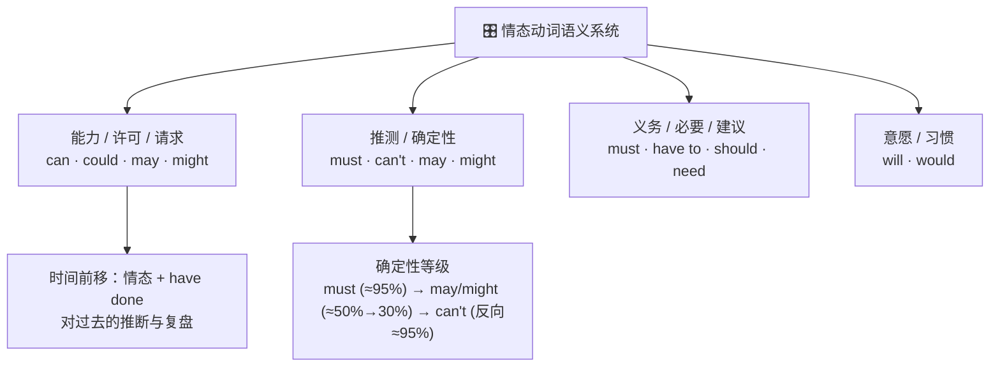

# 情态动词

> **导读**：
> - 情态动词不表示动作本身，而是给动作附加**说话人的态度**：能不能、许不许、该不该、会不会。
> - 本课按语义功能建立全景：能力与许可、推测的确定性等级、义务与建议，最后进入高阶的“情态 + 完成式”，对过去事件进行推断与复盘。

---

## 一、 情态动词语义功能全景图

> [!NOTE]
> 情态动词的共同句法特征：后接**动词原形**；无人称与数的变化（不说 `he musts`）；疑问与否定不借助 `do`（`Can he...?` / `He can't...`）。

---

## 二、 能力、许可与请求

| 功能 | 常用表达 | 语气与场景 | 示例 |
| :--- | :--- | :--- | :--- |
| 能力（现在） | `can` / `be able to` | 客观能力 | `She can speak three languages.` |
| 能力（过去） | `could` / `was able to` | `could` 表泛指能力；特定一次成功多用 `was able to` | `He could swim at five.` / `We were able to catch the last train.` |
| 许可（非正式） | `can` | 日常口语 | `Can I use your pen?` |
| 许可（正式） | `may` | 书面与正式场合 | `You may leave now.` |
| 请求（礼貌递进） | `Will you...` → `Would / Could you...` | 越用 `would/could` 越委婉 | `Could you help me for a minute?` |

---

## 三、 推测与确定性等级

对现在情况的推测，按把握程度选用不同情态动词：

| 把握程度 | 情态动词 | 含义 | 示例 |
| :--- | :--- | :--- | :--- |
| 几乎肯定（正向） | `must` | 一定 | `The lights are on. He must be home.` |
| 很可能 | `should` | 按理应该 | `They left an hour ago, so they should be there by now.` |
| 可能（约五成） | `may` | 也许 | `It may rain later.` |
| 可能（把握更小） | `might` / `could` | 或许 | `She might join us.` |
| 几乎肯定（反向） | `can't` | 不可能 | `That can't be true.` |

> [!IMPORTANT]
> `must` 的否定推测**不用 `mustn't`** 而用 `can't`：`He must be tired.` 的反面是 `He can't be tired.`（他不可能累），`mustn't` 只表禁止。

---

## 四、 义务、必要与建议

| 强度 | 表达 | 义务来源 | 示例 |
| :--- | :--- | :--- | :--- |
| 最强（禁止） | `mustn't` | 规定 / 说话人强制 | `You mustn't smoke here.`（禁止） |
| 强（必须） | `must` | 说话人主观认为必要 | `You must finish it today.` |
| 强（必须） | `have to` | 客观外界要求 | `I have to wear a uniform at work.` |
| 中（应该） | `should` / `ought to` | 道义或情理建议 | `You should get more sleep.` |
| 弱（需要） | `need`（多用于否定/疑问） | 必要性判断 | `You needn't worry.` |

> [!WARNING]
> 经典辨析：`mustn't do` = **禁止做**（不要做）；`don't have to do` = **不必做**（可做可不做）。`You mustn't tell anyone.`（不许告诉任何人）与 `You don't have to tell anyone.`（不必告诉任何人）含义完全不同。

---

## 五、 情态加完成式：对过去的推断与复盘

结构：**情态动词 + have + 过去分词**。把推测、评价的时间锚点移向过去：

| 结构 | 含义 | 示例 |
| :--- | :--- | :--- |
| `must have done` | 过去一定发生了（有把握的推断） | `The road is wet. It must have rained last night.` |
| `can't / couldn't have done` | 过去不可能发生 | `He couldn't have stolen it; he was with me.` |
| `may / might have done` | 过去也许发生了 | `She might have missed the bus.` |
| `should / ought to have done` | 本应该做却没做（含责备或遗憾） | `You should have told me earlier.` |
| `shouldn't have done` | 本不该做却做了 | `I shouldn't have said that.` |
| `needn't have done` | 本不必做却做了（做了多余的功） | `You needn't have bought so much food.` |
| `could have done` | 本可以做却没做 | `You could have at least called me.` |

> [!TIP]
> `must have done` 只用于**肯定推断**且一般不用于疑问与否定；对过去的疑问推断改用 `Could it have been...?`，否定推断用 `can't / couldn't have done`。

---

## 六、 本课核心练习词汇

点击下列词汇，在 Lexi 中查看释义并听标准发音：

- `modal` · `ability` · `permission` · `obligation` · `speculation`
- `must` · `could` · `might` · `should` · `ought`
- `need` · `dare` · `shall` · `would` · `permission`
