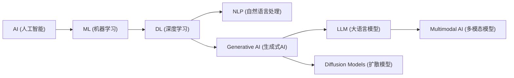

# 人工智能与大模型术语

> **导读**：
> - 人工智能（AI）与大语言模型（LLM）的快速演进催生了大量专业英文缩写、构词与技术概念；
> - 掌握这些术语的标准英文全称、词源构成与实际语境含义，有助于阅读技术论文、查阅官方文档以及参与开源技术讨论。
> 
> 本课从 **AI 层级全景架构** 入手，系统梳理 **核心缩写词拆解**、**模型训练与推理关键术语**、**经典模型命名词源** 以及 **提示词与交互表达**。

---

## 一、 人工智能技术体系层级全景

现代大语言模型是人工智能领域多年演进的产物，其技术包含清晰的层级包含关系：

| 技术层级 | 英文术语 | 中文释义 | 核心概念与定位 |
| :--- | :--- | :--- | :--- |
| **顶层概念** | `Artificial Intelligence` | 人工智能 | 让机器模拟人类智能的广义学科领域 |
| **核心方法** | `Machine Learning` | 机器学习 | 从数据中自动学习规律而非硬编码规则 |
| **关键技术** | `Deep Learning` | 深度学习 | 基于多层神经网络（Neural Networks）的学习方法 |
| **生成分支** | `Generative AI` | 生成式人工智能 | 能够创造文本、图像、音频等全新内容的技术分支 |
| **语言核心** | `Large Language Model` | 大语言模型 | 基于海量文本训练、具备强大语言理解与生成能力的模型 |
| **跨域融合** | `Multimodal AI` | 多模态人工智能 | 同时理解并处理文本、图像、视频、音频等多种模态信息的模型 |

---

## 二、 常见 AI / LLM 核心缩写词全解

技术文献与讨论中频繁使用首字母缩写（Acronyms），了解其完整展开与单词构成是理解技术本质的基础：

### 1. 基础概念与架构缩写

| 缩写 | 英文全称 | 中文含义 | 构词拆解与技术说明 |
| :--- | :--- | :--- | :--- |
| `AI` | `Artificial Intelligence` | 人工智能 | `artificial` (人造的) + `intelligence` (智力) |
| `AGI` | `Artificial General Intelligence` | 通用人工智能 | `general` (通用的/全能的)，指具备人类同等或超越人类综合认知能力的 AI |
| `LLM` | `Large Language Model` | 大语言模型 | `large` (参数量与数据量巨大) + `model` (模型) |
| `GPT` | `Generative Pre-trained Transformer` | 生成式预训练转换器 | **核心拆解**： 1. `generative` (生成式的，词根 `generate` + `-ive`) 2. `pre-trained` (预先训练好的，前缀 `pre-` 表示预先) 3. `transformer` (转换器架构，词根 `transform` + `-er`) |
| `NLP` | `Natural Language Processing` | 自然语言处理 | 研究计算机如何理解和处理人类自然语言的学科 |
| `CV` | `Computer Vision` | 计算机视觉 | 研究计算机如何“看懂”图像与视频的学科 |
| `ASR` | `Automatic Speech Recognition` | 自动语音识别 | 将人类语音转换为文本的技术（语音转文字） |
| `TTS` | `Text-to-Speech` | 语音合成 | 将文本转换为自然语音的技术（文字转语音） |

---

### 2. 训练机制与模型优化缩写

| 缩写 | 英文全称 | 中文含义 | 构词拆解与技术说明 |
| :--- | :--- | :--- | :--- |
| `RLHF` | `Reinforcement Learning from Human Feedback` | 基于人类反馈的强化学习 | 通过人类标注偏好对模型进行价值与安全性对齐（Alignment） |
| `DPO` | `Direct Preference Optimization` | 直接偏好优化 | 无需单独训练奖励模型的轻量化人类偏好对齐方法 |
| `RAG` | `Retrieval-Augmented Generation` | 检索增强生成 | `retrieval` (检索) + `augmented` (增强的)，结合外部知识库消除幻觉 |
| `MoE` | `Mixture of Experts` | 专家混合架构 | `mixture` (混合物) + `experts` (专家)，仅激活部分专家子网络以降低计算开销 |
| `LoRA` | `Low-Rank Adaptation` | 低秩自适应微调 | `low-rank` (数学低秩矩阵) + `adaptation` (自适应)，极低成本微调大模型 |
| `SFT` | `Supervised Fine-Tuning` | 有监督微调 | `supervised` (有监督的/有标准答案的) + `fine-tuning` (微调) |

---

## 三、 模型生命周期与关键技术术语精讲

从数据处理、模型训练到部署推理，AI 工程师日常使用以下核心术语：

### 1. 数据与表征（Data & Representation）

| 核心术语 | 构词与概念含义 | 技术原理与工程解析 |
| :--- | :--- | :--- |
| `token` | 词元 / 基本单位 | 模型处理文本的最小切分单位（英文中约 1 个单词拆为 1~2 个 token） |
| `tokenization` | `token` + `-ize` + `-ation` (分词/词元化) | 将原始自然语言文本切分为 token 序列并映射为整数 ID 的预处理过程 |
| `embedding` | `embed` (嵌入) + `-ing` (向量嵌入) | 将离散 token 映射到连续高维几何向量空间（Vector Space），捕捉深层语义关系 |
| `vector` | 向量 / 特征向量 | 包含高维浮点数的多维数组，通过余弦相似度（Cosine Similarity）衡量语义相近度 |
| `corpus` | 语料库 (复数: `corpora`) | 用于模型大规模无监督预训练的海量原始文本数据集合 |

---

### 2. 训练与模型压缩（Training & Compression）

| 核心术语 | 构词与概念含义 | 技术原理与工程解析 |
| :--- | :--- | :--- |
| `pre-training` | `pre-` (预先) + `training` (预训练) | 在海量无标注语料上通过自监督学习掌握通用语言规律与世界知识 |
| `fine-tuning` | `fine` (精细) + `tuning` (调节) (微调) | 在特定垂直领域或任务数据集上进行小规模有监督精细调整 |
| `distillation` | 原义：**化学蒸馏** (提炼精华) **知识蒸馏 (Knowledge Distillation)** | 将庞大教师模型（Teacher）的深层知识迁移压缩至轻量学生模型（Student） |
| `quantization` | `quantize` (量化) + `-ation` (模型量化) | 将模型权重从 FP16 高精度压缩为 INT8/INT4 低精度以大幅削减显存占用 |
| `parameter` | 参数 (简写: `params`) | 神经网络中在训练中学习优化的权重数量（如 7B = 70亿参数，70B = 700亿参数） |
| `benchmark` | 基准测试 / 权威评测集 | 用于客观标准化评估模型各项能力的标准测试集（如 MMLU, GSM8K, HumanEval） |

---

### 3. 推理与性能指标（Inference & Metrics）

| 核心术语 | 概念含义 | 技术原理与工程解析 |
| :--- | :--- | :--- |
| `inference` | 推理 / 模型预测 | 训练完成后，模型接收外部用户输入并生成输出结果的在线运行阶段 |
| `context window` | 上下文窗口 | 模型单次对话交互中能够同时容纳处理的最大 token 长度上限（如 128K） |
| `latency` | 延迟 / 首字时延 (TTFT) | 从发送请求到接收到模型返回首个 token 所耗费的端到端耗时 |
| `throughput` | 吞吐量 | 部署系统在单位时间内能够并发处理生成的 token 总数量（tokens/sec） |
| `hallucination` | 幻觉现象 | 模型以极其自信的语气生成看似合理却与事实完全背离的虚假内容 |
| `alignment` | 价值观与安全对齐 | 通过 RLHF/DPO 等手段确保模型输出符合人类意图、道德伦理与安全准则 |

---

## 四、 经典模型家族与代号词源背后的故事

各大科技公司与开源社区在给大模型命名时，常蕴含深厚的科学或人文典故：

| 模型代号 | 开发机构 | 命名典故与词源含义 |
| :--- | :--- | :--- |
| `GPT` | OpenAI | `Generative Pre-trained Transformer`（生成式预训练转换器，严谨的技术功能缩写） |
| `Claude` | Anthropic | 致敬现代信息论之父 **Claude Shannon（克劳德·香农）** |
| `Gemini` | Google | 天文学中的**双子座**（拉丁语原意：双胞胎），寓意由 Google DeepMind 与 Google Research 两大核心团队联合打造，原生支持多模态 |
| `LLaMA` | Meta | `Large Language Model Meta AI` 的首字母拼合，巧妙取意为羊驼（Llama），引发了开源界以骆驼科动物命名的传统（Alpaca, Vicuna） |
| `BERT` | Google | `Bidirectional Encoder Representations from Transformers`，同时向经典童话《芝麻街》角色 Bert 致敬 |
| `Mistral` | Mistral AI | 法语词汇，指地中海西北部干爽强劲的**密史脱拉风**，寓意模型轻快、敏捷、强劲 |
| `DeepSeek` | DeepSeek | 组合词：`deep` (深度的) + `seek` (求索/寻找)，寓意对人工智能深度认知的不断探索 |

---

## 五、 Prompt 工程与交互常用核心术语

编写提示词与构建智能体时的高频词汇：

| 术语 | 英文全称 / 表达 | 中文释义 | 实战应用场景 |
| :--- | :--- | :--- | :--- |
| `Prompt` | `Prompt` | 提示词 / 输入指令 | 发送给模型的指令引导文本 |
| `System Prompt` | `System Prompt` | 系统提示词 | 设定模型角色设定、行为准则与全局约束的高优先级指令 |
| `Few-shot` | `Few-shot Prompting` | 少样本提示 | 在提示词中提供 2~3 个示例引导模型按格式输出 |
| `Zero-shot` | `Zero-shot Prompting` | 零样本提示 | 不给任何示例，直接向模型提出任务要求 |
| `Chain-of-Thought` | `Chain-of-Thought (CoT)` | 思维链 | 引导模型“一步一步思考 (Let's think step by step)”以提升逻辑推理能力 |
| `Agent` | `AI Agent` | 智能体 / 代理 | 具备自主规划、工具调用（Function Calling）与环境交互能力的 AI 系统 |
| `Temperature` | `Temperature` | 采样温度参数 | 控制输出随机性（值越低输出越确定精准，值越高越富有创意发散） |
| `Top-p / Top-k` | `Top-p / Top-k Sampling` | 核采样 / 候选截断采样 | 限制每次预测下一个 token 时候选概率池范围的生成控制参数 |

---

## 六、 本课核心练习词汇

点击下列词汇，可在 Lexi 中查看详尽释义并听标准发音：

- `artificial` · `intelligence` · `generative` · `transformer` · `token`
- `embedding` · `distillation` · `quantization` · `inference` · `latency`
- `throughput` · `hallucination` · `alignment` · `parameter` · `benchmark`
- `retrieval` · `augmented` · `mixture` · `expert` · `prompt`
