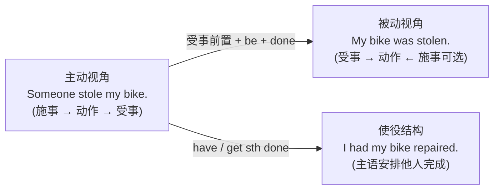

# 被动语态与使役

> **导读**：
> - 被动语态的本质是**视角切换**：把动作的承受者推到主语位置，施事者退居 `by` 短语或直接隐去。
> - 使役结构则表达“让某事被完成、让某人做某事”，与被动共享“受事视角”的逻辑。本课先建立被动转换机制，再覆盖时态变换、主动表被动、特殊被动与使役四大板块。

---

## 一、 被动语态与使役结构全景图

---

## 二、 被动语态构成与各时态变换

被动语态公式：**`be + 过去分词 (done)`**。`be` 承担时态与人称变化，过去分词保持不变。

### 1. 跨时态变换矩阵（以 `build` 为例）

| 时态 | 主动形式 | 被动形式 | 被动例句 |
| :--- | :--- | :--- | :--- |
| 一般现在 | `build / builds` | `am / is / are built` | `These cars are built in Germany.` |
| 一般过去 | `built` | `was / were built` | `The bridge was built in 1990.` |
| 现在进行 | `is building` | `is being built` | `A new lab is being built now.` |
| 现在完成 | `has built` | `has been built` | `The system has been built.` |
| 一般将来 | `will build` | `will be built` | `The stadium will be built next year.` |
| 情态被动 | `can build` | `can be built` | `The problem can be solved easily.` |

### 2. 何时使用被动

| 使用场景 | 说明 | 示例 |
| :--- | :--- | :--- |
| 施事未知或不重要 | 关注点在受事 | `My wallet was stolen.` |
| 客观陈述（科技/新闻文体） | 淡化主观色彩 | `The experiment was repeated three times.` |
| 承接上文受事 | 保持话题连贯 | `We proposed a plan. The plan was approved.` |

---

## 三、 主动形式表被动与不可被动化动词

### 1. 主动形式表达被动含义

部分动词以主动形式出现，语义上却描述受事的属性：

| 动词类型 | 示例 | 说明 |
| :--- | :--- | :--- |
| 描述事物属性的 `sell / wash / write / read` | `This book sells well.` / `The pen writes smoothly.` | 主语事物本身具备该特性，常与副词搭配 |
| `need / want / deserve + doing` | `The car needs washing.` | `doing` 主动形式表被动，= `needs to be washed` |

### 2. 不可被动化的动词

| 类别 | 典型成员 | 原因 |
| :--- | :--- | :--- |
| 不及物动词 | `happen`, `take place`, `appear`, `die` | 无宾语，无受事可前置 |
| 系动词 | `become`, `seem`, `belong to` | 表示状态而非动作 |

> [!IMPORTANT]
> `An accident was happened.` 是错误表达；`happen`、`take place`、`break out` 永远用主动：`An accident happened.`。

---

## 四、 被动特殊结构

| 结构 | 形式 | 示例 | 说明 |
| :--- | :--- | :--- | :--- |
| `get` 被动 | `get + done` | `He got fired.` / `Get vaccinated.` | 口语化，常指意外或突发结果 |
| 双宾语被动 | 人或物均可前置作主语 | `I was given a book.` / `A book was given to me.` | 人作主语更常见 |
| 保留宾语 | 被动后仍保留另一宾语 | `He was asked a question.` | 双宾结构的另一种投射 |
| 固定搭配整体被动 | 动词短语视为整体 | `The child was taken good care of.` | 短语中的介词/副词不可丢 |
| 转述类被动 | `It is said / believed / reported that...` | `It is reported that the fire was controlled.` | 新闻与学术常用客观句式 |

---

## 五、 使役结构：`have / get / make / let`

使役表达“主语不亲自执行，而是安排或导致他人执行”：

| 结构 | 公式 | 示例 | 含义侧重 |
| :--- | :--- | :--- | :--- |
| `have sb do` | `have + 人 + 动词原形` | `I'll have my assistant call you.` | 安排某人做某事（中性委托） |
| `have sth done` | `have + 物 + 过去分词` | `I had my hair cut.` / `We had the house painted.` | 请人完成某事（服务类高频） |
| `get sb to do` | `get + 人 + to do` | `She got her brother to help.` | 说服/设法让某人做 |
| `get sth done` | `get + 物 + 过去分词` | `Get the report printed.` | 使某事完成（口语，强调结果） |
| `make sb do` | `make + 人 + 动词原形` | `The news made her cry.` | 致使、迫使（不可抗拒） |
| `let sb do` | `let + 人 + 动词原形` | `Let me check the log.` | 允许 |

> [!NOTE]
> `have sth done` 还可表示遭遇不幸：`He had his wallet stolen.`（钱包被偷了）。语境决定是“安排服务”还是“遭遇意外”。

---

## 六、 本课核心练习词汇

点击下列词汇，在 Lexi 中查看释义并听标准发音：

- `passive` · `active` · `agent` · `causative` · `damaged`
- `repaired` · `stolen` · `built` · `invented` · `allow`
- `force` · `persuade` · `vaccinated` · `approved` · `delivered`
