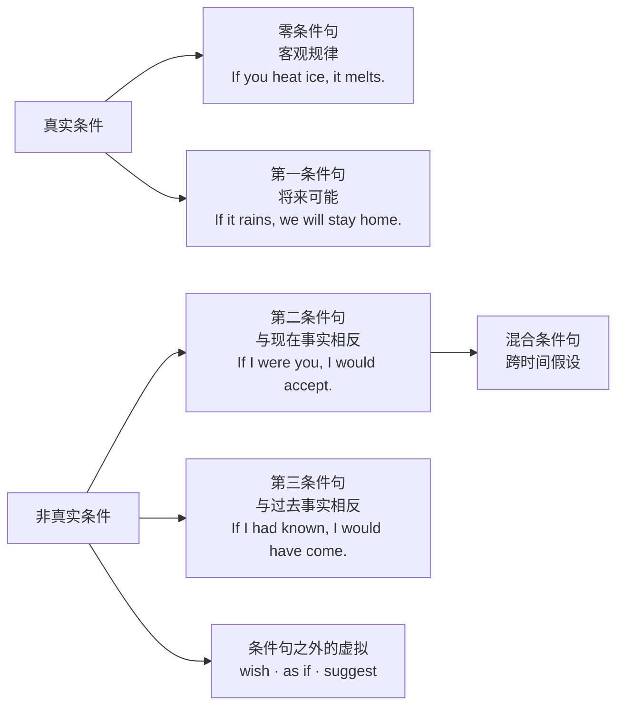

# 条件句与虚拟语气

> **导读**：
> - 条件句按“真实性”分为两端：**真实条件**（可能发生）用正常时态，**非真实条件**（假设、与事实相反）用“时态后退一格”表达心理距离。
> - 虚拟语气是非真实思维的语法化：从条件句延伸到 `wish`、`suggest`、`as if` 等场景。本课沿“真实 → 非真实”连续谱逐层推进。

---

## 一、 条件句与虚拟语气全景图

---

## 二、 真实条件句

| 类型 | 结构 | 用法 | 示例 |
| :--- | :--- | :--- | :--- |
| 零条件句 | `If + 一般现在, 一般现在` | 客观规律、恒定事实 | `If you heat ice, it melts.` |
| 第一条件句 | `If + 一般现在, will do` | 将来真实可能发生 | `If it rains tomorrow, we will stay home.` |

> [!IMPORTANT]
> **主将从现**：条件从句用一般现在表示将来，主句才用 `will`。不说 `If it will rain...`。

### 常见条件连词替换

| 连词 | 含义 | 示例 |
| :--- | :--- | :--- |
| `unless` | 除非（= `if...not`） | `You'll fail unless you practice.` |
| `as long as` | 只要 | `You can stay as long as you keep quiet.` |
| `in case` | 以防、万一（预防性） | `Take an umbrella in case it rains.` |
| `provided / providing that` | 在…条件下（较正式） | `You may go, provided that you finish first.` |

---

## 三、 非真实条件句：与现在、过去事实相反

“时态后退一格”是虚拟的核心机制：用更远的时态形式表达与事实的心理距离。

| 类型 | 从句形式 | 主句形式 | 事实指向 | 示例 |
| :--- | :--- | :--- | :--- | :--- |
| 第二条件句（现在/将来非真实） | 一般过去（`be` 多用 <code class="ord-special">were</code>） | `would / could / might + do` | 与现在事实相反 | `If I were you, I would accept the offer.`（我并不是你） |
| 第三条件句（过去非真实） | `had done` | `would / could / might + have done` | 与过去事实相反 | `If I had known earlier, I would have helped.`（当时并不知道） |

> [!NOTE]
> 第二条件句中各人称的 `be` 动词正式文体统一用 `were`：`If I were rich...` / `If she were here...`；口语中 `was` 亦常见。

---

## 四、 混合条件句与 if 省略倒装

### 1. 混合条件句：主从句时间不一致

| 组合 | 结构 | 示例 |
| :--- | :--- | :--- |
| 过去条件 → 现在结果 | 从句 `had done`，主句 `would do` | `If I had studied medicine, I would be a doctor now.` |
| 现在状态 → 过去结果 | 从句一般过去，主句 `would have done` | `If he were more careful, he wouldn't have made that mistake.` |

### 2. 省略 `if` 的倒装形式

正式文体中可省略 `if`，将从句的 `were / had / should` 提前：

| 原形 | 倒装形式 | 示例 |
| :--- | :--- | :--- |
| `If I were...` | `Were I...` | `Were I you, I would refuse.` |
| `If I had known...` | `Had I known...` | `Had I known the truth, I would have told you.` |
| `If it should rain...` | `Should it rain...` | `Should it rain, the event will be canceled.` |

---

## 五、 条件句之外的虚拟

虚拟语气同样作用于 wish、建议命令类动词等场景：

| 场景 | 结构 | 示例 | 说明 |
| :--- | :--- | :--- | :--- |
| `wish` / `if only`（愿望落空） | 对现在用一般过去；对过去用 `had done` | `I wish I were taller.` / `If only I had listened to you.` | 表达与事实相反的愿望 |
| `as if / as though` | 与事实相反用过去形式 | `He talks as if he knew everything.` | 看似如此实则不然 |
| 建议命令类动词 | `suggest / demand / insist / recommend / order + that sb (should) do` | `The doctor insisted that he (should) rest.` | 从句动词用原形（`should` 可省） |
| 建议命令类名词/形容词 | `It is necessary / important that...`、`My suggestion is that...` | `It is essential that every file be backed up.` | 同样用 `(should) do` |
| `would rather` | `would rather sb did`（现在）/ `had done`（过去） | `I'd rather you didn't smoke here.` | 宁愿他人如何 |
| `It's (high) time` | `It's time sb did` | `It's time we left.` | 早该做某事了 |

> [!WARNING]
> `suggest` 表“暗示、表明”时不虚拟，用正常时态：`His smile suggested that he was satisfied.`；只有表“建议”才用 `(should) do`。

---

## 六、 本课核心练习词汇

点击下列词汇，在 Lexi 中查看释义并听标准发音：

- `conditional` · `subjunctive` · `hypothetical` · `unreal` · `unless`
- `otherwise` · `suppose` · `imagine` · `pretend` · `insist`
- `demand` · `suggest` · `recommend` · `provided` · `whereas`
