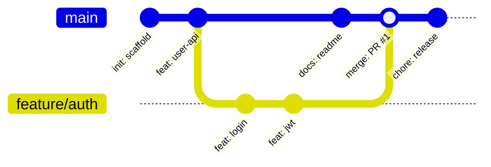

# 开发与工程常用术语

> **导读**：
> - 现代软件开发几乎完全构筑在英语语境之上：从版本控制、命令行工具到运行报错与开源协作。
> - 很多开发者虽然每天敲代码，但对 `rebase`、`cherry-pick`、`stash`、`deprecated` 等指令与术语背后的词源本义缺乏深刻理解，导致查阅英文文档或排查错误时效率受限。
> 
> 本课系统梳理 **Git 版本控制工作流**、**Linux 核心系统指令**、**常见异常报错与 Debug 调试术语**。

---

## 一、 软件工程与版本控制全景工作流

从编写代码到提交部署，现代工程涉及以下核心区域与流转动作：

---

## 二、 Git 版本控制核心操作与指令词源拆解

| Git 核心术语 | 词源本义与底层原理 | 典型工程场景与实战指令 |
| :--- | :--- | :--- |
| `commit` | 词源：**承诺 / 交付记录** 将暂存区的修改永久固化为一个版本历史快照 | `git commit -m "feat: add user login"` |
| `stash` | 词源：**藏匿 / 储藏** 将当前未完成的脏工作区临时封存藏起，以便紧急切换分支 | `git stash` (暂存当前修改) `git stash pop` (弹出恢复修改) |
| `checkout` | 词源：**结账离开 / 检出档案** 切换分支或将某个历史版本检出到工作区 | `git checkout main` `git checkout -b feature/login` |
| `merge` | 词源：**合并 / 融合** 将两个分支的历史分叉合并在一起，产生新的合并提交节点 | `git merge feature/auth` |
| `rebase` | 构词：`re-` (重新) + `base` (基底) (**变基**) 将当前分支的基底挪到目标分支最新提交之上，形成线性历史 | `git rebase main` |
| `cherry-pick` | 词源：**摘樱桃**（精选挑出最好的） 挑选某个分支上的单独某一次特定提交合并过来 | `git cherry-pick <commit-hash>` |
| `revert` | 词源：`re-` (向后) + `vert` (转) (**安全回滚**) 通过新建一个相反的提交来撤销指定历史改动（不破坏历史线） | `git revert HEAD` |
| `reset` | 词源：**重置** 强制将分支指针重置到某一历史位置（`--hard` 会丢弃未提交改动） | `git reset --hard HEAD~1` |
| `conflict` | 词源：**冲突** 多人在同一文件的相同行做出不同修改，Git 无法自动合并 | `Resolve merge conflicts` (解决合并冲突) |

---

## 三、 Linux 核心系统指令与权限机制英文

Linux 终端命令多为英文短语或首字母缩写：

| Linux 命令 | 英文全称 / 来源 | 中文释义 | 命令核心功能解析 |
| :--- | :--- | :--- | :--- |
| `pwd` | `Print Working Directory` | 打印当前工作目录 | 显示当前所在文件系统的绝对路径 |
| `ls` | `List` | 列出目录内容 | 列出当前目录下的文件与子文件夹 (`ls -la`) |
| `cd` | `Change Directory` | 切换目录 | 切换当前所在的路径目录 (`cd ..`) |
| `mkdir` | `Make Directory` | 创建目录 | 新建一个或多个文件夹 (`mkdir -p a/b/c`) |
| `rm` | `Remove` | 删除文件或目录 | 移除指定文件 (`rm -rf` 强制递归删除) |
| `cp` | `Copy` | 复制 | 拷贝文件或目录 (`cp -r src/ dist/`) |
| `mv` | `Move` | 移动 / 重命名 | 移动文件路径或重命名文件 (`mv old.txt new.txt`) |
| `chmod` | `Change Mode` | 修改文件权限模式 | 更改文件读写执行权限 (`chmod +x script.sh`) |
| `chown` | `Change Owner` | 更改所有者 | 修改文件或目录所属的用户和用户组 |
| `sudo` | `Superuser Do` | 超级管理员执行 | 以 root 超级管理员权限执行后续指令 |
| `grep` | `Global Regular Expression Print` | 全局正则检索打印 | 搜索包含特定文本或正则表达式的行 |
| `tail` | `Tail (尾巴)` | 查看文件末尾内容 | 查看最新日志文件输出 (`tail -f app.log`) |

---

## 四、 常见异常报错（Errors）、堆栈信息与 Debug 术语

排查 Bug 时最频繁遇见的英文术语与警示表达：

| 报错或术语 | 英文全称 / 构词 | 中文释义 | 核心含义与触发场景 |
| :--- | :--- | :--- | :--- |
| `SyntaxError` | `syntax` (语法) + `error` | **语法错误** | 代码书写违反语言规范（如少写括号或分号） |
| `TypeError` | `type` (类型) + `error` | **类型错误** | 对某变量执行了不支持该类型的方法（如调用 undefined 的属性） |
| `ReferenceError` | `reference` (引用) + `error` | **引用错误** | 访问了尚未声明或不存在的变量 |
| `Stack Overflow` | `stack` (调用栈) + `overflow` (溢出) | **栈溢出** | 函数无限递归导致程序调用栈超出内存上限 |
| `Out of Memory` | 简称 `OOM` | **内存耗尽** | 应用程序占用的堆内存超过了系统分配的最大限制 |
| `Deprecated` | `/ˈdep.rə.keɪ.tɪd/` (形容词) | **已废弃 / 不推荐使用** | 该 API 或功能在未来版本会被移除，建议使用新方案替代 |
| `Breaking Change`| `breaking` (破坏性的) + `change` | **破坏性更新 / 不向下兼容** | 该更新导致旧版本代码无法直接运行，需手动升级适配 |
| `Traceback / Stack Trace` | `trace` (追踪) + `back` (回溯) | **堆栈调用跟踪信息** | 程序崩溃时自顶向下打印出的函数调用链路 |
| `Refactor` | `re-` (重新) + `factor` (因式分解) | **代码重构** | 在不改变外部功能的前提下优化代码内部结构 |
| `Patch / Hotfix` | `patch` (补丁) / `hotfix` (紧急修复) | **补丁 / 线上热修复** | 针对线上突发严重 Bug 发布的快速修复更新 |

---

## 五、 本课核心练习词汇

点击下列词汇，在 Lexi 中查看释义并听标准发音：

- `repository` · `commit` · `branch` · `stash` · `checkout`
- `rebase` · `conflict` · `directory` · `permission` · `process`
- `syntax` · `reference` · `overflow` · `deprecated` · `refactor`
- `traceback` · `exception` · `terminal` · `production` · `deployment`
