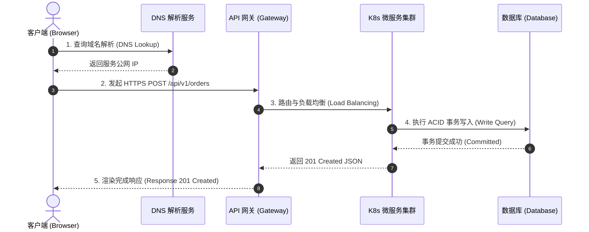
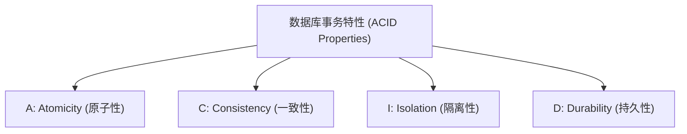

# 计算机网络与云原生架构

> **导读**：
> - 现代互联网技术体系构筑在严密的协议规范与架构术语之上：从客户端请求、DNS 解析、HTTP 状态码到数据库事务与云原生微服务集群。
> - 理解这些术语的标准英文构词与底层工程含义，是阅读官方架构文档、配置云服务与参与全球技术交流的关键。
> 
> 本课系统梳理 **网络请求与云原生架构全景**、**HTTP 方法与状态码体系**、**数据库 ACID 核心特性** 以及 **Docker/K8s 云原生专业英文**。

---

## 一、 网络通信与现代云原生架构全景图

一次完整的网络请求从客户端到达云端微服务的标准链路架构：

---

## 二、 HTTP 协议、请求方法与状态码全解

### 1. HTTP 核心请求方法（HTTP Methods）

| 方法 | 英文原义 | RESTful 设计语义 | 幂等性 (Idempotent) |
| :--- | :--- | :--- | :--- |
| `GET` | **获取** | 从服务器读取/检索资源（不改变服务器数据） | 是（多次请求结果一致） |
| `POST` | **投递 / 发送** | 向服务器提交新数据以创建新资源 | 否（多次请求会创建多条新记录） |
| `PUT` | **放置 / 替换** | 完整替换并更新服务器上的指定资源 | 是 |
| `PATCH` | **打补丁** | 对资源进行局部/部分字段修改 | 否 |
| `DELETE` | **删除** | 删除服务器上的指定资源 | 是 |
| `OPTIONS` | **选项** | 预检请求（CORS Preflight），查询服务器支持的通信方法 | 是 |

---

### 2. HTTP 状态码体系（Status Codes）

HTTP 状态码由 3 位数字组成，首位数字定义了响应的大类：

| 状态码大类 | 代表含义 | 常见高频状态码 | 英文含义与触发场景 |
| :--- | :--- | :--- | :--- |
| **`2xx` (Success)** | **请求成功处理** | `200 OK` `201 Created` `204 No Content` | `OK`：请求成功返回数据 `Created`：新资源已成功创建 `No Content`：请求成功但无需返回内容（如删除成功） |
| **`3xx` (Redirection)**| **重定向转移** | `301 Moved Permanently` `302 Found (Temporary)` `304 Not Modified` | `301`：资源永久重定向到新 URL `302`：临时重定向 `304`：协商缓存命中，客户端使用本地缓存 |
| **`4xx` (Client Error)**| **客户端错误** | `400 Bad Request` `401 Unauthorized` `403 Forbidden` `404 Not Found` `429 Too Many Requests` | `400`：请求参数格式错误 `401`：未提供身份认证凭据（未登录） `403`：已登录但无权限访问该资源 `404`：请求的资源不存在 `429`：超出频率速率限制（Rate Limited） |
| **`5xx` (Server Error)**| **服务器端错误** | `500 Internal Server Error` `502 Bad Gateway` `503 Service Unavailable` `504 Gateway Timeout` | `500`：服务器内部代码崩溃异常 `502`：网关/代理从上游收到非法响应 `503`：服务过载或停机维护中 `504`：网关等待上游服务响应超时 |

---

## 三、 数据库、数据结构与 ACID 事务核心特性

### 数据库核心术语

| 核心术语 | 英文全称 / 构词 | 技术原理与工程解析 |
| :--- | :--- | :--- |
| `Query` | 查询指令 | 向数据库发出的数据检索、插入、更新或删除指令 |
| `Schema` | 模式 / 表结构定义 | 数据库中关于表结构、字段类型、主键外键与完整性约束的架构蓝图 |
| `Index` | 索引 (复数: `indices`) | 为大幅加速数据检索效率而在特定字段上构建的 B+ 树或哈希检索结构 |
| `Migration` | 数据迁移 / 结构版本变迁 | 将数据库表结构变更脚本化并纳入 Git 版本控制的工程机制 |

---

### 数据库事务四大特性：ACID 原则

| 特性 | 英文术语 | 词源构词与中文释义 | 核心技术原理 |
| :--- | :--- | :--- | :--- |
| **A** | `Atomicity` | `atom` (不可分割的原子) + `-icity` **原子性** | 事务中所有操作要么全部成功执行，要么全部失败回滚（All or Nothing） |
| **C** | `Consistency` | `consistent` (前后一致的) + `-ency` **一致性** | 事务执行前后，数据库必须始终保持合法状态与约束完整性 |
| **I** | `Isolation` | `isolate` (隔离/分开) + `-ation` **隔离性** | 多个并发事务同时执行时，彼此相互隔离互不干扰 |
| **D** | `Durability` | `durable` (持久耐用的) + `-ity` **持久性** | 一旦事务成功提交，其对数据的修改将永久保存在磁盘中，即使断电也不会丢失 |

---

## 四、 云原生、容器化与 Kubernetes 核心英语

| 术语 | 英文全称 / 词源 | 中文释义 | 技术解析与应用 |
| :--- | :--- | :--- | :--- |
| `Container` | `contain` (容纳) + `-er` | **容器** | 包含应用代码及所有依赖运行环境的轻量级独立沙盒 |
| `Image` | **镜像** | 用于创建运行容器的只读静态模板 |
| `Registry` | `register` (注册) + `-ry` | **镜像仓库** | 集中存储与分发容器镜像的中心服务（如 Docker Hub） |
| `Cluster` | **集群** | 由多台物理机或虚拟机协同组成的计算资源池 |
| `Pod` | 词源：**豌豆荚**（装有一颗或多颗豆子） | **Kubernetes 最小调度单元** | 共享网络与存储的一个或多个紧密协作的容器集合 |
| `Node` | **节点** | K8s 集群中的单台物理机或虚拟机工作单元 |
| `Deployment` | `deploy` (部署) + `-ment` | **无状态应用部署控制器** | 声明式管理 Pod 副本数量与滚动升级策略的控制器 |
| `Scalability` | `scale` (规模) + `-able` + `-ity` | **可伸缩性 / 弹性扩缩容** | 系统根据负载高低自动增减计算实例资源的能力 |
| `High Availability`| 简称 `HA` | **高可用性** | 系统长期持续无故障稳定运行的能力（通常要求 99.99% 四个九） |
| `CI / CD` | `Continuous Integration / Continuous Deployment` | **持续集成 / 持续部署** | 自动化代码测试、打包、构建并发布上线的流水线机制 |

---

## 五、 本课核心练习词汇

点击下列词汇，在 Lexi 中查看释义并听标准发音：

- `protocol` · `gateway` · `cluster` · `container` · `registry`
- `query` · `schema` · `migration` · `atomicity` · `consistency`
- `isolation` · `durability` · `deployment` · `scalability` · `pipeline`
- `unauthorized` · `forbidden` · `idempotent` · `timeout` · `permanent`
