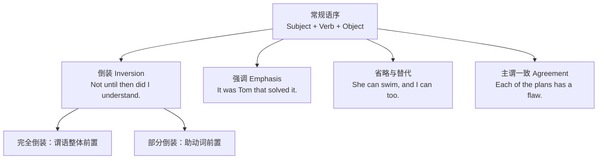

# 高级句法

> **导读**：
> - 英语在常规语序之外有四种句法手段：**倒装**调整语序突出焦点，**强调**标记关键成分，**省略与替代**消除冗余，**主谓一致**约束句子骨架。
> - 本课是语法主线的收官：四者都建立在前序课程的名词、动词与从句基础之上，学完即完成从入门到精通的语法闭环。

---

## 一、 四大句法手段全景图

---

## 二、 倒装：完全倒装与部分倒装

### 1. 完全倒装：谓语动词整体移到主语之前

| 触发条件 | 示例 | 说明 |
| :--- | :--- | :--- |
| `here / there / now / then` 开头 + `be / come / go` | `Here comes the bus.` / `There goes the bell.` | 主语为名词时倒装；主语为代词不倒装（`Here it comes.`） |
| 方位副词/介词短语开头 + 位移动词 | `On the hill stands a tower.` | 描写性场景，主语较长时保持句子平衡 |
| `there be` 存在句 | `There are two options.` | 存在句本身即完全倒装结构 |

### 2. 部分倒装：只把助动词/情态动词移到主语之前

| 触发条件 | 示例 | 说明 |
| :--- | :--- | :--- |
| 否定词开头（`never`, `seldom`, `hardly`, `not only`, `no sooner`） | `Never have I seen such a storm.` | 语气强烈，正式文体 |
| `Only + 状语` 开头 | `Only then did I realize the truth.` | `only` 修饰状语才倒装 |
| `so + 形容词/副词` 前置 | `So fast does light travel that we cannot perceive it.` | 强调程度 |
| 虚拟条件省略 `if`（承接 11 课） | `Had I known, I would have come.` | `were / had / should` 提前 |
| `as / though` 让步倒装 | `Child as he is, he speaks three languages.` | 表语/动词原形提前，注意名词前**不加冠词** |

> [!IMPORTANT]
> `So do I.` / `Neither do I.`（我也是 / 我也不是）也属于部分倒装，用于简短附和，助动词须与前句时态一致。

---

## 三、 强调结构

| 强调手段 | 公式 | 示例 | 说明 |
| :--- | :--- | :--- | :--- |
| 强调句型 | `It is / was + 被强调部分 + that / who + 其余` | `It was Tom that solved the problem.` | 可强调主语、宾语、状语；去掉 `It is...that` 后句子仍完整 |
| 助动词强调 | `do / does / did + 动词原形` | `I do appreciate your help.` / `He did finish it.` | 强调肯定，只用于一般现在与一般过去 |
| 疑问词强调 | `what / who / where + ever` | `What on earth happened?` | 口语加强语气 |

> [!TIP]
> 判断强调句的方法：**删去 `It is/was ... that` 后若还原出一个完整句子，即为强调句**。`It was at nine that he arrived.` → `He arrived at nine.` 成立。

---

## 四、 省略与替代

| 手段 | 场景 | 示例 | 说明 |
| :--- | :--- | :--- | :--- |
| 并列成分省略 | 并列句中省略相同部分 | `She likes tea, and (she likes) coffee too.` | 省略重复的谓语或宾语 |
| 不定式保留 `to` | 省略重复的动词原形，保留 `to` | `You may leave if you want to (leave).` | `want to` 后省略动词 |
| `do so` 替代 | 替代前文动作 | `He promised to submit the report, and he did so on time.` | 正式文体替代 |
| `so / neither` 倒装替代 | 简短附和 | `I can swim.` — `So can I.` / `Neither can I.` | 承接本章倒装规则 |
| 状语从句省略 | 从句主语与主句一致且含 `be` 时，省略“主语 + be” | `When (he was) asked about it, he smiled.` | 逻辑主语必须一致 |

> [!WARNING]
> 状语从句省略的前提是**从句主语与主句主语一致**：`When crossing the street, cars nearly hit him.` 是典型悬垂错误（省略后逻辑主语变成了 `cars`）。

---

## 五、 主谓一致

| 一致原则 | 核心规则 | 示例 |
| :--- | :--- | :--- |
| 语法一致 | 按主语的语法形式（单复数）决定谓语 | `The list of items is long.`（中心词 `list` 为单数） |
| 意义一致 | 按表达的实际意义决定 | `The team are arguing among themselves.`（强调队员个体） |
| 就近原则 | 谓语与最近的主语一致 | `Either you or he is right.` / `Neither the students nor the teacher knows.` |

### 高频难点速查

| 主语类型 | 谓语 | 示例 |
| :--- | :--- | :--- |
| `A with / along with / as well as B` | 随 A | `The teacher, along with his students, is visiting the lab.` |
| 集合名词（`family`, `team`, `class`） | 整体单数 / 成员复数 | `His family is large.` / `His family are all doctors.` |
| `a number of` vs `the number of` | 复数 vs 单数 | `A number of students are absent.` / `The number of students is rising.` |
| 时间/距离/金额作整体 | 单数 | `Ten years is a long time.` |
| 书名、国名、学科（复数形式） | 单数 | `The United States is...` / `Physics is...` |

---

## 六、 本课核心练习词汇

点击下列词汇，在 Lexi 中查看释义并听标准发音：

- `inversion` · `emphasis` · `ellipsis` · `agreement` · `neither`
- `seldom` · `nowhere` · `merely` · `whatever` · `themselves`
- `rarely` · `scarcely` · `wherever` · `nonetheless` · `whichever`
