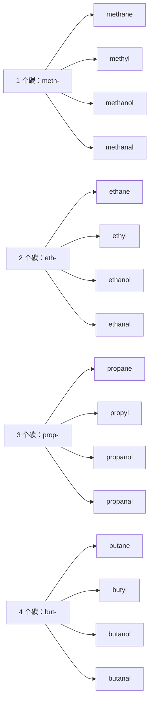

# 元素、周期表与化学构词

> **中心问题**：怎样把英文元素周期表读成一张术语、命名和材料描述的地图？  
> **阅读场景**：教材插图、试剂标签、论文摘要、材料说明和科普文章。  
> **课程边界**：本课帮助识别英文概念与词形，不推导元素性质，也不替代化学基础训练。

元素周期表在英文材料里不是一张需要死背的海报。它把名称、符号、原子序数、分类和历史压缩在同一张图上；读懂它的栏目语言，就能更快识别化合物名称、材料描述和实验记录中的高频词。

## 1. 周期表是一张分类地图

`periodic table` 是元素周期表，`element` 是元素，`symbol` 是元素符号，`atomic number` 是原子序数。表中的横行叫 `period`，纵列叫 `group`；有些材料也会说 `family`，强调一组元素共享的性质或历史分类。

`Elements in the same group often show related chemical behavior.`

这里的 `group` 是分类位置，不是普通意义上的「一群东西」。阅读图表时先看标题和图例，再看它是在按位置、性质还是用途分组。

## 2. 原子、元素、分子、化合物与混合物

`atom` 是描述物质微观结构时的基本单位，`element` 是由同一种原子构成的化学元素，`molecule` 是由原子结合形成的独立粒子，`compound` 指不同元素以一定方式结合形成的纯物质，`mixture` 则表示成分共存而不必以固定比例结合。

`Water is a compound made of hydrogen and oxygen.`

这五个词经常被中文统称为「物质相关名词」，但英文论文会严格区分它们指向的是结构单位、元素种类、粒子、纯物质还是混合状态。

## 3. 符号不是英文缩写那么简单

很多符号与英文名直接相连，例如 `oxygen` 对应 <lexi-notation>`O`</lexi-notation>，`carbon` 对应 <lexi-notation>`C`</lexi-notation>。另一些符号保留了拉丁语或历史名称：`sodium` 的 <lexi-notation>`Na`</lexi-notation> 来自 *natrium*，`potassium` 的 <lexi-notation>`K`</lexi-notation> 来自 *kalium*，`iron` 的 <lexi-notation>`Fe`</lexi-notation> 来自 *ferrum*。

这些历史线索值得知道，因为它们解释「为什么字母不像英文名」；但在阅读中仍应把符号当作固定标签，而不是每次重新按词根推导。

## 4. 名称里的地点、人名与词尾

元素名称有不同来源：有些来自地点，如 `germanium`；有些纪念人物，如 `curium`；有些来自神话、天体或早期材料名称。<lexi-morpheme kind="suffix">`-ium`</lexi-morpheme> 在元素名中很常见，但它不是「只要看到就必然是某一种性质」的语法标记。

`hydrogen`、`oxygen` 中的 <lexi-morpheme kind="root">`hydr-`</lexi-morpheme>、<lexi-morpheme kind="root">`oxy-`</lexi-morpheme> 与许多科学词形成词族。词根能帮助识别术语网络，却不能代替查证实际名称与定义。

## 5. 周期表中的类别词

`metal`、`nonmetal`、`metalloid`、`alkali metal`、`halogen`、`noble gas` 常出现在图例和入门材料中。它们主要帮助读者看懂分类话语，例如材料在比较元素的外观、导电性、反应性或使用场景时会怎样分组。

`Silicon is commonly described as a metalloid.`

本课不要求根据类别预测化学行为；阅读时只要知道这些是分类标签，并在需要时回查专业资料即可。

## 6. 化学式怎样在英文句子中出现

<lexi-notation>`H₂O`</lexi-notation>、<lexi-notation>`CO₂`</lexi-notation>、<lexi-notation>`NaCl`</lexi-notation> 是公式记号，不应被当成一个可查词的长单词。英文会在它们周围放置描述关系的词：`consists of`、`contains`、`is composed of`、`is present in`。

`The sample contains trace amounts of iron.`

读公式时先分辨它在标记元素、化合物还是样品成分；读句子时再看数量、条件和分析结论。

## 7. 从元素名扩展到材料术语

元素名常进入材料和分析词汇：`silicon-based`、`carbon-rich`、`iron oxide`、`metallic`。<lexi-morpheme kind="suffix">`-based`</lexi-morpheme> 指「以……为基础」，<lexi-morpheme kind="suffix">`-rich`</lexi-morpheme> 指「富含……」，它们让一张周期表延伸到真实材料描述。

`The device uses a silicon-based material with improved stability.`

## 8. 一条实用阅读路线

遇到化学英文名词时，先判断它是元素、符号、分类词、粒子、化合物还是材料描述；再找它的数量、结构或用途；最后区分哪些是历史词源线索，哪些是当前文档的精确定义。这样，周期表就从背诵对象变成了阅读术语网络的入口。

## 9. 118 个元素：按周期查阅

以下清单按原子序数和周期排列，目的是让读者在英文材料中能把名称、符号和所在周期对应起来；它不是要求一次背完的单词表。元素名称与符号以 IUPAC 周期表为准；`aluminium` / `aluminum`、`caesium` / `cesium` 是常见英美拼写差异。

- **第 1 周期（1—2）**：`hydrogen`（<lexi-notation>`H`</lexi-notation>）；`helium`（<lexi-notation>`He`</lexi-notation>）。
- **第 2 周期（3—10）**：`lithium`（<lexi-notation>`Li`</lexi-notation>）；`beryllium`（<lexi-notation>`Be`</lexi-notation>）；`boron`（<lexi-notation>`B`</lexi-notation>）；`carbon`（<lexi-notation>`C`</lexi-notation>）；`nitrogen`（<lexi-notation>`N`</lexi-notation>）；`oxygen`（<lexi-notation>`O`</lexi-notation>）；`fluorine`（<lexi-notation>`F`</lexi-notation>）；`neon`（<lexi-notation>`Ne`</lexi-notation>）。
- **第 3 周期（11—18）**：`sodium`（<lexi-notation>`Na`</lexi-notation>）；`magnesium`（<lexi-notation>`Mg`</lexi-notation>）；`aluminium`（<lexi-notation>`Al`</lexi-notation>）；`silicon`（<lexi-notation>`Si`</lexi-notation>）；`phosphorus`（<lexi-notation>`P`</lexi-notation>）；`sulfur`（<lexi-notation>`S`</lexi-notation>）；`chlorine`（<lexi-notation>`Cl`</lexi-notation>）；`argon`（<lexi-notation>`Ar`</lexi-notation>）。
- **第 4 周期（19—36）**：`potassium`（<lexi-notation>`K`</lexi-notation>）；`calcium`（<lexi-notation>`Ca`</lexi-notation>）；`scandium`（<lexi-notation>`Sc`</lexi-notation>）；`titanium`（<lexi-notation>`Ti`</lexi-notation>）；`vanadium`（<lexi-notation>`V`</lexi-notation>）；`chromium`（<lexi-notation>`Cr`</lexi-notation>）；`manganese`（<lexi-notation>`Mn`</lexi-notation>）；`iron`（<lexi-notation>`Fe`</lexi-notation>）；`cobalt`（<lexi-notation>`Co`</lexi-notation>）；`nickel`（<lexi-notation>`Ni`</lexi-notation>）；`copper`（<lexi-notation>`Cu`</lexi-notation>）；`zinc`（<lexi-notation>`Zn`</lexi-notation>）；`gallium`（<lexi-notation>`Ga`</lexi-notation>）；`germanium`（<lexi-notation>`Ge`</lexi-notation>）；`arsenic`（<lexi-notation>`As`</lexi-notation>）；`selenium`（<lexi-notation>`Se`</lexi-notation>）；`bromine`（<lexi-notation>`Br`</lexi-notation>）；`krypton`（<lexi-notation>`Kr`</lexi-notation>）。
- **第 5 周期（37—54）**：`rubidium`（<lexi-notation>`Rb`</lexi-notation>）；`strontium`（<lexi-notation>`Sr`</lexi-notation>）；`yttrium`（<lexi-notation>`Y`</lexi-notation>）；`zirconium`（<lexi-notation>`Zr`</lexi-notation>）；`niobium`（<lexi-notation>`Nb`</lexi-notation>）；`molybdenum`（<lexi-notation>`Mo`</lexi-notation>）；`technetium`（<lexi-notation>`Tc`</lexi-notation>）；`ruthenium`（<lexi-notation>`Ru`</lexi-notation>）；`rhodium`（<lexi-notation>`Rh`</lexi-notation>）；`palladium`（<lexi-notation>`Pd`</lexi-notation>）；`silver`（<lexi-notation>`Ag`</lexi-notation>）；`cadmium`（<lexi-notation>`Cd`</lexi-notation>）；`indium`（<lexi-notation>`In`</lexi-notation>）；`tin`（<lexi-notation>`Sn`</lexi-notation>）；`antimony`（<lexi-notation>`Sb`</lexi-notation>）；`tellurium`（<lexi-notation>`Te`</lexi-notation>）；`iodine`（<lexi-notation>`I`</lexi-notation>）；`xenon`（<lexi-notation>`Xe`</lexi-notation>）。
- **第 6 周期（55—86）前段**：`caesium`（<lexi-notation>`Cs`</lexi-notation>）；`barium`（<lexi-notation>`Ba`</lexi-notation>）；`lanthanum`（<lexi-notation>`La`</lexi-notation>）；`cerium`（<lexi-notation>`Ce`</lexi-notation>）；`praseodymium`（<lexi-notation>`Pr`</lexi-notation>）；`neodymium`（<lexi-notation>`Nd`</lexi-notation>）；`promethium`（<lexi-notation>`Pm`</lexi-notation>）；`samarium`（<lexi-notation>`Sm`</lexi-notation>）；`europium`（<lexi-notation>`Eu`</lexi-notation>）；`gadolinium`（<lexi-notation>`Gd`</lexi-notation>）；`terbium`（<lexi-notation>`Tb`</lexi-notation>）；`dysprosium`（<lexi-notation>`Dy`</lexi-notation>）；`holmium`（<lexi-notation>`Ho`</lexi-notation>）；`erbium`（<lexi-notation>`Er`</lexi-notation>）；`thulium`（<lexi-notation>`Tm`</lexi-notation>）；`ytterbium`（<lexi-notation>`Yb`</lexi-notation>）；`lutetium`（<lexi-notation>`Lu`</lexi-notation>）。
- **第 6 周期（55—86）后段**：`hafnium`（<lexi-notation>`Hf`</lexi-notation>）；`tantalum`（<lexi-notation>`Ta`</lexi-notation>）；`tungsten`（<lexi-notation>`W`</lexi-notation>）；`rhenium`（<lexi-notation>`Re`</lexi-notation>）；`osmium`（<lexi-notation>`Os`</lexi-notation>）；`iridium`（<lexi-notation>`Ir`</lexi-notation>）；`platinum`（<lexi-notation>`Pt`</lexi-notation>）；`gold`（<lexi-notation>`Au`</lexi-notation>）；`mercury`（<lexi-notation>`Hg`</lexi-notation>）；`thallium`（<lexi-notation>`Tl`</lexi-notation>）；`lead`（<lexi-notation>`Pb`</lexi-notation>）；`bismuth`（<lexi-notation>`Bi`</lexi-notation>）；`polonium`（<lexi-notation>`Po`</lexi-notation>）；`astatine`（<lexi-notation>`At`</lexi-notation>）；`radon`（<lexi-notation>`Rn`</lexi-notation>）。
- **第 7 周期（87—118）前段**：`francium`（<lexi-notation>`Fr`</lexi-notation>）；`radium`（<lexi-notation>`Ra`</lexi-notation>）；`actinium`（<lexi-notation>`Ac`</lexi-notation>）；`thorium`（<lexi-notation>`Th`</lexi-notation>）；`protactinium`（<lexi-notation>`Pa`</lexi-notation>）；`uranium`（<lexi-notation>`U`</lexi-notation>）；`neptunium`（<lexi-notation>`Np`</lexi-notation>）；`plutonium`（<lexi-notation>`Pu`</lexi-notation>）；`americium`（<lexi-notation>`Am`</lexi-notation>）；`curium`（<lexi-notation>`Cm`</lexi-notation>）；`berkelium`（<lexi-notation>`Bk`</lexi-notation>）；`californium`（<lexi-notation>`Cf`</lexi-notation>）；`einsteinium`（<lexi-notation>`Es`</lexi-notation>）；`fermium`（<lexi-notation>`Fm`</lexi-notation>）；`mendelevium`（<lexi-notation>`Md`</lexi-notation>）；`nobelium`（<lexi-notation>`No`</lexi-notation>）；`lawrencium`（<lexi-notation>`Lr`</lexi-notation>）。
- **第 7 周期（87—118）后段**：`rutherfordium`（<lexi-notation>`Rf`</lexi-notation>）；`dubnium`（<lexi-notation>`Db`</lexi-notation>）；`seaborgium`（<lexi-notation>`Sg`</lexi-notation>）；`bohrium`（<lexi-notation>`Bh`</lexi-notation>）；`hassium`（<lexi-notation>`Hs`</lexi-notation>）；`meitnerium`（<lexi-notation>`Mt`</lexi-notation>）；`darmstadtium`（<lexi-notation>`Ds`</lexi-notation>）；`roentgenium`（<lexi-notation>`Rg`</lexi-notation>）；`copernicium`（<lexi-notation>`Cn`</lexi-notation>）；`nihonium`（<lexi-notation>`Nh`</lexi-notation>）；`flerovium`（<lexi-notation>`Fl`</lexi-notation>）；`moscovium`（<lexi-notation>`Mc`</lexi-notation>）；`livermorium`（<lexi-notation>`Lv`</lexi-notation>）；`tennessine`（<lexi-notation>`Ts`</lexi-notation>）；`oganesson`（<lexi-notation>`Og`</lexi-notation>）。

> 用法提示：IUPAC 将纵列统一编号为 1—18，并推荐用 `lanthanoids`（La—Lu）和 `actinoids`（Ac—Lr）作为集合名称；不同版式对第 3 族的位置排法可能不同。课程按原子序数列出，避免把版式争议误写成元素名称的争议。

## 10. 分子、离子与化合物：不能都叫 molecule

`molecule` 是由原子以特定方式结合而成的粒子；`ion` 是带净电荷的原子或原子团；`formula unit` 常用于离子化合物的最简比例单位。于是 <lexi-notation>`H₂O`</lexi-notation> 可以称为水分子，<lexi-notation>`CO₂`</lexi-notation> 是二氧化碳分子；而 <lexi-notation>`NaCl`</lexi-notation> 在固体中形成离子晶格，更准确的阅读词是「formula unit」，不应想象成一个独立的盐分子。

`Sodium chloride is an ionic compound rather than a discrete molecule.`

`cation` 指带正电的离子，`anion` 指带负电的离子；`polyatomic ion` 指由多个原子构成并整体带电的离子，例如 <lexi-notation>`SO₄²⁻`</lexi-notation>。这些词让读者知道一段材料是在讨论粒子、比例单位，还是整体化合物。

## 11. 化学式如何编码数量、括号与状态

下标说明一种实体中各元素的相对数量：<lexi-notation>`H₂O`</lexi-notation> 中的 <lexi-notation>`2`</lexi-notation> 属于氢；系数说明有多少个实体：<lexi-notation>`2 H₂O`</lexi-notation> 是两个水分子。括号把一个重复单元组合起来，例如 <lexi-notation>`Ca(OH)₂`</lexi-notation>；点号常出现在水合物表达中，如 <lexi-notation>`CuSO₄·5H₂O`</lexi-notation>。

`The formula indicates the relative number of atoms, not the shape of the molecule.`

状态标记也会出现在式子旁：<lexi-notation>`(s)`</lexi-notation>、<lexi-notation>`(l)`</lexi-notation>、<lexi-notation>`(g)`</lexi-notation>、<lexi-notation>`(aq)`</lexi-notation> 分别提示固体、液体、气体和水溶液。它们是阅读记号，不是可朗读或可查词的普通英语单词。

## 12. 常见分子与化合物的命名阅读

下列例子不是化学配方清单，而是用来观察名称、组成与类别之间的关系：

先以最典型的 <lexi-notation>`H₂O`</lexi-notation> 为例：看到化学式、需要逐字符指认时，读作 `H two O`（字母 `H`、数字 `two`、字母 `O`）；在谈论这种物质本身时，通常说 `water`。前者是 `formula reading`，后者是物质名称；不要把 `H two O` 当成 `water` 的正式化学名称。

同一原则也适用于 <lexi-notation>`CO₂`</lexi-notation>：可以把式子读作 `C O two`，但在句子里谈这种气体时说 `carbon dioxide`。下标只在读化学式时读出来；名称中的 <lexi-morpheme kind="prefix">`di-`</lexi-morpheme> 已经表达“两个氧原子”，不再额外读出数字。

中文名称、英文名称和化学式不是互相逐字翻译，而是三种并行的表达。中文熟悉“盐”和 <lexi-notation>`NaCl`</lexi-notation>，并不表示英文发音会自动推出；遇到新物质时，先分别确认“它叫什么”“式子怎么拼读”“中文系统名的顺序是否相同”。

### 分子：名称通常是整体词

- 中文「水」／英文 `water`／式子 <lexi-notation>`H₂O`</lexi-notation>。读式子是 `H two O`，谈物质说 `water`。
- 中文「二氧化碳」／英文 `carbon dioxide`／式子 <lexi-notation>`CO₂`</lexi-notation>。读式子是 `C O two`；<lexi-morpheme kind="prefix">`di-`</lexi-morpheme> 表示两个氧。
- 中文「甲烷」／英文 `methane`／式子 <lexi-notation>`CH₄`</lexi-notation>。读式子是 `C H four`；`meth-` 告诉你它有一个碳，`-ane` 表示饱和烃。
- 中文「氨」／英文 `ammonia`／式子 <lexi-notation>`NH₃`</lexi-notation>。读式子是 `N H three`，而不是按照中文「氨」去猜英文发音。
- 中文「乙醇」／英文 `ethanol`／式子 <lexi-notation>`C₂H₅OH`</lexi-notation>。读式子可说 `C two H five O H`；名称中的 `eth-` 和 `-ol` 则分别提示两碳骨架与醇类。

### 离子化合物：中文与英文的名称顺序恰好相反

以 <lexi-notation>`NaCl`</lexi-notation> 为例：中文系统名是「氯化钠」——先说阴离子「氯化」，再说阳离子「钠」；英文是 `sodium chloride`——先说阳离子 `sodium`，再说阴离子 `chloride`。逐符号核对式子时说 `N A C L`，不是把 <lexi-notation>`Na`</lexi-notation> 读成 `sodium`、把 <lexi-notation>`Cl`</lexi-notation> 读成 `chloride`。日常语境里的 `salt` 往往指食盐，但它是类别或日常称呼，不是所有盐都等于 `sodium chloride`。

- 中文「碳酸钙」／英文 `calcium carbonate`／式子 <lexi-notation>`CaCO₃`</lexi-notation>；式子可读 `C A C O three`。英文仍是阳离子 `calcium` 在前，阴离子 `carbonate` 在后。
- 中文「氢氧化钠」／英文 `sodium hydroxide`／式子 <lexi-notation>`NaOH`</lexi-notation>；式子可读 `N A O H`。`hydroxide` 是整体离子名称，不能拆成几个字母来读。

### 酸：名称还要看它是否处于水溶液

- 中文「盐酸」／英文 `hydrochloric acid`／式子 <lexi-notation>`HCl(aq)`</lexi-notation>。需要朗读完整式子时可说 `H C L aqueous`；<lexi-notation>`(aq)`</lexi-notation> 指水溶液，这正是 `acid` 这个名称成立的语境线索。
- 中文「硫酸」／英文 `sulfuric acid`／式子 <lexi-notation>`H₂SO₄`</lexi-notation>；式子可读 `H two S O four`。
- 中文「硝酸」／英文 `nitric acid`／式子 <lexi-notation>`HNO₃`</lexi-notation>；式子可读 `H N O three`。

`oxide`、`chloride`、`sulfate`、`carbonate` 和 `hydroxide` 是化合物名中的高频尾部。它们提供组成或离子类别线索，但完整含义仍取决于前面的元素、价态说明与具体语境。

## 13. 从甲、乙、丙、丁到碳链词根：先理解，不急着背

中文有机化学里的「甲、乙、丙、丁、戊……」在这里提示碳原子数；它不是翻译成 `A`、`B`、`C`、`D`。英语系统命名也要表达碳数，但使用的是一组历史保留下来的构词词根。它们不是现代英语的 `one`、`two`、`three`，所以只给出对照确实不够。

前四个词根最值得当作**化学专用词汇**来认识：<lexi-morpheme kind="root">`meth-`</lexi-morpheme>、<lexi-morpheme kind="root">`eth-`</lexi-morpheme>、<lexi-morpheme kind="root">`prop-`</lexi-morpheme>、<lexi-morpheme kind="root">`but-`</lexi-morpheme> 分别标记 1、2、3、4 个碳。它们来自命名史中的保留短形式，而不是日常数词；因此不要试图从 `meth` 猜出「一」，而要把它放回一个会不断复现的词族中。IUPAC 也把 `methyl`、`ethyl`、`propyl`、`butyl` 等列为广泛使用的已建立短名。

这就是需要建立的语义网络：**词根告诉你碳数，词尾告诉你结构类别**。看到 `ethanol`，可以先拆成 <lexi-morpheme kind="root">`eth-`</lexi-morpheme>（两碳）和 <lexi-morpheme kind="suffix">`-ol`</lexi-morpheme>（醇）；看到 `propanal`，则是三碳和 <lexi-morpheme kind="suffix">`-al`</lexi-morpheme>（醛）。

## 14. 五到十：数字词根开始出现跨领域线索

从 5 开始，碳数词根更容易和英语及科学术语中的数字网络互相支持：

- 5 个碳：戊 → <lexi-morpheme kind="root">`pent-`</lexi-morpheme>；联想 `pentagon`、`pentathlon` 中的「五」。
- 6 个碳：己 → <lexi-morpheme kind="root">`hex-`</lexi-morpheme>；联想 `hexagon`、`hexagonal`。
- 7 个碳：庚 → <lexi-morpheme kind="root">`hept-`</lexi-morpheme>；联想 `heptagon`。
- 8 个碳：辛 → <lexi-morpheme kind="root">`oct-`</lexi-morpheme>；联想 `octagon`、`octopus`。
- 9 个碳：壬 → <lexi-morpheme kind="root">`non-`</lexi-morpheme>；联想 `nonagon`。它和日常词 `nine` 字形不同，正说明英语的数字词源并不总是一致。
- 10 个碳：癸 → <lexi-morpheme kind="root">`dec-`</lexi-morpheme>；联想 `decade`、`decimal`、`decagon`。

这些关联不是记忆游戏：当读者在几何、度量、医学或化学材料里反复看到同一数义构词成分，就能把陌生词放进已有网络。相比之下，<lexi-morpheme kind="root">`meth-`</lexi-morpheme> 到 <lexi-morpheme kind="root">`but-`</lexi-morpheme> 的主要网络在化学词族内部，应该靠 `methane`、`methyl`、`methanol` 这类并列词来巩固。

## 15. `-yl`：从完整分子到附着的取代基

<lexi-morpheme kind="suffix">`-yl`</lexi-morpheme> 常提示一个从母体烃「取走一个氢」后作为部分结构出现的基团。因此 `methane` 和 `methyl`、`ethane` 和 `ethyl` 不只是拼写相近：前者是完整母体烃名，后者常作为取代基进入更长的名称。

`An ethyl group is attached to the main carbon chain.`

`isopropyl`、`isobutyl`、`sec-butyl`、`tert-butyl` 常出现在文献和产品资料中，表示同一碳数下连接方式不同的常用基团名。它们是进一步阅读支链命名的入口；本课不把它们误简化成又一批必须孤立背诵的「甲乙丙丁」。

## 16. 醛类：甲醛、乙醛怎样进入英文名称

`aldehyde` 是醛类这一类化合物的总称。其典型结构包含一个醛基：<lexi-notation>`R–CHO`</lexi-notation>。对于直链、末端带醛基的系统命名，英文通常从相同碳数的烷烃名称出发，用 <lexi-morpheme kind="suffix">`-al`</lexi-morpheme> 结尾：`ethane` → `ethanal`，不是 *ethane aldehyde*。

- **甲醛**：`formaldehyde`；系统名 `methanal`；式子 <lexi-notation>`CH₂O`</lexi-notation> 或 <lexi-notation>`HCHO`</lexi-notation>。
- **乙醛**：`acetaldehyde`；系统名 `ethanal`；式子 <lexi-notation>`CH₃CHO`</lexi-notation>。
- **丙醛**：常用名 `propionaldehyde`；系统名 `propanal`；式子 <lexi-notation>`CH₃CH₂CHO`</lexi-notation>。
- **丁醛**：常见名 `butyraldehyde`；系统名 `butanal`；式子 <lexi-notation>`CH₃CH₂CH₂CHO`</lexi-notation>。
- **戊醛**：常见名 `valeraldehyde`；系统名 `pentanal`；式子 <lexi-notation>`CH₃(CH₂)₃CHO`</lexi-notation>。

`Formaldehyde is also called methanal in systematic nomenclature.`

`The sample contained trace amounts of acetaldehyde (ethanal).`

真实论文、法规和安全文件可能偏好保留名，也可能偏好系统名，因此阅读时应把一对名称看成同一物质的两张入口，而不是误以为它们是两种不同化合物。IUPAC 将醛定义为羰基连接一个氢原子和一个 <lexi-notation>`R`</lexi-notation> 基团的一类化合物；名称体系有历史保留名，也有系统命名规则。

## 17. 同一条碳链如何换成功能团词汇

以两碳的 <lexi-morpheme kind="root">`eth-`</lexi-morpheme> 为例，词尾会把阅读对象切换到不同类别：

- `ethane`：<lexi-morpheme kind="suffix">`-ane`</lexi-morpheme>，烷烃；
- `ethene`：<lexi-morpheme kind="suffix">`-ene`</lexi-morpheme>，含双键的烃；
- `ethyne`：<lexi-morpheme kind="suffix">`-yne`</lexi-morpheme>，含三键的烃；
- `ethanol`：<lexi-morpheme kind="suffix">`-ol`</lexi-morpheme>，醇；
- `ethanal`：<lexi-morpheme kind="suffix">`-al`</lexi-morpheme>，醛；
- `ethanoic acid`：<lexi-morpheme kind="suffix">`-oic acid`</lexi-morpheme>，羧酸，常用名是 `acetic acid`。

这是一张构词地图，不是万能的命名生成器：支链、多个官能团、环、芳香环和官能团优先级都会引入更复杂的规则。它足以让读者在遇到陌生术语时，先抓住碳数和功能团两条最重要的线索。

## 18. 本课参考与继续阅读

元素名称、符号、原子序数和周期表分组应以 [IUPAC Periodic Table of Elements](https://iupac.org/what-we-do/periodic-table-of-elements/) 为准。课程中的列表用于英语阅读与术语定位；需要原子量、同位素、反应条件或安全信息时，应转向 IUPAC、权威化学数据库和具体材料的安全数据表。
