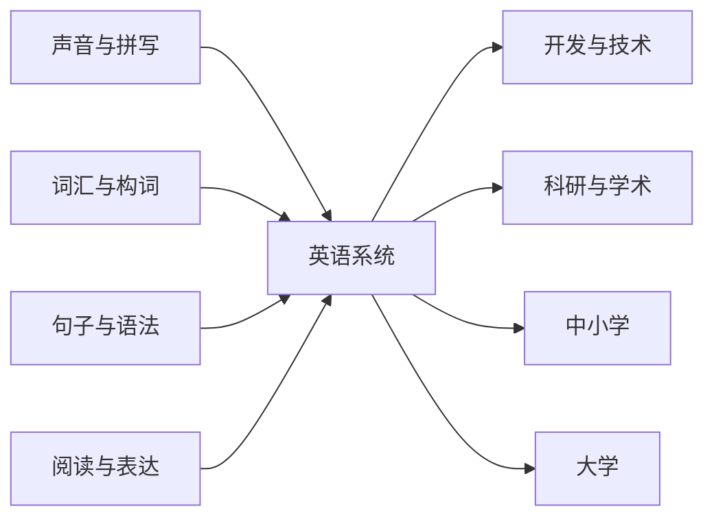

# Lexi 系统课程规划

> **版本**：1.4<br>
> **适用范围**：课程分类、主题边界、课程粒度、推荐路径和发布目录。
> **配套文档**：写作、标签、排版和验收规则见 [`_spec.md`](./_spec.md)。

## 一、课程定位

Lexi 的课程帮助中文学习者建立英语的声音、词汇、句子和篇章能力，并快速读懂技术、科研与化学材料里的英文术语和基本概念。

- 语言课程可以深入语言系统；
- 领域课程只解释读懂英文材料所必需的概念、搭配、语气与文档表达；
- 领域课程不是计算机、科研或化学的专业入门课，也不提供实验、部署或研究设计训练；
- 课程像可以连续阅读的专业小册子，而非题库、知识点切片或术语百科。

## 二、课程粒度：少而厚

当前发布目录为 **39 门中长篇课程**。课程数量服从内容主线，不能为了覆盖分类或填满列表，把一个主题拆成同一模板换术语的小课。

一门课程应当：

1. 围绕一个明确的中心问题；
2. 有连续的论述线，而非多个独立定义的拼接；
3. 包含核心概念、相邻概念对比、常见搭配、例句或真实材料语言；
4. 在必要处给出适用边界与常见误读；
5. 让学习者读完后能用一张清楚的关系图理解该主题。

以下情况应合并：内容共享同一阅读任务、同一语言模型，或必须互相解释才能读懂。以下情况才应拆分：中心问题不同，且合并会形成两条互不相干的主线。

例如，词义、搭配与语块应共同构成一门丰富的单词课程；研究方法、测量和证据强度应共同构成一门研究阅读课。化学的物质、反应与溶液可作为同一阅读线，而不是拆成化学教材式的单元小课。

## 三、横向主题与纵向深度

横向主题回答「学什么」；纵向深度回答「在同一主题中读到哪里」。深度来自解释、对比、语域、搭配、例句和真实材料，不来自重复规则、练习题或更细的课程编号。



每门课程通常按这条内在顺序展开：先说明问题和阅读场景，再建立核心模型，随后做关键对比并放入完整句子或材料语言，最后回看术语关系和边界。当前界面使用单个 Markdown 文件承载一门课程；未来支持多章节后，仍应保持一门课程的一条主线。

## 四、发布课程目录

### 1. 声音与拼写（3 门）

1. 音素与发音动作
2. 拼写、重音与节奏
3. 连读、弱读与语调

这一组从声音的产生、书写提示与词重音，延伸到句子的节奏和信息焦点。

### 2. 词汇与构词（6 门）

4. 数字、单位与数据表达
5. 时间、历法与日程
6. 空间、方位与路径
7. 词根、词缀与形态变体
8. 词义、搭配与语块
9. 核心动词与短语动词

数字、时间和空间方位是高频概念词汇系统，和构词、词义、搭配共同归入这一分类。时间课只讲历法与日程语言，空间课只讲导航与方位语言；时态和介词语法仍由语法课程负责。

### 3. 句子与语法（12 门）

10. 名词短语与限定
11. 代词与指代
12. 修饰、程度与比较
13. 疑问、否定与祈使
14. 时态与体（aspect）
15. 情态、语气与立场
16. 主动、被动与使役
17. 条件、假设与反事实
18. 介词与关系
19. 非谓语动词
20. 从句与复句
21. 语序、强调与信息结构

这些课程覆盖英语句子主干与扩展方式。基础句型、助动系统、一致、省略等内容在最能解释它们的主课中展开，不再拆成薄课。

### 4. 阅读与表达（1 门）

22. 阅读、篇章与技术写作

这门课把长句主干、衔接、指代、标点和技术文档句型合并为一条从阅读到清晰表达的路径。

### 5. 开发与技术（3 门）

23. 大语言模型、检索与智能体术语
24. 版本控制、提交与评审
25. 容器、云服务与可观测性术语

每门课按文档阅读场景组织术语和搭配，只解释理解英文材料需要的基本概念，不教授模型训练、系统设计、部署或故障处理。

### 6. 科研与学术（1 门）

26. 论文写作与研究交流

论文课将研究问题、检索、方法、结果、引用、评审与开放材料组织成一条完整论证线。

### 7. 中小学（6 门）

27. 元素、周期表与化学构词
28. 数学：数量、代数、图形与证明
29. 物理：运动、力、能量与波
30. 生物：细胞、遗传、生态与演化
31. 地理与地球科学：地图、气候与地貌
32. 历史与社会：年代、制度与因果

这一组面向中小学阶段已经接触或容易建立直观认识的学科概念，重点连接中文已有知识与英文术语。每个学科只设一门全景长课：周期表课程连接元素、命名与化学构词；数学课连接运算、代数、图形与证明；物理、生物、地理和历史课则各自沿该学科最稳定的概念主线展开。它们不按年级拆课，也不替代计算训练、实验、史实教材或学科考试。

### 8. 大学（7 门）

33. 化学研究：基础、反应与溶液
34. 化学研究：材料、分析与实验安全
35. 高等数学与统计：变化、模型与推断
36. 物理与工程：模型、测量与系统
37. 生命科学：分子、细胞与实验
38. 计算机科学：算法、数据与系统
39. 经济与社会科学：市场、制度与证据

这一组面向大学课程、论文和实验材料中更集中的专业语言。两门化学研究课分别围绕物质、反应与溶液，以及材料、分析与安全文档展开；数学与统计课聚焦结构、变化、概率和推断；物理工程、生命科学、计算机科学和经济社会科学各自连接模型、测量、方法与证据语言。它们仍是英文术语阅读课，不替代大学专业课程、实验操作、安全培训、医疗判断、工程设计或政策建议。

八个分类的发布数量依次为 **3／6／12／1／3／1／6／7**。这里的“中小学”和“大学”表示材料来源与所需先验概念层级，不表示严格年级、课程标准或学分体系。

## 五、推荐阅读路径

课程编号是展示顺序，稳定身份由 `slug` 决定。学习者不需要从 1 读到 39：

- **基础语言路径**：音素 → 拼写、重音与节奏 → 名词短语 → 时态与体（aspect） → 从句与复句 → 阅读、篇章与技术写作；
- **概念词汇路径**：数字与单位 → 时间与历法 → 空间与方位；词根词缀 → 词义、搭配与语块 → 核心动词与短语动词；
- **开发材料路径**：按正在阅读的 AI、代码协作或云服务文档，直接选对应课程；
- **科研材料路径**：论文写作与研究交流 → 元素、周期表与化学构词；读到化学材料时再进入反应、分析与安全课程。
- **中小学学科路径**：按正在阅读的数学、物理、生物、地理或历史材料直接选课；需要数值读法、空间介词或篇章分析时，回到相应语言课程；
- **大学学科路径**：先读论文写作与研究交流，再按材料选择高等数学与统计、物理与工程、生命科学、计算机科学或经济与社会科学；化学材料沿两门化学研究课继续。

领域路径是英语阅读路径，不是专业能力的先修链。碰到真正的研究、工程或实验问题，应转向原始研究、官方规范、专业教材和合格人员。

## 六、课程边界与发布原则

- 每门课程导读应说明：中心问题、阅读场景、所含内容、相邻课程边界和可获得的能力；
- 同一规则完整解释一次，其他课程只作简短提醒或链接；
- 术语必须由关系、搭配和语境组织，不能只堆成清单；
- 不使用练习、答案区或人造任务伪造深度；
- 课程达到中长篇、论述连贯、标签与排版验收通过后，才能进入 `system-courses.json`；
- 不为了凑足分类、维持旧编号或制造「课程很多」的感觉发布内容不足的课程。

## 七、文件与维护

```text
public/data/system-courses/
├─ _curriculum.md
├─ _spec.md
├─ 01-*.md
└─ 39-*.md
```

- `_curriculum.md` 是课程分类、边界和目录的唯一规划依据；
- `_spec.md` 是写作、标签、排版、交互和验收的唯一规范依据；
- `system-courses.json` 只列出已发布课程；
- `_*.md` 不进入课程列表；
- `id`、显示顺序和文件名前缀当前保持一致；`slug` 为稳定的小写 kebab-case 身份；
- 新增课程前，先在本文件说明它为何不能由现有中长篇课程承载，再开始编写。
