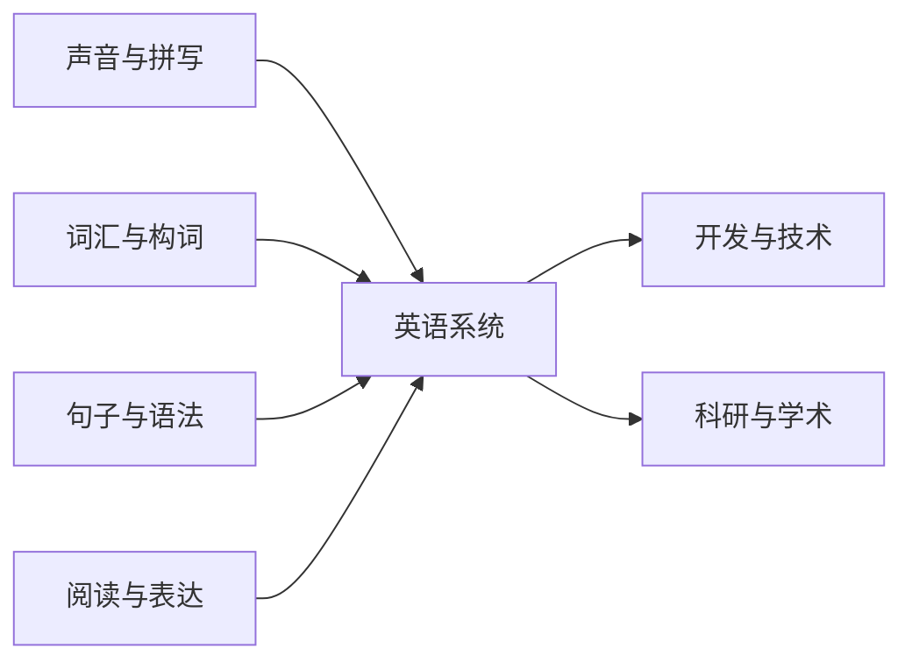

# Lexi 系统课程规划

> **版本**：1.2  
> **适用范围**：课程分类、主题边界、课程粒度、推荐路径和发布目录。  
> **配套文档**：写作、标签、排版和验收规则见 [`_spec.md`](./_spec.md)。

## 一、课程定位

Lexi 的课程帮助中文学习者建立英语的声音、词汇、句子和篇章能力，并快速读懂技术、科研与化学材料里的英文术语和基本概念。

- 语言课程可以深入语言系统；
- 领域课程只解释读懂英文材料所必需的概念、搭配、语气与文档表达；
- 领域课程不是计算机、科研或化学的专业入门课，也不提供实验、部署或研究设计训练；
- 课程像可以连续阅读的专业小册子，而非题库、知识点切片或术语百科。

## 二、课程粒度：少而厚

当前发布目录固定为 **29 门中长篇课程**。课程数量服从内容主线，不能为了覆盖分类或填满列表，把一个主题拆成同一模板换术语的小课。

一门课程应当：

1. 围绕一个明确的中心问题；
2. 有连续的论述线，而非多个独立定义的拼接；
3. 包含核心概念、相邻概念对比、常见搭配、例句或真实材料语言；
4. 在必要处给出适用边界与常见误读；
5. 让学习者读完后能用一张清楚的关系图理解该主题。

以下情况应合并：内容共享同一阅读任务、同一语言模型，或必须互相解释才能读懂。以下情况才应拆分：中心问题不同，且合并会形成两条互不相干的主线。

例如，词义、搭配与语块应共同构成一门丰富的单词课程；研究方法、测量和证据强度应共同构成一门研究阅读课。化学的物质、反应与溶液可作为同一阅读线，而不是拆成化学教材式的单元小课。

## 三、横向主题与纵向深度

横向主题回答「学什么」；纵向深度回答「在同一主题中读到哪里」。深度来自解释、对比、语域、搭配、例句和真实材料，不来自重复规则、练习题或更细的课程编号。



每门课程通常按这条内在顺序展开：先说明问题和阅读场景，再建立核心模型，随后做关键对比并放入完整句子或材料语言，最后回看术语关系和边界。当前界面使用单个 Markdown 文件承载一门课程；未来支持多章节后，仍应保持一门课程的一条主线。

## 四、发布课程目录

### 1. 声音与拼写

1. 音素与发音动作
2. 拼写、重音与节奏
3. 连读、弱读与语调

这一组从声音的产生、书写提示与词重音，延伸到句子的节奏和信息焦点。

### 2. 词汇与构词

4. 数字、单位与数据表达
5. 时间、历法与日程
6. 空间、方位与路径
7. 词根、词缀与形态变体
8. 词义、搭配与语块
9. 核心动词与短语动词

数字、时间和空间方位是高频概念词汇系统，和构词、词义、搭配共同归入这一分类。时间课只讲历法与日程语言，空间课只讲导航与方位语言；时态和介词语法仍由语法课程负责。

### 3. 句子与语法

7. 名词短语与限定
8. 代词与指代
9. 修饰、程度与比较
10. 疑问、否定与祈使
11. 时态与体（aspect）
12. 情态、语气与立场
13. 主动、被动与使役
14. 条件、假设与反事实
15. 介词与关系
16. 非谓语动词
17. 从句与复句
18. 语序、强调与信息结构

这些课程覆盖英语句子主干与扩展方式。基础句型、助动系统、一致、省略等内容在最能解释它们的主课中展开，不再拆成薄课。

### 4. 阅读与表达

19. 阅读、篇章与技术写作

这门课把长句主干、衔接、指代、标点和技术文档句型合并为一条从阅读到清晰表达的路径。

### 5. 开发与技术

21. 大语言模型、检索与智能体术语
22. Git、提交与代码评审
23. 容器、云服务与可观测性术语

每门课按文档阅读场景组织术语和搭配，只解释理解英文材料需要的基本概念，不教授模型训练、系统设计、部署或故障处理。

### 6. 科研与学术

24. 论文写作与研究交流
25. 元素、周期表与化学构词
26. 化学研究：基础、反应与溶液
27. 化学研究：材料、分析与实验安全

论文课将研究问题、检索、方法、结果、引用、评审与开放材料组织成一条完整论证线。化学位于「科研与学术」中：周期表与化学构词课负责元素、命名历史和术语网络；另两门课围绕反应与溶液、材料分析与安全文档展开。它们不构成从基础化学到专业化学的培养路线，也不替代实验操作或安全培训。

## 五、推荐阅读路径

课程编号是展示顺序，稳定身份由 `slug` 决定。学习者不需要从 1 读到 29：

- **基础语言路径**：音素 → 拼写、重音与节奏 → 名词短语 → 时态与体（aspect） → 从句与复句 → 阅读、篇章与技术写作；
- **概念词汇路径**：数字与单位 → 时间与历法 → 空间与方位；词根词缀 → 词义、搭配与语块 → 核心动词与短语动词；
- **开发材料路径**：按正在阅读的 AI、代码协作或云服务文档，直接选对应课程；
- **科研材料路径**：论文写作与研究交流 → 元素、周期表与化学构词；读到化学材料时再进入反应、分析与安全课程。

领域路径是英语阅读路径，不是专业能力的先修链。碰到真正的研究、工程或实验问题，应转向原始研究、官方规范、专业教材和合格人员。

## 六、课程边界与发布原则

- 每门课程导读应说明：中心问题、阅读场景、所含内容、相邻课程边界和可获得的能力；
- 同一规则完整解释一次，其他课程只作简短提醒或链接；
- 术语必须由关系、搭配和语境组织，不能只堆成清单；
- 不使用练习、答案区或人造任务伪造深度；
- 课程达到中长篇、论述连贯、标签与排版验收通过后，才能进入 `system-courses.json`；
- 不为了凑足分类、维持旧编号或制造「课程很多」的感觉发布内容不足的课程。

## 七、文件与维护

```text
public/data/system-courses/
├─ _curriculum.md
├─ _spec.md
├─ 01-*.md
└─ 27-*.md
```

- `_curriculum.md` 是课程分类、边界和目录的唯一规划依据；
- `_spec.md` 是写作、标签、排版、交互和验收的唯一规范依据；
- `system-courses.json` 只列出已发布课程；
- `_*.md` 不进入课程列表；
- `id`、显示顺序和文件名前缀当前保持一致；`slug` 为稳定的小写 kebab-case 身份；
- 新增课程前，先在本文件说明它为何不能由现有中长篇课程承载，再开始编写。
