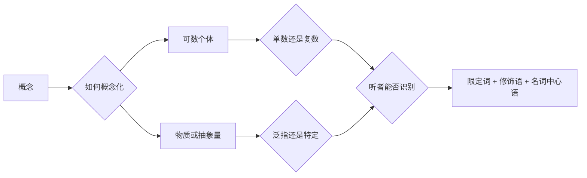

# 名词短语：数量、冠词、限定与修饰

> **中心问题**：怎样用数量、冠词和修饰确定名词指向的对象？ 
> **适用背景**：能读简单句，先按当前结构问题选读。 
> **阅读材料**：完整句、对话、教材说明和材料段落。 
> **篇章边界**：可数性、数量和名词短语结构集中在此；代词与跨句指代另篇展开。

## 1. 名词短语的生成路径

构造名词短语时依次判断：

1. 当前词义是可数还是不可数？
2. 可数名词是单数还是复数？
3. 所指是新引入、任意一类，还是双方可识别？
4. 是否已经有物主词、指示词或数量词占据限定位置？
5. 名词前后还需要哪些修饰语？

> [!IMPORTANT]
> “可数”不是单词永久不变的标签，而是某个词义在当前概念化方式下能否直接分成个体。`chicken` 可以表示一只鸡，也可以表示鸡肉；`experience` 可以表示经历，也可以表示经验这种抽象积累。

---

## 2. 可数性：把概念切成个体还是连续量

### 可数名词需要数量形态

单数可数名词通常不能裸露出现：

- `a book`
- `the book`
- `my book`
- `this book`
- `one book`

错误的 `I bought book` 缺少限定。复数可数名词则可以泛指：

`Books can preserve ideas across centuries.`

这里 `books` 表示整个类别，不要求听者识别某几本书。

### 不可数名词不直接与 a/an 或普通复数结合

常见不可数概念包括：

- 物质：`water`、`rice`、`steel`；
- 信息和知识：`information`、`advice`、`research`；
- 活动或状态：`work`、`traffic`、`progress`；
- 抽象性质：`patience`、`evidence`、`equipment`。

需要计数时，使用量词结构：

- `a piece of advice`
- `two pieces of equipment`
- `three items of information`
- `a body of evidence`
- `several research studies`

`research` 本身通常不可数，但 `study`、`paper`、`project` 是可数单位。

### 同一个词可以转换概念化方式

- `coffee`：饮料这种物质；`two coffees`：两杯或两份咖啡；
- `paper`：材料；`a paper`：论文、报纸或文件；
- `glass`：玻璃材料；`a glass`：玻璃杯；
- `room`：空间；`a room`：一个房间；
- `time`：时间；`three times`：三次；
- `experience`：经验；`an experience`：一次经历。

复数并不是随意把不可数词变可数，而是引入了可识别的种类、份数、事件或个体读法。

### 类别习惯会随专业语境变化

专业领域可能把日常连续量切成技术单位：

- 语言学可以讨论 `different Englishes`，指英语变体；
- 商业语境中的 `deliverables` 把交付成果视为可数项目；
- 化学中的 `a water` 通常不表示一杯水，但餐饮语境可以；
- 法律和学术文本中的 `evidence` 仍通常不可数，具体证据项可说 `pieces of evidence`。

学习可数性必须连同词义和语域，而不是只背一个 C/U 标签。

---

## 3. 复数、所有格与名词短语结构

### 规则复数集中解释一次

多数名词加 `-s`：

- `book` → <lexi-word form="changed">`books`</lexi-word>
- `idea` → <lexi-word form="changed">`ideas`</lexi-word>
- `student` → <lexi-word form="changed">`students`</lexi-word>

以咝音结尾时通常加 `-es`：

- `bus` → <lexi-word form="changed">`buses`</lexi-word>
- `watch` → <lexi-word form="changed">`watches`</lexi-word>
- `box` → <lexi-word form="changed">`boxes`</lexi-word>

辅音字母加 `y` 通常变 `y` 为 `i` 再加 `-es`：

- `city` → <lexi-word form="changed">`cities`</lexi-word>
- `analysis` 不适用这条规则，因为词尾不是 `y`。

部分 `f/fe` 结尾词变为 `-ves`，但不能一概而论：

- `leaf` → <lexi-word form="changed">`leaves`</lexi-word>
- `knife` → <lexi-word form="changed">`knives`</lexi-word>
- `roof` → `roofs`
- `chief` → `chiefs`

### 复数词尾有三种常见读音

- 清辅音后常为 <lexi-phoneme>`/s/`</lexi-phoneme>：`books`；
- 浊音和元音后常为 <lexi-phoneme>`/z/`</lexi-phoneme>：`bags`、`ideas`；
- 咝音后增加音节 <lexi-phoneme>`/ɪz/`</lexi-phoneme> 或 <lexi-phoneme>`/əz/`</lexi-phoneme>：`buses`、`watches`。

这是发音环境产生的规律，不需要逐词死记。

### 不规则复数需要作为词形关系学习

- `man` → <lexi-word form="irregular">`men`</lexi-word>
- `woman` → <lexi-word form="irregular">`women`</lexi-word>
- `child` → <lexi-word form="irregular">`children`</lexi-word>
- `person` → <lexi-word form="irregular">`people`</lexi-word>
- `mouse` → <lexi-word form="irregular">`mice`</lexi-word>
- `tooth` → <lexi-word form="irregular">`teeth`</lexi-word>
- `foot` → <lexi-word form="irregular">`feet`</lexi-word>

零变化复数包括 `sheep`、`deer`，但这些形式仍可以在句法上表示复数。来自希腊语或拉丁语的专业词可能保留多种复数，例如 `criterion` → `criteria`；应以目标领域的实际规范为准。

### 所有格表达关系，不只表达所有权

- `Maya's laptop`：所有或使用关系；
- `the company's decision`：机构作出的决定；
- `today's meeting`：时间关系；
- `two weeks' delay`：持续时间；定语形式常为 `a two-week delay`；
- `the roof of the building`：无生命整体与部分关系。

单数名词通常加 `'s`；规则复数以 `s` 结尾时只加撇号：`the students' projects`。不规则复数仍加 `'s`：`children's books`。

### 名词短语内部有稳定层次

<lexi-notation>`determiner`</lexi-notation> + <lexi-notation>`premodifier`</lexi-notation> + <lexi-notation>`head noun`</lexi-notation> + <lexi-notation>`postmodifier`</lexi-notation>

例如：

`those three carefully designed experiments in the report`

- `those`：指示限定；
- `three`：数量；
- `carefully designed`：前置修饰；
- `experiments`：中心名词；
- `in the report`：后置修饰。

判断长名词短语时先找到中心名词，再向两侧恢复限定和修饰关系。

---

## 4. a/an：引入一个尚未确定的成员

### a/an 的核心条件

`a/an` 通常要求：

- 名词是单数可数；
- 指向某一类别中的一个成员；
- 听者暂时不需要识别具体是哪一个。

`A researcher entered the room.`

第一次出现的 `researcher` 通常是新信息。后续再次指称时可以说 `the researcher`。

### a 还是 an 由声音决定

- `a university`：开头是辅音音素 <lexi-phoneme>`/j/`</lexi-phoneme>；
- `an hour`：`h` 不发音，开头是元音；
- `an MRI scan`：字母 `M` 的读音以元音开始；
- `a URL` 或 `an URL` 取决于实际读作字母串还是单词及说话习惯。

规则判断的是下一个发音，而不是下一个字母。

### 分类、职业与频率

- `She is an engineer.`：把个人归入职业类别；
- `This is a useful test.`：描述类别成员；
- `twice a week`：每一周两次；
- `$5 a kilogram`：每千克五美元；
- `What a surprise!`：感叹结构。

### a/an 不是“第一次出现”的机械标记

如果对象虽首次出现但双方可以唯一识别，仍使用 `the`：

`Please close the door.`

房间里只有一个相关的门时，听者可以通过共同场景识别它。反过来，即使某对象前文出现过，若重新作为类别中的任意成员讨论，也可能使用 `a/an`。

---

## 5. the 与零冠词：可识别性和类别表达

### the 的核心不是“特指”这个中文标签

更可操作的问题是：说话人是否假设听者能够确定是哪一个或哪一组？识别来源可能是：

- 前文已经引入；
- 当前场景可见；
- 后置修饰限定：`the report on your desk`；
- 常识关系：进入房间后说 `the ceiling`；
- 某语境中的唯一角色：`the winner`；
- 共同知识：`the sun`。

`I saw a dog. The dog was waiting by the gate.`

第二句的 `the dog` 通过前文获得唯一识别。

### 零冠词常表达类别、物质或制度活动

- 复数类别泛指：`Dogs need social interaction.`
- 不可数概念泛指：`Water expands when it freezes.`
- 语言和多数课程名称：`English`、`chemistry`；
- 餐食：`have breakfast`；
- 某些制度活动：`go to school`、`be in prison`、`go to bed`。

制度活动和具体地点需要区分：

- `go to school`：作为学生参与学校制度；
- `go to the school`：前往某所可识别的学校建筑或机构。

### 类别泛指有多种结构

- `A tiger is a powerful animal.`：任选一个成员代表类别；
- `The tiger is a powerful animal.`：较正式地把整个物种作为抽象类别；
- `Tigers are powerful animals.`：复数零冠词，日常最自然。

三种形式的语域和视角不同，不能简单互换到所有句子。

### 专有名词也可能带 the

多数人名、城市和国家使用零冠词：`Maya`、`London`、`China`。以下类型常带 `the`：

- 复数或联合政治实体：`the United States`、`the Netherlands`；
- 河流、海洋、山脉：`the Nile`、`the Pacific`、`the Alps`；
- 机构正式名称中的普通名词结构；
- 报纸、酒店、剧院等部分惯用名称。

名称习惯需要查证，不能完全由一条语法规则推导。

### 冠词与其他限定词通常互斥

英语名词短语通常不同时使用两个中心限定词：

- `my book`，不是 `the my book`；
- `this problem`，不是 `the this problem`；
- `Maya's report`，不是 `the Maya's report`。

但可以组合前限定、中心限定和后限定，例如 `all these three proposals` 在特定语境可成立，实际顺序和自然度由限定词类别决定。

---

## 6. 语篇、信息结构与高级判断

### 冠词选择建立指称链

一段文本会不断引入、保持和重新激活对象：

`A team tested a new sensor. The sensor failed during the first trial, but the team repaired it.`

`a team` 和 `a new sensor` 引入对象；`the sensor`、`the team` 表示听者已经可以追踪；`it` 继续保持同一指称。冠词和代词共同建立语篇连贯。

### 后置修饰不自动触发 the

比较：

- `a book about phonetics`：任何一本相关书；
- `the book about phonetics`：语境中可识别的那一本；
- `books about phonetics`：一类书。

修饰语缩小范围，但是否达到唯一识别仍取决于共同语境。

### 学术写作中的抽象名词

抽象名词首次出现时也不一定使用 `a/an`：

- `Evidence suggests that...`
- `The evidence collected in this study suggests that...`
- `A finding from the pilot study was later replicated.`

第一句泛指证据这种不可数概念；第二句由后置分词明确限定；第三句把研究结果概念化为一个可数发现。

### 名词化能够压缩信息，也可能隐藏行动者

`The committee rejected the proposal.`

名词化后：

`The rejection of the proposal caused delays.`

名词化便于把整个事件作为新主语继续讨论，但可能隐藏“谁拒绝了”。专业写作应根据论证需要选择动词结构或名词结构。

---

## 7. 复习与核心词汇

完成本课后，应能：

- 根据词义和语境判断可数性；
- 构造规则与不规则复数；
- 找出复杂名词短语的中心名词；
- 用“听者能否识别”解释冠词选择；
- 区分类别泛指、制度活动和具体地点；
- 在段落中建立稳定的指称链。

核心词汇：

`noun` · `countable` · `uncountable` · `plural` · `possessive` · `determiner` · `referent` · `definite` · `indefinite` · `generic` · `article` · `head noun` · `modifier` · `nominalization`

## 8. 数量限定：个体、总量与分配

### some、any 和 no

`some` 常用于肯定陈述，表示存在但数量未明确：

`We found some errors in the report.`

`any` 常出现在疑问、否定和条件环境：

- `Did you find any errors?`
- `We did not find any errors.`
- `If you notice any error, report it.`

但两者不是“肯定/否定”的机械替换：

- `Would you like some coffee?`：说话人提供具体事物并预期可能接受；
- `Any student can apply.`：表示任意成员，没有限制；
- `Some student left a bag here.`：存在某位身份未知的学生。

`no` 本身构成否定：`no evidence`，通常不再与 `not` 叠加成标准书面语中的双重否定。

### many/few 与 much/little

- 复数可数：`many samples`、`few errors`；
- 不可数：`much time`、`little evidence`。

有无 `a` 会改变评价：

- `few opportunities`：少到令人觉得不足；
- `a few opportunities`：虽然不多，但确实有一些；
- `little progress`：进展不足；
- `a little progress`：有一些进展。

### all、every 和 each

- `all students` 把群体作为整体覆盖；
- `every student` 覆盖群体中的每个成员，语法上接单数名词；
- `each student` 更突出逐个成员，可以用于较小或明确集合；
- `all the data` 指可识别数据的全部；
- `each of the samples` 后接复数集合，但中心限定词 `each` 通常触发单数一致。

`Each sample was tested twice.`

### both、either 和 neither

- `both options`：两个都；
- `either option`：两个中的任意一个；
- `neither option`：两个都不；
- `either of the options`；
- `neither of them`。

实际主谓一致会受到形式、距离和语域影响；正式编辑中通常让 `either/neither` 作中心时使用单数动词。

### most、most of 与 almost

- `most students`：大多数学生；
- `most of the students`：某个可识别群体中的大多数；
- `almost all students`：几乎所有学生；
- 不能用 `almost students` 表示“大多数学生”。

`most` 是限定数量，`almost` 是程度副词，需要修饰 `all`、数字或其他可分级表达。

---

## 9. 阅读路径与规则查证

遇到长句时先找主干与关系；遇到用法选择时再看上下文、语域和作者的表达目的。通用结构可以复用，具体搭配仍需词典与原句支持。

参考：[Cambridge Grammar：Clauses and sentences](https://dictionary.cambridge.org/grammar/british-grammar/sentences-and-clauses)。

---

相关篇章：[句子成分、基本句型与动词配价](#course=sentence-components-patterns-and-valency) · [代词、指代与一致](#course=pronouns-reference-and-agreement) · [衔接、标点、段落与论证](#course=cohesion-punctuation-paragraphs-and-argument)
