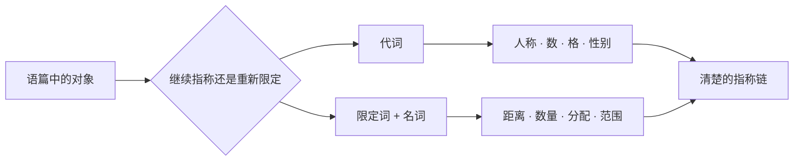

# 代词、指代与一致

> **中心问题**：怎样判断代词的指向、形式与一致关系？ 
> **适用背景**：能读简单句，先按当前结构问题选读。 
> **阅读材料**：完整句、对话、教材说明和材料段落。 
> **篇章边界**：数量限定回查名词短语篇；本篇集中解释指代与一致。

## 1. 指代与限定的整体模型

选择形式时依次判断：

1. 指向说话人、听话人还是第三方？
2. 在句中充当主语、宾语还是所有者？
3. 指称一个、多个，还是性别未知或无关的人？
4. 需要回指同一小句中的参与者吗？
5. 数量限定作用于可数个体还是不可数连续量？
6. 否定、疑问或条件是否改变 `some/any` 等形式？

---

## 2. 人称、格与所有关系

### 格由句法角色决定

| 人称 | 主格 · 宾格 物主限定 · 独立物主 |
| :--- | :--- |
| 第一人称单数 | `I` · `me` `my` · `mine` |
| 第二人称 | `you` · `you` `your` · `yours` |
| 第三人称单数 | `he/she/it` · `him/her/it` `his/her/its` · `his/hers` |
| 第一人称复数 | `we` · `us` `our` · `ours` |
| 第三人称复数 | `they` · `them` `their` · `theirs` |

主语形式通常出现在限定动词前：

`She sent us the updated file.`

`she` 是主语，`us` 是间接宾语。介词后也使用宾语形式：`between you and me`。

### 物主限定词不能独立出现

- `my report`：`my` 必须限定名词；
- `the report is mine`：`mine` 独立承担整个名词短语；
- `her idea` / `the idea is hers`；
- `their room` / `the room is theirs`。

`its` 是物主形式，`it's` 是 `it is` 或 `it has` 的缩约，二者不能混用。

### 并列结构不能靠“听起来正式”选格

删除并列项可以帮助检查：

- `Maya and I submitted the form.` → `I submitted the form.`
- `The manager thanked Maya and me.` → `The manager thanked me.`

`between you and I` 在规范书面语中不合适，因为介词 `between` 要求宾语形式。

### 单数 they

`they/them/their` 可以指性别未知、无关、不愿说明或使用该代词的单个人：

`If a student needs help, they can contact the tutor.`

单数 `they` 在现代英语中广泛使用。动词仍采用复数形式：`they are`，反身形式可见 `themselves`，也可在单数指称中使用 `themself`，具体选择受语域和风格规范影响。

### it 不只指物体

`it` 还可以承担非指称结构功能：

- 天气：`It is raining.`
- 时间：`It is nearly midnight.`
- 距离：`It is five kilometers to the station.`
- 外置主语：`It is important to verify the result.`
- 强调结构：`It was Maya who found the error.`

这些 `it` 不一定指向前文某个具体事物。

---

## 3. 反身、强调与互指

### 反身代词回指同一局部参与者

- `myself`
- `yourself` / `yourselves`
- `himself`、`herself`、`itself`
- `ourselves`
- `themselves`

`Maya introduced herself to the new team.`

`herself` 与同一小句中的主语 `Maya` 指向同一人。普通宾语代词会表达不同指称：

`Maya introduced her to the new team.`

这里 `her` 通常指另一位女性。

### 反身代词也可以表示强调

`The director herself approved the change.`

删除 `herself` 后句子仍然完整；它只强调“负责人本人”。这与动词要求的反身宾语不同。

### 不要用反身形式制造正式感

以下表达应使用普通代词：

- `Please contact me.`，不是 `Please contact myself.`
- `Sam sent the file to Maya and me.`，不是 `Maya and myself`。

反身代词需要真实的回指或强调功能。

### each other 表示互相

`The two teams reviewed each other's code.`

`each other` 表示多个参与者之间的相互关系；`themselves` 表示每个参与者作用于自身。两者意义不同。

---

## 4. 指示词与替代形式

### this/that 不只是物理距离

- `this` / `these`：说话人把对象放在当前注意中心；
- `that` / `those`：对象较远、已退出中心，或说话人主动拉开距离。

距离可以是：

- 空间距离：`this chair` / `that chair`；
- 时间距离：`this week` / `those days`；
- 语篇距离：`This is the main problem.`；
- 情感距离：`That attitude is unacceptable.`。

### 指示代词与指示限定词

- `this result`：`this` 限定名词；
- `this is surprising`：`this` 独立作代词；
- `those samples` / `those were contaminated`。

单复数必须一致：`this/that` 对应单数，`these/those` 对应复数。

### one/ones 替代可数名词中心语

`The blue cable is shorter than the black one.`

`one` 替代已经可恢复的单数可数名词；复数使用 `ones`。不可数名词通常不使用这种替代：可以说 `fresh coffee`，而不是机械地说 `fresh one`。

### so/not 和 do 可以替代更大结构

- `I think so.`：`so` 替代一个命题；
- `I hope not.`：`not` 替代否定命题；
- `Maya finished early, and Sam did too.`：`did` 替代动词短语。

代词系统实际上包含不同层级的替代形式：名词短语、动词短语和完整命题都可以被恢复。

---

## 5. 范围、指代歧义与高级约束

### 代词必须有清楚的先行项

`Maya told Lina that she had won.`

`she` 可能指 `Maya`，也可能指 `Lina`。如果语境不能消除歧义，应重复姓名或改写：

- `Maya told Lina, “You won.”`
- `Maya told Lina that Maya had won.`
- `Lina learned from Maya that she had won.` 仍可能需要更多说明。

避免重复不是最高目标，清楚指称更重要。

### 量化范围会改变逻辑

`Every student read a book.`

这句话可能表示所有学生读同一本书，也可能每个人读不同的书。逻辑上可写成两种范围：

- `one` `book` > `every` `student`
- `every` `student` > `a` `possibly` `different` `book`

需要精确时改写为 `the same book` 或 `a different book`。

### 否定与量词的范围

- `Not every sample passed.`：并非每个样本都通过，至少一个没通过；
- `No sample passed.`：一个都没通过；
- `Every sample did not pass.`：容易产生范围歧义，应避免；
- `Few samples passed.`：通过者数量少，但不一定为零。

### 局部回指与句法约束

反身代词通常需要在较近的句法范围内找到先行项：

- `Lina criticized herself.`：自然；
- `Lina said that Maya criticized herself.`：`herself` 通常指 `Maya`，不是较远的 `Lina`；
- `Lina said that Maya criticized her.`：`her` 可以指 `Lina` 或其他女性，依语境决定。

这类约束在句法理论中属于**约束理论**的一部分。基础写作只需记住：反身代词寻找局部主语，普通代词通常不能与同一局部主语共指。

### 指代还受语篇中心影响

连续句子倾向让当前主题保持为代词指向：

`Maya opened the report. She noticed an error in the final table.`

如果突然插入多个同类候选，代词解析成本会上升。专业写作应控制每句中竞争先行项的数量。

---

## 6. 复习与核心词汇

完成本课后，应能：

- 根据句法角色选择代词格；
- 区分物主限定词和独立物主代词；
- 正确使用反身、强调和互指形式；
- 用距离与语篇中心解释指示词；
- 根据可数性、极性和数量范围选择限定词；
- 发现并修复代词与量词歧义。

核心词汇：

`pronoun` · `case` · `subject` · `object` · `possessive` · `reflexive` · `reciprocal` · `antecedent` · `reference` · `demonstrative` · `quantifier` · `scope` · `distributive` · `polarity` · `ambiguity`

## 7. 一致关系：不只看最近名词

限定动词通常与句法主语一致：

`The key to the cabinets is missing.`

主语中心是单数 `key`，不是最近的复数 `cabinets`。

但英语中也存在概念一致与近邻一致：

- `A number of students are absent.`
- `The number of students is increasing.`
- `Neither the manager nor the assistants are available.`

集合名词在不同英语变体中可按整体或成员理解：`The team is...` / `The team are...`。专业文稿应选择目标语域并保持一致。

---

## 8. 阅读路径与规则查证

遇到长句时先找主干与关系；遇到用法选择时再看上下文、语域和作者的表达目的。通用结构可以复用，具体搭配仍需词典与原句支持。

参考：[Cambridge Grammar：Clauses and sentences](https://dictionary.cambridge.org/grammar/british-grammar/sentences-and-clauses)。

---

相关篇章：[名词短语：数量、冠词、限定与修饰](#course=noun-phrases-quantity-articles-and-modification) · [形容词、副词、程度与比较](#course=modifiers-degree-and-comparison) · [句子成分、基本句型与动词配价](#course=sentence-components-patterns-and-valency) · [衔接、标点、段落与论证](#course=cohesion-punctuation-paragraphs-and-argument)
