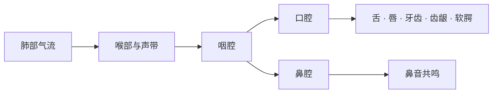

# 发音动作：气流、声带、舌位与口型

> **中心问题**：气流、声带、舌位和口型怎样共同形成声音？ 
> **适用背景**：不需要解剖学知识，已分清声音与字母。 
> **阅读材料**：发音部位图、动作描述、例词与录音。 
> **篇章边界**：集中解释可观察的发音动作；元辅音分类和音标不在此重复。

## 1. 从气流到语言声音

大多数英语声音使用肺部呼出的气流。气流经过喉部和声道时，依次受到控制：

1. **呼吸系统提供气流**：肺部和呼吸肌产生持续气流；
2. **喉部控制声带**：声带可以振动，也可以保持分开；
3. **声道改变共鸣**：咽腔、口腔和鼻腔选择性增强不同频率；
4. **发音器官形成动作**：舌、唇、牙齿、齿龈和软腭改变气流通道。

可以把这一过程理解为“声源 + 滤波器”：声带振动或湍流噪声提供声源，声道形状像可变化的滤波器，塑造最终听到的音色。

## 2. 清音与浊音的触觉检查

将两根手指轻放在喉结附近，交替发以下声音：

- <lexi-phoneme>`/s/`</lexi-phoneme> 与 <lexi-phoneme>`/z/`</lexi-phoneme>；
- <lexi-phoneme>`/f/`</lexi-phoneme> 与 <lexi-phoneme>`/v/`</lexi-phoneme>；
- <lexi-phoneme>`/θ/`</lexi-phoneme> 与 <lexi-phoneme>`/ð/`</lexi-phoneme>。

前一个声音主要依靠气流摩擦，喉部振动较弱；后一个声音伴随明显声带振动。这就是辅音分类中的**清浊对立**。

> [!NOTE]
> 清音不等于“小声”，浊音也不等于“大声”。清浊描述声带是否参与周期性振动，响度描述声音强弱，两者不是同一维度。

## 3. 口腔与鼻腔的通道切换

软腭抬起时，鼻腔通道大体关闭，多数英语元音和口腔辅音由口腔辐射。软腭下降时，气流进入鼻腔，可以产生 <lexi-phoneme>`/m/`</lexi-phoneme>、<lexi-phoneme>`/n/`</lexi-phoneme> 和 <lexi-phoneme>`/ŋ/`</lexi-phoneme>。

捏住鼻子持续发 <lexi-phoneme>`/m/`</lexi-phoneme>，声音会很快受到阻碍；发 <lexi-phoneme>`/s/`</lexi-phoneme> 时影响较小。这个对比可以帮助确认气流通道。

## 4. 发音器官速查

- **双唇**负责闭合、摩擦或圆唇。对比 `pie`、`five`、`we` 的起始动作。
- **上齿**可以与下唇或舌尖形成狭窄通道。对比 `fan` 与 `thin`。
- **齿龈**是舌尖或舌端经常接触的位置。对比 `tea`、`see`、`no`、`low`。
- **硬腭**位于舌前部抬高时接近的区域。观察 `yes` 的起始滑音。
- **软腭**既能与舌后部形成接触，也控制鼻腔通道。对比 `key`、`go`、`sing`。
- **声门**是两侧声带之间的开口。感受 `he` 起始位置的气流。

---

## 5. 舌位和唇形是连续变化的

舌头的不同部位可以独立参与动作。描述舌位时要说明舌尖、舌端或舌面，还要说明它接近哪里。只说“舌头抬高”往往缺少足够信息。嘴唇的闭合、展唇和圆唇则改变出口及声道形状。

外面看到的口型只能提供部分信息。两个声音的嘴唇看起来相似，舌位仍可能不同；同一个音的嘴唇也会提前准备下一音。因此，应把口型、舌位、声带和听感一起观察。

## 6. 动作说明怎样帮助查证

`voiced`、`voiceless` 指声带参与情况，`place of articulation` 指形成阻碍的部位，`manner of articulation` 指形成阻碍的方式。先辨认说明用的是哪个维度，再做对应的观察。

读 `Keep your lips relaxed.` 时，要求针对嘴唇，不是把整条气流取消。观察一个动作变化，也要回到词或短句确认可辨性。动作知识的用途是定位差异，不能代替真实声音和可靠示范。

## 7. 读音查证与继续阅读

现代示范以通用美式为主。遇到口音或词典记号差异，应把词、音标和来源录音一起核对。国际音标表示声音，网页 TTS 不能可靠朗读音标符号本身。

参考：[国际语音学协会交互音标表](https://www.internationalphoneticassociation.org/IPAcharts/IPA_charts_TI/IPA_charts_TI.html)。

---

相关篇章：[国际音标与词典标音：符号、重音和读音变体](#course=ipa-and-dictionary-pronunciation) · [元音：单元音、双元音与容易混淆的声音](#course=vowels-monophthongs-and-diphthongs) · [字母、声音、音素与音节：几套系统之间的关系](#course=letters-sounds-phonemes-and-syllables)
