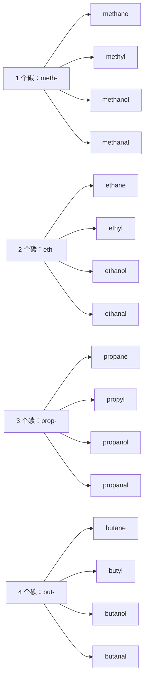

# 有机名称与结构阅读：碳链、基团和名称层次

> **中心问题**：怎样把熟悉的有机结构连接到英文碳链、基团和名称？ 
> **适用背景**：已理解基础有机结构和官能团。 
> **阅读材料**：教材名称、结构图、化学式与常用名说明。 
> **篇章边界**：重点是命名与结构的阅读关系；有机反应机理和正式系统命名的全面规则后续专题展开。

## 1. 常见分子与化合物的命名阅读

下列例子不是化学配方清单，而是用来观察名称、组成与类别之间的关系：

先以最典型的 <lexi-notation>`H₂O`</lexi-notation> 为例：看到化学式、需要逐字符指认时，读作 `H two O`（字母 `H`、数字 `two`、字母 `O`）；在谈论这种物质本身时，通常说 `water`。前者是 `formula reading`，后者是物质名称；不要把 `H two O` 当成 `water` 的正式化学名称。

同一原则也适用于 <lexi-notation>`CO₂`</lexi-notation>：可以把式子读作 `C O two`，但在句子里谈这种气体时说 `carbon dioxide`。下标只在读化学式时读出来；名称中的 <lexi-morpheme kind="prefix">`di-`</lexi-morpheme> 已经表达“两个氧原子”，不再额外读出数字。

中文名称、英文名称和化学式不是互相逐字翻译，而是三种并行的表达。中文熟悉“盐”和 <lexi-notation>`NaCl`</lexi-notation>，并不表示英文发音会自动推出；遇到新物质时，先分别确认“它叫什么”“式子怎么拼读”“中文系统名的顺序是否相同”。

### 分子：名称通常是整体词

- 中文「水」／英文 `water`／式子 <lexi-notation>`H₂O`</lexi-notation>。读式子是 `H two O`，谈物质说 `water`。
- 中文「二氧化碳」／英文 `carbon dioxide`／式子 <lexi-notation>`CO₂`</lexi-notation>。读式子是 `C O two`；<lexi-morpheme kind="prefix">`di-`</lexi-morpheme> 表示两个氧。
- 中文「甲烷」／英文 `methane`／式子 <lexi-notation>`CH₄`</lexi-notation>。读式子是 `C H four`；`meth-` 告诉你它有一个碳，`-ane` 表示饱和烃。
- 中文「氨」／英文 `ammonia`／式子 <lexi-notation>`NH₃`</lexi-notation>。读式子是 `N H three`，而不是按照中文「氨」去猜英文发音。
- 中文「乙醇」／英文 `ethanol`／式子 <lexi-notation>`C₂H₅OH`</lexi-notation>。读式子可说 `C two H five O H`；名称中的 `eth-` 和 `-ol` 则分别提示两碳骨架与醇类。

### 离子化合物：中文与英文的名称顺序恰好相反

以 <lexi-notation>`NaCl`</lexi-notation> 为例：中文系统名是「氯化钠」——先说阴离子「氯化」，再说阳离子「钠」；英文是 `sodium chloride`——先说阳离子 `sodium`，再说阴离子 `chloride`。逐符号核对式子时说 `N A C L`，不是把 <lexi-notation>`Na`</lexi-notation> 读成 `sodium`、把 <lexi-notation>`Cl`</lexi-notation> 读成 `chloride`。日常语境里的 `salt` 往往指食盐，但它是类别或日常称呼，不是所有盐都等于 `sodium chloride`。

- 中文「碳酸钙」／英文 `calcium carbonate`／式子 <lexi-notation>`CaCO₃`</lexi-notation>；式子可读 `C A C O three`。英文仍是阳离子 `calcium` 在前，阴离子 `carbonate` 在后。
- 中文「氢氧化钠」／英文 `sodium hydroxide`／式子 <lexi-notation>`NaOH`</lexi-notation>；式子可读 `N A O H`。`hydroxide` 是整体离子名称，不能拆成几个字母来读。

### 酸：名称还要看它是否处于水溶液

- 中文「盐酸」／英文 `hydrochloric acid`／式子 <lexi-notation>`HCl(aq)`</lexi-notation>。需要朗读完整式子时可说 `H C L aqueous`；<lexi-notation>`(aq)`</lexi-notation> 指水溶液，这正是 `acid` 这个名称成立的语境线索。
- 中文「硫酸」／英文 `sulfuric acid`／式子 <lexi-notation>`H₂SO₄`</lexi-notation>；式子可读 `H two S O four`。
- 中文「硝酸」／英文 `nitric acid`／式子 <lexi-notation>`HNO₃`</lexi-notation>；式子可读 `H N O three`。

`oxide`、`chloride`、`sulfate`、`carbonate` 和 `hydroxide` 是化合物名中的高频尾部。它们提供组成或离子类别线索，但完整含义仍取决于前面的元素、价态说明与具体语境。

## 2. 从甲、乙、丙、丁到碳链词根：先理解，不急着背

中文有机化学里的「甲、乙、丙、丁、戊……」在这里提示碳原子数；它不是翻译成 `A`、`B`、`C`、`D`。英语系统命名也要表达碳数，但使用的是一组历史保留下来的构词词根。它们不是现代英语的 `one`、`two`、`three`，所以只给出对照确实不够。

前四个词根最值得当作**化学专用词汇**来认识：<lexi-morpheme kind="root">`meth-`</lexi-morpheme>、<lexi-morpheme kind="root">`eth-`</lexi-morpheme>、<lexi-morpheme kind="root">`prop-`</lexi-morpheme>、<lexi-morpheme kind="root">`but-`</lexi-morpheme> 分别标记 1、2、3、4 个碳。它们来自命名史中的保留短形式，而不是日常数词；因此不要试图从 `meth` 猜出「一」，而要把它放回一个会不断复现的词族中。IUPAC 也把 `methyl`、`ethyl`、`propyl`、`butyl` 等列为广泛使用的已建立短名。

这就是需要建立的语义网络：**词根告诉你碳数，词尾告诉你结构类别**。看到 `ethanol`，可以先拆成 <lexi-morpheme kind="root">`eth-`</lexi-morpheme>（两碳）和 <lexi-morpheme kind="suffix">`-ol`</lexi-morpheme>（醇）；看到 `propanal`，则是三碳和 <lexi-morpheme kind="suffix">`-al`</lexi-morpheme>（醛）。

## 3. 五到十：数字词根开始出现跨领域线索

从 5 开始，碳数词根更容易和英语及科学术语中的数字网络互相支持：

- 5 个碳：戊 → <lexi-morpheme kind="root">`pent-`</lexi-morpheme>；联想 `pentagon`、`pentathlon` 中的「五」。
- 6 个碳：己 → <lexi-morpheme kind="root">`hex-`</lexi-morpheme>；联想 `hexagon`、`hexagonal`。
- 7 个碳：庚 → <lexi-morpheme kind="root">`hept-`</lexi-morpheme>；联想 `heptagon`。
- 8 个碳：辛 → <lexi-morpheme kind="root">`oct-`</lexi-morpheme>；联想 `octagon`、`octopus`。
- 9 个碳：壬 → <lexi-morpheme kind="root">`non-`</lexi-morpheme>；联想 `nonagon`。它和日常词 `nine` 字形不同，正说明英语的数字词源并不总是一致。
- 10 个碳：癸 → <lexi-morpheme kind="root">`dec-`</lexi-morpheme>；联想 `decade`、`decimal`、`decagon`。

这些关联不是记忆游戏：当读者在几何、度量、医学或化学材料里反复看到同一数义构词成分，就能把陌生词放进已有网络。相比之下，<lexi-morpheme kind="root">`meth-`</lexi-morpheme> 到 <lexi-morpheme kind="root">`but-`</lexi-morpheme> 的主要网络在化学词族内部，应该靠 `methane`、`methyl`、`methanol` 这类并列词来巩固。

## 4. `-yl`：从完整分子到附着的取代基

<lexi-morpheme kind="suffix">`-yl`</lexi-morpheme> 常提示一个从母体烃「取走一个氢」后作为部分结构出现的基团。因此 `methane` 和 `methyl`、`ethane` 和 `ethyl` 不只是拼写相近：前者是完整母体烃名，后者常作为取代基进入更长的名称。

`An ethyl group is attached to the main carbon chain.`

`isopropyl`、`isobutyl`、`sec-butyl`、`tert-butyl` 常出现在文献和产品资料中，表示同一碳数下连接方式不同的常用基团名。它们是进一步阅读支链命名的入口；本课不把它们误简化成又一批必须孤立背诵的「甲乙丙丁」。

## 5. 醛类：甲醛、乙醛怎样进入英文名称

`aldehyde` 是醛类这一类化合物的总称。其典型结构包含一个醛基：<lexi-notation>`R–CHO`</lexi-notation>。对于直链、末端带醛基的系统命名，英文通常从相同碳数的烷烃名称出发，用 <lexi-morpheme kind="suffix">`-al`</lexi-morpheme> 结尾：`ethane` → `ethanal`，不是 *ethane aldehyde*。

- **甲醛**：`formaldehyde`；系统名 `methanal`；式子 <lexi-notation>`CH₂O`</lexi-notation> 或 <lexi-notation>`HCHO`</lexi-notation>。
- **乙醛**：`acetaldehyde`；系统名 `ethanal`；式子 <lexi-notation>`CH₃CHO`</lexi-notation>。
- **丙醛**：常用名 `propionaldehyde`；系统名 `propanal`；式子 <lexi-notation>`CH₃CH₂CHO`</lexi-notation>。
- **丁醛**：常见名 `butyraldehyde`；系统名 `butanal`；式子 <lexi-notation>`CH₃CH₂CH₂CHO`</lexi-notation>。
- **戊醛**：常见名 `valeraldehyde`；系统名 `pentanal`；式子 <lexi-notation>`CH₃(CH₂)₃CHO`</lexi-notation>。

`Formaldehyde is also called methanal in systematic nomenclature.`

`The sample contained trace amounts of acetaldehyde (ethanal).`

真实论文、法规和安全文件可能偏好保留名，也可能偏好系统名，因此阅读时应把一对名称看成同一物质的两张入口，而不是误以为它们是两种不同化合物。IUPAC 将醛定义为羰基连接一个氢原子和一个 <lexi-notation>`R`</lexi-notation> 基团的一类化合物；名称体系有历史保留名，也有系统命名规则。

## 6. 同一条碳链如何换成功能团词汇

以两碳的 <lexi-morpheme kind="root">`eth-`</lexi-morpheme> 为例，词尾会把阅读对象切换到不同类别：

- `ethane`：<lexi-morpheme kind="suffix">`-ane`</lexi-morpheme>，烷烃；
- `ethene`：<lexi-morpheme kind="suffix">`-ene`</lexi-morpheme>，含双键的烃；
- `ethyne`：<lexi-morpheme kind="suffix">`-yne`</lexi-morpheme>，含三键的烃；
- `ethanol`：<lexi-morpheme kind="suffix">`-ol`</lexi-morpheme>，醇；
- `ethanal`：<lexi-morpheme kind="suffix">`-al`</lexi-morpheme>，醛；
- `ethanoic acid`：<lexi-morpheme kind="suffix">`-oic acid`</lexi-morpheme>，羧酸，常用名是 `acetic acid`。

这是一张构词地图，不是万能的命名生成器：支链、多个官能团、环、芳香环和官能团优先级都会引入更复杂的规则。它足以让读者在遇到陌生术语时，先抓住碳数和功能团两条最重要的线索。

## 7. 名称不能替代结构与来源

一个熟悉的常用名可能只命名一种具体物质，系统名称则可能通过多个部分表达结构关系。读者不能只凭一个词根推断全部连接，也不能把中文俗名自行翻译为正式英文名。

阅读教材时把名称、结构图和作者的说明放在一起。需要正式使用时，查材料采用的命名体系与版本；本篇提供结构阅读的入口，不把几条构词线索当作完整命名规则。

## 8. 本科、研究生与博士的阅读层次

本科教材层把碳链、基团与名称部分对应到结构图，区分系统名称和常用名。

研究生专题层在专著中辨认更细的结构限定，核对名称所依据的命名体系，不从词根猜全部连接。

博士文献层阅读新化合物或方法的名称与结构说明，并将命名、结构确认和实验结果作为不同证据任务。

层次表示材料深度和所需背景。已熟悉专题的读者可以直接选读，不必把同一主题按学历重复学习。

---

相关篇章：[化学与材料英文导读：反应、方法与证据](#course=university-chemistry-reader) · [教材、专著、综述和研究论文的结构](#course=textbooks-monographs-reviews-and-research-papers) · [方法、数据、图表与结果表达](#course=methods-data-figures-and-results) · [引用、证据、局限与研究贡献](#course=citations-evidence-limitations-and-contributions)
